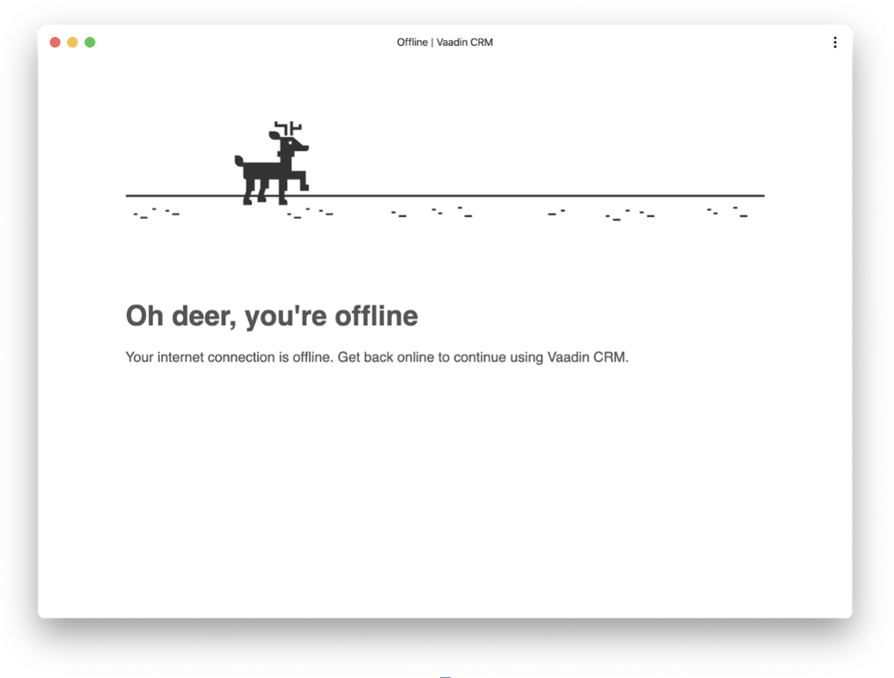

= Turning a Vaadin Flow Application Into an Installable PWA

In this chapter, you turn the completed CRM application into a progressive web application (PWA), so that users can install it. 

== What Is a PWA?

The term “PWA” is used to describe modern web applications that offer a native app-like user experience. 
PWA technologies make applications faster, more reliable, and more engaging. 
PWAs can be installed on most mobile devices and on desktop when using supported browsers. 
They can even be listed in the Microsoft Store and Google Play Store. 
You can learn more about the underlying technologies and features in the <<{articles}/guide/configuration/pwa#,PWA configuration>> documentation.

Two main components enable PWA technologies:

* ServiceWorker: a JavaScript worker file that controls network traffic and enables custom cache control.
* Web app manifest: a JSON file that identifies the web application as an installable application.

== Generating PWA Resources

Vaadin provides the `@PWA` annotation, which automatically generates the required PWA resources. 

Update the `@PWA` annotation on `Application.java` as follows:

.`Application.java`
[source,java]
----
@PWA( // <1>
    name = "Vaadin CRM", // <2>
    shortName = "CRM" // <3>
)
public class Application extends SpringBootServletInitializer implements AppShellConfigurator {

    public static void main(String[] args) {
        SpringApplication.run(Application.class, args);
    }

}
----
<1> The `@PWA` annotation tells Vaadin to create a `ServiceWorker` and a manifest file.
<2> `name` is the full name of the application for the manifest file.
<3> `shortName` should be short enough to fit under an icon when installed, and should not exceed 12 characters. 

=== Customize the Application Icon

You can override the default icon by replacing `src/main/resources/META-INF/resources/icons/icon.png` with your own 512px x 512px PNG icon.

You can use your own icon, or save the image below, by right-clicking and selecting *Save Image*.

== Customize the Offline Page 

Vaadin creates a generic offline fallback page that displays when the application is launched offline. 
Replacing this default page with a custom page that follows your own design guidelines makes your app more polished. 

Use the code below to create `offline.html` in the `META-INF/resources` folder: 

.`offline.html`
[source,html]
----
<!DOCTYPE html>
<html lang="en">
<head>
    <meta charset="UTF-8"/>
    <meta name="viewport" content="width=device-width, initial-scale=1.0"/>
    <meta http-equiv="X-UA-Compatible" content="ie=edge"/>
    <title>Offline | Vaadin CRM</title>
    
</head>
<body>

    
    <h1>Oh deer, you're offline</h1>
    
Your internet connection is offline. Get back online to continue using Vaadin CRM.

</body>
</html>
----

<1> The JavaScript snippet reloads the page if the browser detects that it's back online. 

Add the following image (or use one of your own) to the `META-INF/resources/images` folder and name it `offline.png`.

Make the files available offline by adding them to the `@PWA` annotation in `Application` as follows:

.`Application.java`
[source,java]
----
@PWA(
    name = "VaadinCRM",
    shortName = "CRM", 
    offlinePath="offline.html", 
    offlineResources = { "./images/offline.png"} // <1>
)
----
<1> `offlineResources` is a list of files that Vaadin makes available offline through the `ServiceWorker`.

Restart the app. 
You can now install the application on supported browsers.

== Testing the Offline Page

Shut down the server in IntelliJ and refresh the browser (or launch the installed app). 
You should now see the custom offline page.

In the next chapter, you will add tests to the application: both unit tests and in-browser tests.

include::{root}/articles/flow/tutorials/in-depth-course/_ebook-banner.adoc[opts=optional]
