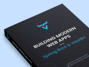

pass:[<!-- vale Vale.Terms = NO -->]
pass:[<!-- vale Vale.Spelling = NO -->]
pass:[<!-- vale Vaadin.OneSentencePerLine = NO -->]

[.toc-banner-source.skip-search-index]
--

[.toc-banner-source-text]
*Download free e-book.* +
The complete guide is also available in an easy-to-follow PDF format.

[.toc-banner-source-link]
\https://pages.vaadin.com/en/build-a-modern-web-app-with-spring-boot-vaadin-pdf

[source,html,role=render-only]
----
include::{root}/frontend/demo/render-banner.ts[render,persistent]
----
--

pass:[<!-- vale Vaadin.OneSentencePerLine = YES -->]
pass:[<!-- vale Vale.Spelling = YES -->]
pass:[<!-- vale Vale.Terms = YES -->]
