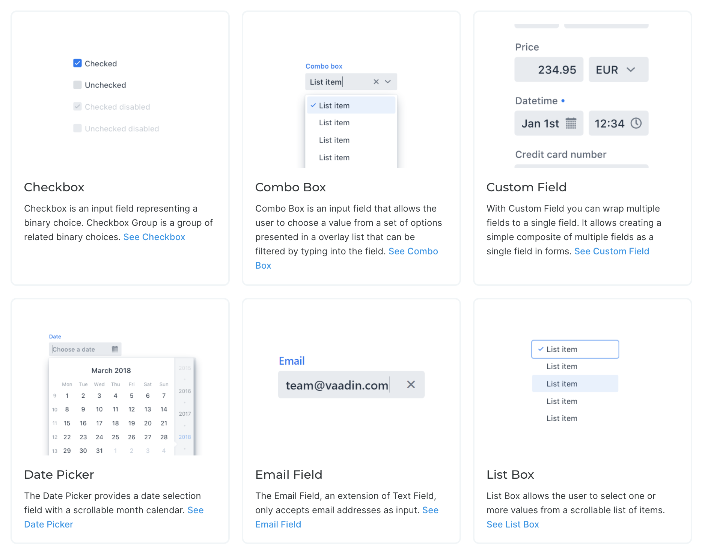
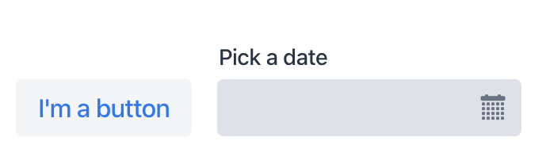
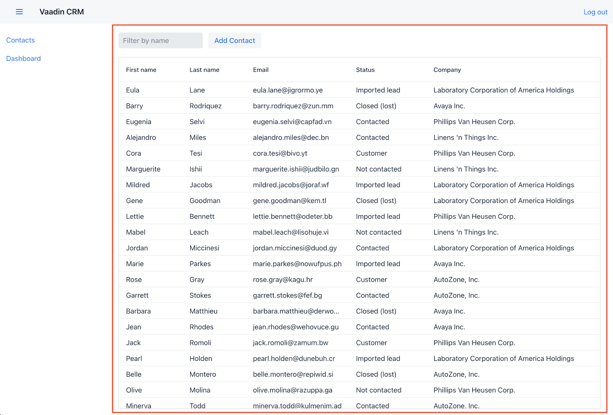
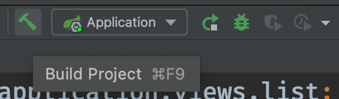

= Creating a Vaadin Flow View With Components

In this chapter, you learn core Vaadin concepts and scaffold the first view of the CRM application.

This chapter covers:

* Vaadin component basics.
* Constructing a view with the Vaadin Flow Java API.

== A Quick Introduction to Vaadin Flow

Here are the most important Vaadin Flow concepts you need to know to get started. 

=== What Is Vaadin Flow? 

Vaadin is a Java framework for building web applications. 
It has a component-based programming model that allows you to build user interfaces.

=== Vaadin UI Components

Vaadin includes over <<{articles}/ds/overview#,40 UI components>> to help you build apps faster.
By using ready-made building blocks, you are able to focus more of your time on building end-user functionality.

Vaadin components are custom HTML elements that are registered with the browser.
They are based on W3C web component standards.

The components have light and dark themes, and you can further customize them through CSS variables to fit your brand.

You create a new component by initializing a Java object. 
For instance, to create a `Button`, you write:

.Creating a Button
[source,java]
----
Button button = new Button("I'm a button");
----

=== Layouts

Layouts determine how components display in the browser window. 
The most common layout components are `HorizontalLayout`, `VerticalLayout`, and `Div`. 
The first two set the content orientation as horizontal or vertical, respectively, whereas `Div` lets you control the positioning with CSS.

You add components to layouts using the `add()` method.

`HorizontalLayout` and `VerticalLayout` provide methods to align items on both the primary and the cross axis. 
For instance, if you want all components, regardless of their height, to be aligned with the bottom of a `HorizontalLayout`, you can set the default alignment to `Alignment.END`:

.Setting layout alignment
[source,java]
----
Button button = new Button("I'm a button");
HorizontalLayout layout = new HorizontalLayout(button, new DatePicker("Pick a date"));

layout.setDefaultVerticalComponentAlignment(Alignment.END);
add(layout);
----

=== UI Events

You can add functionality to your application by listening to events, such as click events from buttons, or value-change events from select components. 

This example adds the text "Clicked!" to the layout when the button is clicked. 

.Listening to click events
[source,java]
----
button.addClickListener(clickEvent -> 
  add(new Text("Clicked!")));
----

=== Where's the HTML?

One unique Vaadin Flow feature is that you can build web applications entirely in Java. 
This higher level of abstraction makes development more productive and debugging easier.

Vaadin also supports HTML templates and customizing the code that runs in the browser; you don't usually need to worry about this. 

== The Contact List View

The first view is the Contact list view. 
This view lists all the contacts in the system. 
Users can search, add, edit, and delete contacts in this view.

You initially focus only on the list view. 
You add the layout containing the header and sidebar later in the “Navigation and parent layouts” chapter.

In this and the next chapter, you create the required layouts and components for the view. 
Then, in the chapter that follows, you create a service class for accessing the backend and populating the view with data.

Locate the `ListView.java` class under `src/main/java`. 
Replace the contents of the file with the following:

.`ListView.java`
[source,java]
----
package com.example.application.views.list;

import com.example.application.data.entity.Contact;
import com.vaadin.flow.component.button.Button;
import com.vaadin.flow.component.grid.Grid;
import com.vaadin.flow.component.orderedlayout.HorizontalLayout;
import com.vaadin.flow.component.orderedlayout.VerticalLayout;
import com.vaadin.flow.component.textfield.TextField;
import com.vaadin.flow.data.value.ValueChangeMode;
import com.vaadin.flow.router.PageTitle;
import com.vaadin.flow.router.Route;

@Route(value = "")
@PageTitle("Contacts | Vaadin CRM")
public class ListView extends VerticalLayout { // <1>
    Grid<Contact> grid = new Grid<>(Contact.class); // <2>
    TextField filterText = new TextField();

    public ListView() {
        addClassName("list-view");
        setSizeFull();
        configureGrid(); // <3>

        add(getToolbar(), grid); // <4>
    }

    private void configureGrid() {
        grid.addClassNames("contact-grid");
        grid.setSizeFull();
        grid.setColumns("firstName", "lastName", "email"); // <5>
        grid.addColumn(contact -> contact.getStatus().getName()).setHeader("Status"); // <6>
        grid.addColumn(contact -> contact.getCompany().getName()).setHeader("Company");
        grid.getColumns().forEach(col -> col.setAutoWidth(true)); // <7>
    }

    private HorizontalLayout getToolbar() {
        filterText.setPlaceholder("Filter by name...");
        filterText.setClearButtonVisible(true);
        filterText.setValueChangeMode(ValueChangeMode.LAZY); // <8>

        Button addContactButton = new Button("Add contact");

        HorizontalLayout toolbar = new HorizontalLayout(filterText, addContactButton); // <9>
        toolbar.addClassName("toolbar");
        return toolbar;
    }
}
----
<1> The view extends `VerticalLayout`, which places all child components vertically.
<2> The Grid component is typed with `Contact`. 
<3> The grid configuration is extracted to a separate method to keep the constructor easier to read.
<4> Add the toolbar and grid to the `VerticalLayout`.
<5> Define which properties of `Contact` the grid should show.
<6> Define custom columns for nested objects.
<7> Configure the columns to automatically adjust their size to fit their contents. 
<8> Configure the search field to fire value-change events only when the user stops typing. This way you avoid unnecessary database calls.
<9> The toolbar uses a `HorizontalLayout` to place the `TextField` and `Button` next to each other.

If your application is still running from the previous step, you only need to perform a build, either with the `CMD/Ctrl-F9` keyboard shortcut, or by pressing the “hammer” icon in the toolbar.
Vaadin will automatically reload your browser to display the changes.

You can keep the server running throughout the tutorial. 
There are only a couple of cases where you need to restart the server; these will be highlighted in the instructions. 

You should now see the empty view structure in the browser window. 
In the next chapter, you will build a component for the form that is used for editing contacts.

image::images/components-and-layouts/list-view-complete.png[The completed list view has all the components, but no data yet]

include::{articles}/flow/tutorials/in-depth-course/_ebook-banner.adoc[opts=optional]

