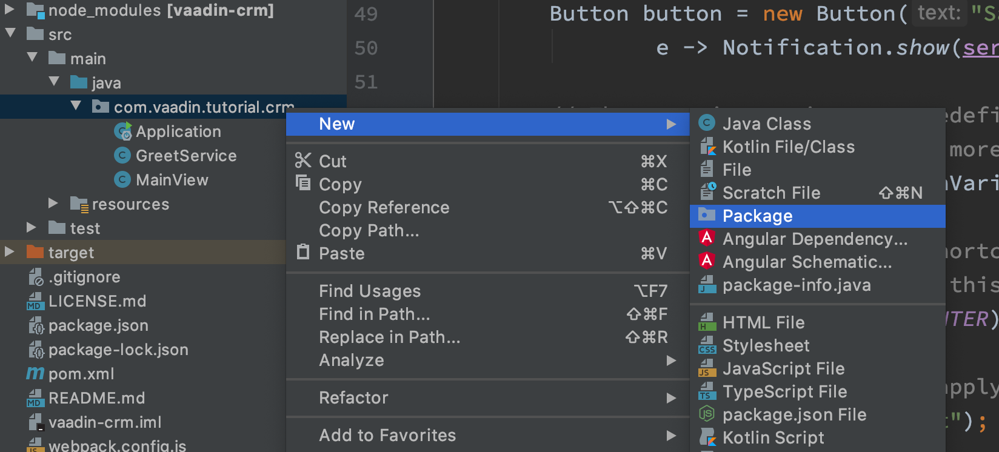
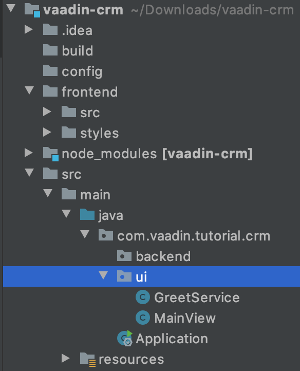
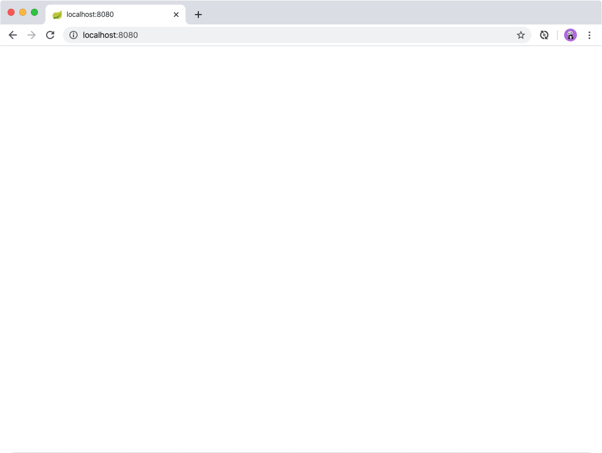

= Vaadin Flow Basics: Building UIs With Components and Layouts

In this chapter you learn core Vaadin concepts and get your project ready for coding.

video::vmh5coL-nKs[youtube]

== Quick Introduction to Vaadin

Here are the most important Vaadin Flow concepts you need to know to get started. 

=== What Is Vaadin Flow? 

Vaadin is a Java framework for building web applications. 
It has a component-based programming model that allows you to build user interfaces.

=== Vaadin UI Components

Vaadin includes a <<{articles}/ds/components#,large library of UI components>> that you can use as the building blocks of your application.

You create a new component by initializing a Java object. 
For instance, to create a `Button`, you write:

.Creating a Button
[source,java]
----
Button button = new Button("I'm a button");
----

=== Layouts

Layouts determine how components display in the browser window. 
The most common layout components are `HorizontalLayout`, `VerticalLayout`, and `Div`. 
The first two set the content orientation as horizontal or vertical, respectively, whereas `Div` lets you control the positioning with CSS.

You add components to layouts using the `add()` method.

`HorizontalLayout` and `VerticalLayout` provide methods to align items on both the primary and the cross axis. 
For instance, if you want all components, regardless of their height, to be aligned with the bottom of a `HorizontalLayout`, you can set the default alignment to `Alignment.END`:

.Setting layout alignment
[source,java]
----
Button button = new Button("I'm a button");
HorizontalLayout layout = new HorizontalLayout(button, new DatePicker("Pick a date"));

layout.setDefaultVerticalComponentAlignment(Alignment.END);
add(layout);
----

image::images/basics/layout-alignment.png[layout alignment]

=== UI Events

You can add functionality to your application by listening to events, such as, click events from buttons, or value-change events from select components. 

This example adds the text "Clicked!" to the layout when the button is clicked. 

.Listening to click events
[source,java]
----
button.addClickListener(clickEvent -> 
  add(new Text("Clicked!")));
----

=== Where's the HTML?

One unique Vaadin Flow feature is that you can build web applications entirely in Java. 
This higher level of abstraction makes development more productive and debugging easier.

Vaadin also supports HTML-templates and customizing the code that runs in the browser, usually you don't need to worry about this. 

== Preparing the Project

=== Defining Packages

The CRM application has both UI and backend code. 
To keep the code organized, you need to define separate packages for each in the project structure.

To define packages:

. Right-click the `com.vaadin.tutorial.crm` package.
. Select *New > Package* and create a package named `com.vaadin.tutorial.crm.ui`.
. Repeat this process to create another package named `com.vaadin.tutorial.crm.backend`. 

+

. Drag `MainView` into the `ui` package. 
If IntelliJ asks you if you want to refactor the code, say yes.

+
Your project structure should now look like this:
+

=== Setting Up the Main Layout

Next, clean out unnecessary code and set up the main layout. 

To do this:

. Delete the content of `MainView` and replace it with the code shown below. 
+
.`MainView.java`
[source,java]
----
package com.vaadin.tutorial.crm.ui;

import com.vaadin.flow.component.orderedlayout.VerticalLayout;
import com.vaadin.flow.router.Route;

@Route("") // <1>
public class MainView extends VerticalLayout {

    public MainView() {
        
    }

}
----
<1> `@Route("")` maps the view to the root.

. Next, *delete* the following unnecessary files: 

+
** `GreetService.java`
** `frontend/styles/vaadin-text-field-styles.css`

. Verify that you are able to run your application. 

+
You should see an empty window in the browser, and no errors in the console.

