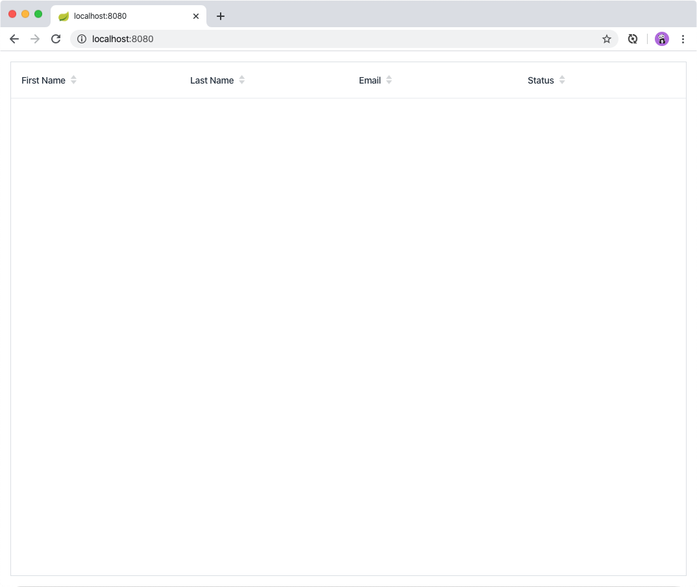
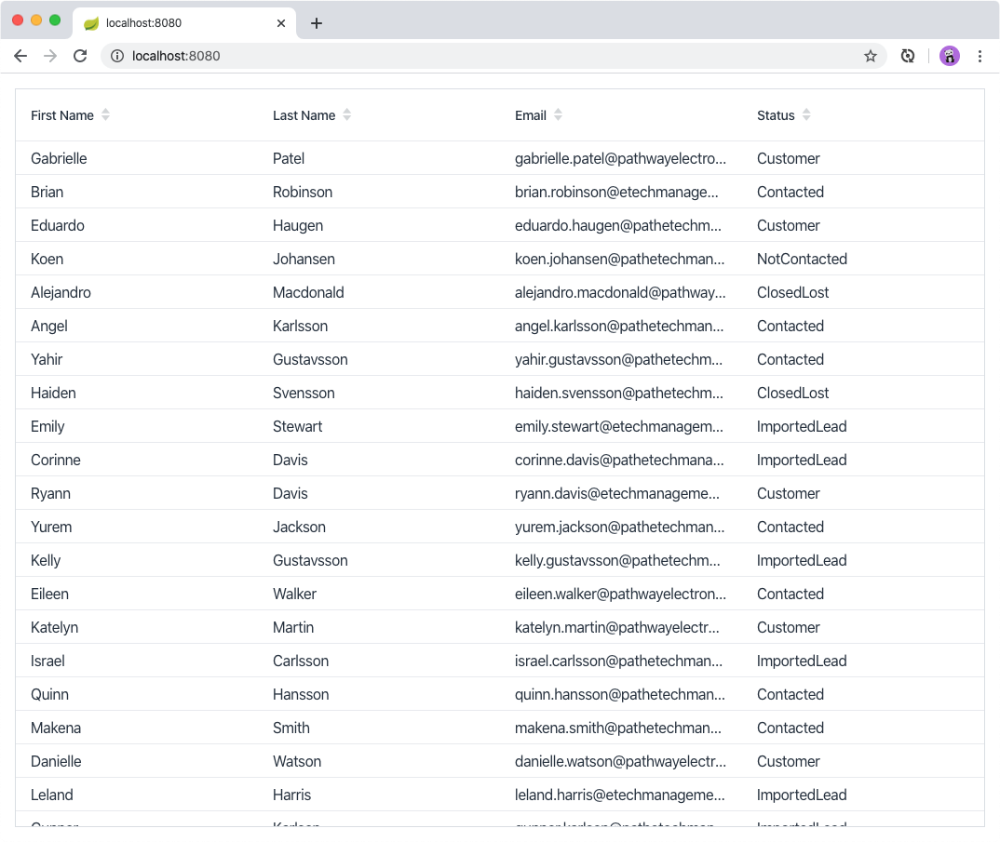
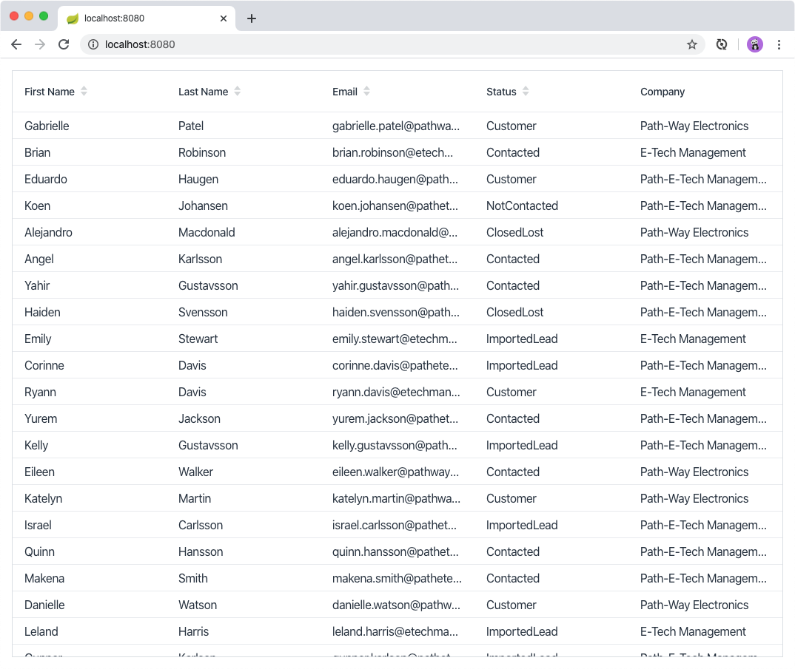

= Adding Data and Configuring Columns in Vaadin Grid

Now that your backend is in place, you're ready to begin building the UI. 
Start by listing all contacts in a data grid. 
To do this, you need to create the necessary UI components and hook them up to the backend.

video::_109sgFRgA0[youtube]

== Creating and Configuring the Grid

To create and configure the grid:

. Edit `MainView.java` and add the following code:
+

.`MainView.java`
[source, java]
----
// Package and imports omitted

@Route("")
public class MainView extends VerticalLayout {

    private Grid<Contact> grid = new Grid<>(Contact.class); // <1>

    public MainView() {
        addClassName("list-view"); // <2>
        setSizeFull(); // <3>
        configureGrid(); // <4> 

        add(grid); // <5> 
    }

    private void configureGrid() {
        grid.addClassName("contact-grid");
        grid.setSizeFull();
        grid.setColumns("firstName", "lastName", "email", "status"); // <6>
        
    }

}
----
<1> Defines a new field grid and instantiates it to a Grid of type Contact. 
<2> Gives the component a CSS class name to help with styling.
<3> Calls `setSizeFull()` to make `MainView` take up the full size of the browser window.
<4> Splits the grid configuration into a separate method. 
You will add more components to the class later on and this helps to keep things easy to understand.
<5> Adds the grid to the main layout using the `add(grid)` method.
<6> Defines the properties of a Contact to shown using the `grid.setColumns(..)` method.

. Run the application and verify that you now see an empty grid with the correct columns. 
+

== Populating the Grid With Data From the Backend

Next, hook up the view to the backend, so that you can fetch contacts to show in the grid. 
Use Spring's dependency injection to get hold of the backend service, by adding it as a parameter to the constructor. 
Spring passes it in when `MainView` is created.

To hook your view to the backend:

. Amend `MainView` as follows:  
+
.`MainView.java`
[source,java]
----
@Route("")
public class MainView extends VerticalLayout {

    private ContactService contactService;
    private Grid<Contact> grid = new Grid<>(Contact.class);

    public MainView(ContactService contactService) {
        this.contactService = contactService; // <1> 
        addClassName("list-view");
        setSizeFull();
        configureGrid();

        add(grid);
        updateList(); // <2>
    }

    private void configureGrid() {
        grid.addClassName("contact-grid");
        grid.setSizeFull();
        grid.setColumns("firstName", "lastName", "email", "status");
    }

    private void updateList() {
        grid.setItems(contactService.findAll());
    }

}
----
<1> Saves ContactService in a field, so you have easy access to it later.
<2> Creates a new method, updateList(), that fetches all contacts from the service, and passes them to the grid. 

. Build the project and verify that you now see contacts listed in the grid.
+

== Adding a Custom Column to The Grid

Each `Contact` belongs to a `Company`. 
You cannot add `"company"` to the column list the same ways as the other columns. 
If you do, the grid doesn't show the company name, but instead something like "com.vaadin.tutorial.crm.backend.e...".  

The company property is a reference to another object, and the grid  shows the fully qualified class name because it doesn't know how you want to display the object. 
To fix this, you need to change how the company column is defined. 

To define the company column:

. Amend `MainView` as follows:
+
.`MainView.java`
[source,java]
----
private void configureGrid() {
    grid.addClassName("contact-grid");
    grid.setSizeFull();
    grid.removeColumnByKey("company"); // <1>
    grid.setColumns("firstName", "lastName", "email", "status");
    grid.addColumn(contact -> { // <2>
        Company company = contact.getCompany();
        return company == null ? "-" : company.getName();
    }).setHeader("Company");
}
----
<1> Removes the default column definition with the `removeColumnByKey` method.
<2> Uses the `addColumn` method to add a custom column.
* `addColumn` gets a `contact` parameter, and returns how it should be shown in the grid. 
In this case, show the company name, or a dash if it's empty.
* `setHeader` defines the column header for the custom column.

. Build the application, and you should now see the company names listed in the grid.
+

== Defining Column Widths

By default, the grid makes each column equally wide. 
Turn on automatic column sizing so that the email and company fields, which are typically longer, get more space. 
Automatic column sizing tries to make the column wide enough to fit the widest content.

To turn on automatic column sizing:

. Amend `MainView` as follows:
+
.`MainView.java`
[source,java]
----
private void configureGrid() {
    // column definitions omitted

    grid.getColumns().forEach(col -> col.setAutoWidth(true)); // <1>
}
----
<1> Automatic width needs to be turned on for each column. 
The easiest way to do it is to call `grid.getColumns()` and then use `forEach` to loop over them.

. Build the application and you should now see that the columns are sized more appropriately.
+

[.toc-banner-source]
--
[source,html,role=render-only]
----
include::{root}/frontend/demo/banners/ebook-banner.ts[render]
----
--
