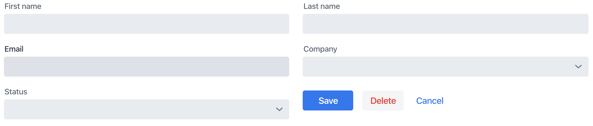
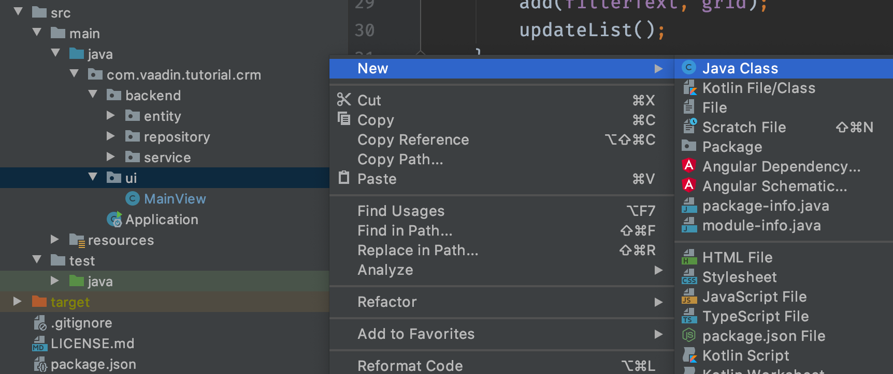
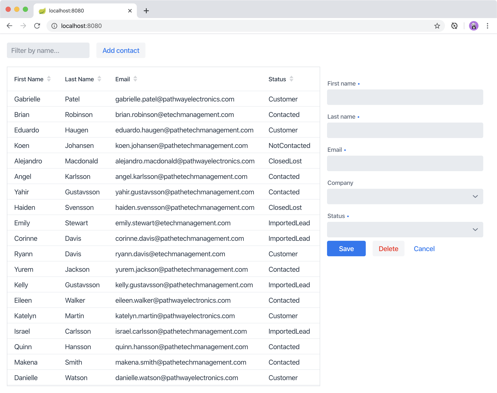

= Creating Reusable Components in Vaadin

In the previous chapter, you added filtering to the grid that lists contacts stored in a database. 
In this chapter, you build a form component to add, remove, and edit contacts. 

video::ttuBu8dYNn0[youtube]

Vaadin is a component-based framework. You've already worked with several components, like `Grid`, `TextField`, and `VerticalLayout`. 
But, the real power of the component-based architecture is in the ability to create your own components. 

Instead of building an entire view in a single class, your view can be composed of smaller components that each handle different parts of the view. 
The advantage of this approach is that individual components are easier to understand and test. 
The top-level view is used mainly to orchestrate the components. 

== Creating a Form Component

The form component has:

* Text fields for the first and last name.
* An email field.
* Two select fields: one to select the company and the other to select the contact status.
+

To create the form, copy the code below and paste it into the `ui` package. 
IntelliJ creates a new Java class, `ContactForm`. 

.`ContactForm.java`
[source,java]
----
public class ContactForm extends FormLayout { // <1>

  TextField firstName = new TextField("First name"); // <2>
  TextField lastName = new TextField("Last name");
  EmailField email = new EmailField("Email");
  ComboBox<Contact.Status> status = new ComboBox<>("Status");
  ComboBox<Company> company = new ComboBox<>("Company");

  Button save = new Button("Save"); // <3>
  Button delete = new Button("Delete");
  Button close = new Button("Cancel");

  public ContactForm() {
    addClassName("contact-form"); // <4>
    add(firstName,
        lastName,
        email,
        company,
        status,
        createButtonsLayout()); // <5>
  }

  private HorizontalLayout createButtonsLayout() {
    save.addThemeVariants(ButtonVariant.LUMO_PRIMARY); // <6>
    delete.addThemeVariants(ButtonVariant.LUMO_ERROR);
    close.addThemeVariants(ButtonVariant.LUMO_TERTIARY);

    save.addClickShortcut(Key.ENTER); // <7>
    close.addClickShortcut(Key.ESCAPE);

    return new HorizontalLayout(save, delete, close); // <8>
  }
}
----
<1> `ContactForm` extends `FormLayout`: a responsive layout that shows form fields in 1 or 2 columns depending on viewport width.
<2> Creates all the UI components as fields in the component.
<3> Uses the `com.vaadin.ui` import for `Button`, not the one from the `crud` package.
<4> Gives the component a CSS class name so you can style it later
<5> Adds all the UI components. 
The buttons require a bit of extra configuration. Create and call a new method, `createButtonsLayout()`.
<6> Makes the buttons visually distinct from each other using built-in https://vaadin.com/components/vaadin-button/html-examples/button-theme-variants-demos[theme variants].
<7> Defines keyboard shortcuts: `Enter` to save and `Escape` to close the editor
<8> Returns a `HorizontalLayout` containing the buttons to place them next to each other.

== Adding the Form to the Main View

The next step is to add the form to the main view.

To do this, amend `MainView` as follows:

.`MainView.java`
[source, java]
----
public class MainView extends VerticalLayout {
    private ContactService contactService;

    private Grid<Contact> grid = new Grid<>(Contact.class);
    private TextField filterText = new TextField();
    private ContactForm form;  // <1>

    public MainView(ContactService contactService) {
        this.contactService = contactService;
        addClassName("list-view");
        setSizeFull();

        configureGrid();
        configureFilter();

        form = new ContactForm(); // <2>

        Div content = new Div(grid, form); // <3>
        content.addClassName("content");
        content.setSizeFull();

        add(filterText, content); // <4>
        updateList();

    }
    // other methods omitted.
}
----
<1> Creates a field for the form so you have access to it from other methods later on.
<2> Initialize the form in the constructor.
<3> Creates a `Div` that wraps the `grid` and the `form`, gives it a CSS class name, and makes it full size.
<4> Adds the `content` layout to the main layout.

== Making the Layout Responsive

To make the layout responsive and usable on both mobile and desktop, we need to add CSS. 

To do this, replace the content of `<project root>/frontend/shared-styles.css` with  the following styles:

.`shared-styles.css`
[source,css]
----
/* List view */
.list-view .content {
    display: flex; /* <1> */
}

.list-view .contact-grid {
    flex: 2; /* <2> */
}

.list-view .contact-form {
    flex: 1;
    padding: var(--lumo-space-m);  /* <3> */
}

@media all and (max-width: 1100px) {  /* <4> */
    .list-view.editing .toolbar,
    .list-view.editing .contact-grid {
        display: none;
   }
}
----
<1> Uses https://developer.mozilla.org/en-US/docs/Learn/CSS/CSS_layout/Flexbox[CSS Flexbox] to manage the layout
<2> Allocates 2/3 of the available width to the grid and 1/3 to the form.
<3> Uses the https://cdn.vaadin.com/vaadin-lumo-styles/1.5.0/demo/sizing-and-spacing.html#custom-properties[Vaadin Lumo theme custom property],  `--lumo-space-m`,  to add standard padding in the form
<4> Hides the toolbar and grid when editing on narrow screens (we'll add some logic to handle this shortly).

== Importing CSS Styles Into the Main View

Next, load the CSS file by adding a `CssImport` annotation in `MainView`.

To add and load the new CSS styles:

. Amend `MainView` as follows:
+
.`MainView.java`
[source,java]
----
@Route("")
@CssImport("./styles/shared-styles.css") // <1>
public class MainView extends VerticalLayout {
    ...
}
----
<1> The import path needs to be relative to the `frontend` folder

. Stop and restart the server to ensure the CSS is loaded. 

. Verify that the main view looks the way it should. The form should now display next to the grid.
+

The visual part of the form is now complete. 
In the next tutorial, you'll make it functional.
