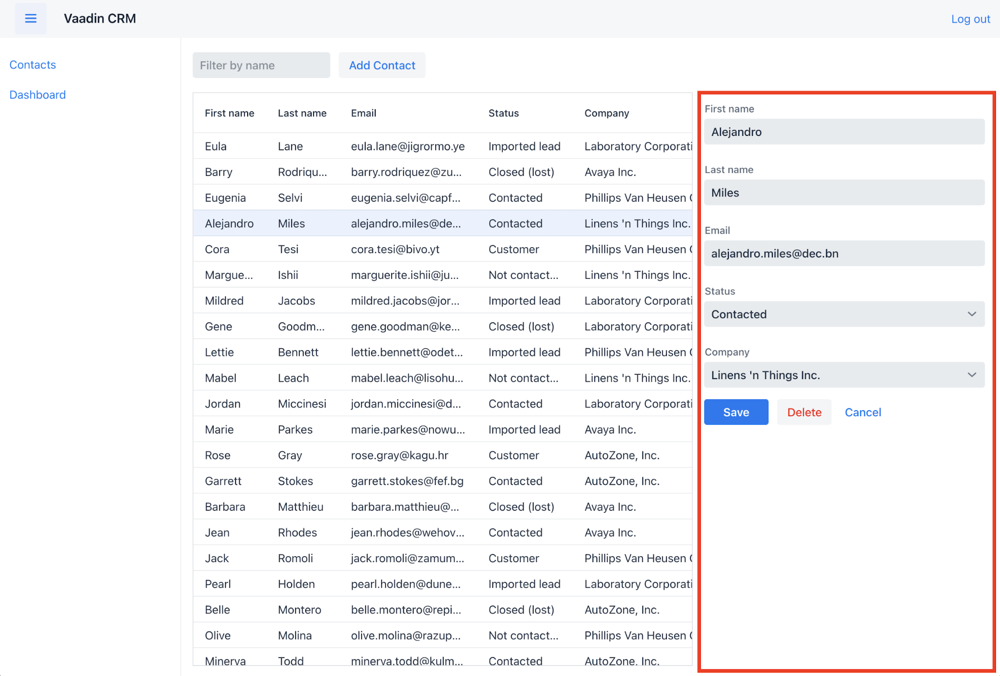

= Creating a Form Component for Editing Contacts

The list view now has a grid to display `Contact` objects. To complete the view, you need to create a form for editing contacts.

This chapter covers:

* Creating a new component.
* Importing and using a custom component.

== Creating Components Using Composition

Vaadin Flow is a component-based framework. 
You've already worked with several components, like `Grid`, `TextField`, and `VerticalLayout`.
But, the real power of the component-based architecture is in the ability to create your own components.

Instead of building an entire view in a single class, your view can be composed of smaller components that each handle different parts of the view.
The advantage of this approach is that individual components are easier to understand and test.
The top-level view is used mainly to orchestrate the components.

== Creating a Form Component

The form component you will create has:

* Text fields for the first and last name.
* An email field.
* Two select fields: one to select the company and the other to select the contact status.

Create a new file, `ContactForm.java`, in the `com.example.application.views.list` package. 
If you are using IntelliJ, copy the code below and paste it into the `views` package.
IntelliJ will automatically create the file.

image::images/creating-a-component/paste-file.png[Create a file automatically by pasting a class definition onto a Java package in IntelliJ IDEA.]

.`ContactForm.java`
[source,java]
----
package com.example.application.views.list;

import com.example.application.data.entity.Company;
import com.example.application.data.entity.Status;
import com.vaadin.flow.component.Key;
import com.vaadin.flow.component.button.Button;
import com.vaadin.flow.component.button.ButtonVariant;
import com.vaadin.flow.component.combobox.ComboBox;
import com.vaadin.flow.component.formlayout.FormLayout;
import com.vaadin.flow.component.orderedlayout.HorizontalLayout;
import com.vaadin.flow.component.textfield.EmailField;
import com.vaadin.flow.component.textfield.TextField;

import java.util.List;

public class ContactForm extends FormLayout { // <1>
  TextField firstName = new TextField("First name"); // <2>
  TextField lastName = new TextField("Last name");
  EmailField email = new EmailField("Email");
  ComboBox<Status> status = new ComboBox<>("Status");
  ComboBox<Company> company = new ComboBox<>("Company");

  Button save = new Button("Save");
  Button delete = new Button("Delete");
  Button close = new Button("Cancel");

  public ContactForm(List<Company> companies, List<Status> statuses) {
    addClassName("contact-form"); // <3>

    company.setItems(companies);
    company.setItemLabelGenerator(Company::getName);
    status.setItems(statuses);
    status.setItemLabelGenerator(Status::getName);

    add(firstName, // <4>
        lastName,
        email,
        company,
        status,
        createButtonsLayout()); 
  }

  private HorizontalLayout createButtonsLayout() {
    save.addThemeVariants(ButtonVariant.LUMO_PRIMARY); // <5>
    delete.addThemeVariants(ButtonVariant.LUMO_ERROR);
    close.addThemeVariants(ButtonVariant.LUMO_TERTIARY);

    save.addClickShortcut(Key.ENTER); // <6>
    close.addClickShortcut(Key.ESCAPE);
    
    return new HorizontalLayout(save, delete, close); // <7>
  }
}
----
<1> `ContactForm` extends `FormLayout`: a responsive layout that shows form fields in 1 or 2 columns depending on viewport width.
<2> Creates all the UI components as fields in the component.
<3> Gives the component a CSS class name, so you can style it later.
<4> Adds all the UI components to the layout.
+
The buttons require a bit of extra configuration. Create and call a new method, `createButtonsLayout()`.
<5> Makes the buttons visually distinct from each other using built-in https://vaadin.com/components/vaadin-button/html-examples/button-theme-variants-demos[theme variants].
<6> Defines keyboard shortcuts: `Enter` to save and `Escape` to close the editor.
<7> Returns a `HorizontalLayout` containing the buttons to place them next to each other.

== Adding the Form to the Main View

The next step is to add the form to the main view.

To do this, amend `ListView` as follows:

.`ListView.java`
[source, java]
----
public class ListView extends VerticalLayout {
    Grid<Contact> grid = new Grid<>(Contact.class);
    TextField filterText = new TextField();
    ContactForm form; // <1>

    public ListView() {
        addClassName("list-view");
        setSizeFull();
        configureGrid();
        configureForm(); // <2> 

        add(getToolbar(), getContent()); // <3> 
    }

    private Component getContent() {
        HorizontalLayout content = new HorizontalLayout(grid, form);
        content.setFlexGrow(2, grid); // <4>
        content.setFlexGrow(1, form);
        content.addClassNames("content");
        content.setSizeFull();
        return content;
    }

    private void configureForm() {
        form = new ContactForm(Collections.emptyList(), Collections.emptyList()); // <5>
        form.setWidth("25em");
    }

    // Remaining methods omitted
}
----
<1> Creates a field for the form, so you have access to it from other methods later on.
<2> Create a method for initializing the form.
<3> Change the `add()` method to call `getContent()`. The method returns a `HorizontalLayout` that wraps the form and the grid, showing them next to each other. 
<4> Use `setFlexGrow()` to define that the Grid should get two times the space of the form. 
<5> Initialize the form with empty company and status lists for now; you add these in the next chapter. 

Build the project to reload the browser.
You should now see the form on the right side of the grid. 

Now that you have the view built, it is time to connect it to the backend.

include::{articles}/flow/tutorials/in-depth-course/_ebook-banner.adoc[opts=optional]
