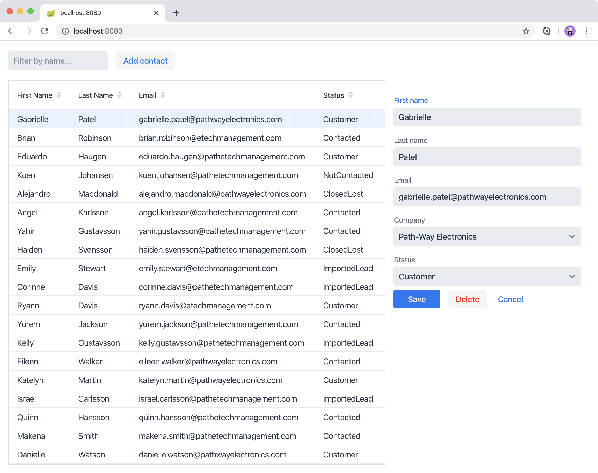
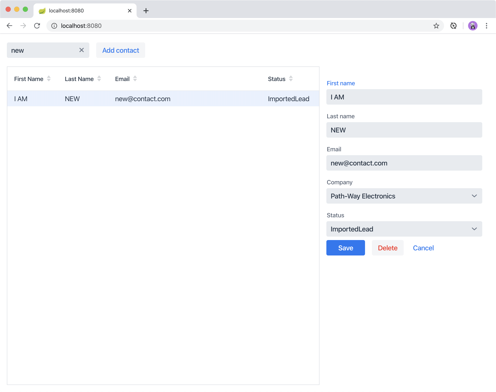

= Passing Data and Events Between Vaadin Components 

In the previous chapter, you created a reusable form component to edit contacts. 
In this tutorial you hook it up to the rest of the application. 
The form:

* Shows the selected contact in the grid.
* Is hidden when no contact is selected.
* Saves and deletes contacts in the database.

video::H86oKt5qbSs[youtube]

== Showing the Selected Contact in the Form

The first step is to show the selected grid row in the form. 

To do this, amend `MainView` as follows:

.`MainView.java`
[source,java]
----
public MainView(ContactService contactService,
                CompanyService companyService) {
    //omitted
    closeEditor(); <1>
}

private void configureGrid() {
  // Omitted

  grid.asSingleSelect().addValueChangeListener(event -> <2>
      editContact(event.getValue()));
}

public void editContact(Contact contact) { <3>
    if (contact == null) { 
        closeEditor();
    } else {
        form.setContact(contact);
        form.setVisible(true);
        addClassName("editing");
    }
}

private void closeEditor() {
    form.setContact(null);
    form.setVisible(false);
    removeClassName("editing");
}

// Remaining methods omitted
----
<1> The `closeEditor()` call at the end of the constructor
* Sets the form contact to `null`, clearing out old values.
* Hides the form.
* Removes the `"editing"` CSS class from the view. 
<2> `addValueChangeListener` adds a listener to the grid. The `Grid` component supports multi and single-selection modes. 
You only need to select a single `Contact`, so you can use the `asSingleSelect()` method. 
The `getValue()` method returns the `Contact` in the selected row or null if there’s no selection.
<3> `editContact` sets the selected contact in the `ContactForm` and hides or shows the form, depending on the selection. 
It also sets the `"editing"` CSS class name when editing.

Build the application. 
You should now be able to select contacts in the grid and see them in the form. 
But, none of the buttons work yet.

== Handling Form Events

The `ContactForm` API is designed to be reusable: it is configurable through properties and it fires the necessary events. 
At this point, you have passed a list of companies and the contact to the form. 
Now all you need to do is listen for the events to complete the integration. 

To handle event listeners, amend `MainView` as follows:

.`MainView.java`
[source,java]
----
public MainView(ContactService contactService,
              CompanyService companyService) {
    this.contactService = contactService;
    addClassName("list-view");
    setSizeFull();

    configureGrid();
    configureFilter();

    form = new ContactForm(companyService.findAll());
    form.addListener(ContactForm.SaveEvent.class, this::saveContact); <1>
    form.addListener(ContactForm.DeleteEvent.class, this::deleteContact); <2>
    form.addListener(ContactForm.CloseEvent.class, e -> closeEditor()); <3> 

    Div content = new Div(grid, form);
    content.addClassName("content");
    content.setSizeFull();

    add(filterText, content);
    updateList();
    closeEditor(); 
}

private void saveContact(ContactForm.SaveEvent event) {
    contactService.save(event.getContact());
    updateList();
    closeEditor();
}

private void deleteContact(ContactForm.DeleteEvent event) { 
    contactService.delete(event.getContact());
    updateList();
    closeEditor();
}
----
<1> Save calls `saveContact`, it:
.. Uses contactService to save the contact in the event to the database.
.. Updates the list.
.. Closes the editor.
<2> Delete calls `deleteContact`, it:
.. Uses `contactService` to delete the contact from the database.
.. Updates the list.
.. Closes the editor.
<3> Close closes the editor.

Build the application and verify that you are now able to update and delete contacts.

== Adding New Contacts

The final step is to add a button to add new contacts. 
Position the button next to the filter field.

. In `MainView`, create a `HorizontalLayout` that wraps the text field and the button, rename the `configureFilter` method to `getToolbar`, and replace its contents, as follows:
+
.`MainView.java`
[source,java]
----
private HorizontalLayout getToolbar() { <1> 
    filterText.setPlaceholder("Filter by name...");
    filterText.setClearButtonVisible(true);
    filterText.setValueChangeMode(ValueChangeMode.LAZY);
    filterText.addValueChangeListener(e -> updateList());

    Button addContactButton = new Button("Add contact");
    addContactButton.addClickListener(click -> addContact()); <2>

    HorizontalLayout toolbar = new HorizontalLayout(filterText, addContactButton); <3>
    toolbar.addClassName("toolbar");
    return toolbar;
  }
----
<1> Returns a `HorizontalLayout`.
<2> The `"Add contact"` button calls `addContact` when clicked.
<3> Adds a `HorizontalLayout` with the filter input field and a button, gives it a CSS class name `"toolbar"` that is used for the responsive layout.

. Define the `addContact()` method as follows:
+
.`MainView.java`
[source,java]
----
void addContact() {
    grid.asSingleSelect().clear(); <1>
    editContact(new Contact()); <2>
}
----
<1> Deselects the grid so that a previously selected `Contact` is no longer highlighted when the user adds a new contact.
<2> Creates a new `Contact` and passes it to `editContact`.

. Update the `MainView` constructor to use the new toolbar as follows:

.`MainView.java`
[source,java]
----
public MainView(ContactService contactService,
                  CompanyService companyService) {
      this.contactService = contactService;
      addClassName("list-view");
      setSizeFull();
      <1>
      configureGrid();

      form = new ContactForm(companyService.findAll());
      form.addListener(ContactForm.SaveEvent.class, this::saveContact);
      form.addListener(ContactForm.DeleteEvent.class, this::deleteContact);
      form.addListener(ContactForm.CloseEvent.class, e -> this.closeEditor());
      closeEditor();

      Div content = new Div(grid, form);
      content.addClassName("content");
      content.setSizeFull();

      add(getToolbar(), content); <2>
      updateList();
  }
----
<1> Removes the `configureFilter()` method call.
<2> Replaces the `filterText` component with a call to `getToolbar()`.

Build the application and verify that you are now able to add new contacts. 
New contacts are added at the end of the list, so you may need to scroll or use the filter to find them. 

In the next tutorial, you'll add a second screen to the application and learn how to navigate between views. 