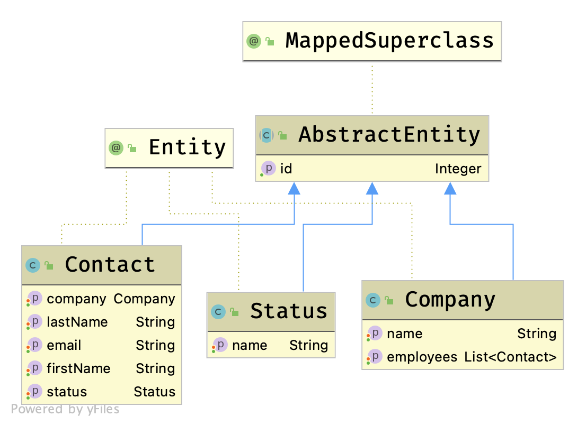
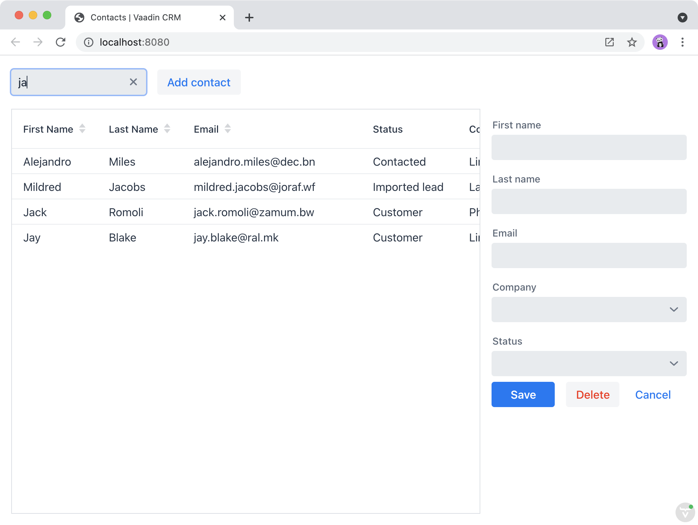

= Connecting the View to the Backend

In the previous chapter, you created the view using Vaadin components and layouts. 
In this chapter, you will connect the view to the backend to display and update data. 

You can find the backend code in the `src/main/java` directory. 

This chapter covers:

* Spring Boot.
* How to create a Spring Service for interfacing the backend.
* How to access a service from the view.

== An Introduction to Spring Boot

Vaadin uses https://spring.io/projects/spring-boot[Spring Boot^] on the server. 
Spring Boot is an opinionated, convention-over-configuration approach to creating Spring applications. 
Spring Boot automates much of the required configuration and manages an embedded Tomcat server, so you don't need to deploy the application to a separate server. 

In this tutorial, you use the following features that are configured by Spring Boot:

* https://spring.io/projects/spring-data[Spring Data^] for accessing the database through https://spring.io/projects/spring-data-jpa[JPA^] and Hibernate. 
* An embedded https://www.h2database.com/html/main.html[H2 Database^] for development, and https://www.postgresql.org[PostgreSQL] for production. 
* Spring Boot DevTools for automatic code reload.
* Embedded Tomcat server for deployment.
* https://spring.io/projects/spring-security[Spring Security^] for authenticating users.

== Backend Overview

The starter you downloaded contains the _entities_ and _repositories_ you need, along with a sample data generator. 

=== Domain Model: Entities

The Vaadin CRM application has three JPA entities that make up its domain model: `Contact`, `Company`, and `Status`. 
A contact belongs to a company and has a status. 

You can find the entities in the `com.example.application.data.entity` package. 

=== Database Access: Repositories

The application uses Spring Data JPA repositories for database access. 
Spring Data provides implementations of basic create, read, update, and delete (CRUD) database operations when you extend from the `JpaRepository` interface. 

You can find the repositories in the `com.example.application.data.service` package. 

=== Sample Data Generator

The `com.example.application.data.generator` package contains a sample data generator that populates the database with data. 
It uses `CommandLineRunner`, which Spring Boot runs when the application starts up. 

== Creating a Service for Accessing the Database

Instead of accessing the database directly from the view, you will create a Spring Service. 
The service class handles the application's business logic and, in larger applications, it will often transform database entities into data-transfer objects (DTO) for views. 
In this tutorial, you will create a single service that provides all the methods you need. 

Create a new class, `CrmService.java`, in the `data.service` package with the following content: 

.`CrmService.java`
[source,java]
----
package com.example.application.data.service;

import com.example.application.data.entity.Company;
import com.example.application.data.entity.Contact;
import com.example.application.data.entity.Status;
import com.example.application.data.repository.CompanyRepository;
import com.example.application.data.repository.ContactRepository;
import com.example.application.data.repository.StatusRepository;
import org.springframework.stereotype.Service;

import java.util.List;

@Service // <1>
public class CrmService {

    private final ContactRepository contactRepository;
    private final CompanyRepository companyRepository;
    private final StatusRepository statusRepository;

    public CrmService(ContactRepository contactRepository,
                      CompanyRepository companyRepository,
                      StatusRepository statusRepository) { // <2>
        this.contactRepository = contactRepository;
        this.companyRepository = companyRepository;
        this.statusRepository = statusRepository;
    }

    public List<Contact> findAllContacts(String stringFilter) {
        if (stringFilter == null || stringFilter.isEmpty()) { // <3>
            return contactRepository.findAll();
        } else {
            return contactRepository.search(stringFilter);
        }
    }

    public long countContacts() {
        return contactRepository.count();
    }

    public void deleteContact(Contact contact) {
        contactRepository.delete(contact);
    }

    public void saveContact(Contact contact) {
        if (contact == null) { // <4>
            System.err.println("Contact is null. Are you sure you have connected your form to the application?");
            return;
        }
        contactRepository.save(contact);
    }

    public List<Company> findAllCompanies() {
        return companyRepository.findAll();
    }

    public List<Status> findAllStatuses(){
        return statusRepository.findAll();
    }
}
----
<1> The `@Service` annotation will make this a Spring-managed service that you can inject into your view.  
<2> Use Spring constructor injection to autowire the database repositories.
<3> Check if there is an active filter, return either all contacts or use the repository to filter based on the string. 
<4> Service classes often include validation and other business rules before persisting data. 
Here, you check that you aren't accidentally trying to save a `null` object.

== Implementing Filtering in the Repository

Add the `search()` method to the contacts repository to provide the service class with the required method for filtering contacts.

.`ContactRepository.java`
[source,java]
----
public interface ContactRepository extends JpaRepository<Contact, Long> {

  @Query("select c from Contact c " +
      "where lower(c.firstName) like lower(concat('%', :searchTerm, '%')) " +
      "or lower(c.lastName) like lower(concat('%', :searchTerm, '%'))") // <1>
    List<Contact> search(@Param("searchTerm") String searchTerm); // <2>
}
----
<1> Uses the `@Query` annotation to define a custom query. In this case, it checks if the string matches the first or the last name, and ignores the case. The query uses https://en.wikipedia.org/wiki/Java_Persistence_Query_Language[Java Persistence Query Language (JPQL)] which is an SQL-like language for querying JPA-managed databases.

Note that you do not need to implement the method.
Spring Data will provide the implementation based on the query.

== Using the Backend Service From the View

You can now inject the `CrmService` into the list view to access the backend. 

.`ListView.java`
[source,java]
----
package com.example.application.views.list;

import com.example.application.data.entity.Contact;
import com.example.application.data.service.CrmService;
import com.vaadin.flow.component.Component;
import com.vaadin.flow.component.button.Button;
import com.vaadin.flow.component.grid.Grid;
import com.vaadin.flow.component.orderedlayout.HorizontalLayout;
import com.vaadin.flow.component.orderedlayout.VerticalLayout;
import com.vaadin.flow.component.textfield.TextField;
import com.vaadin.flow.data.value.ValueChangeMode;
import com.vaadin.flow.router.PageTitle;
import com.vaadin.flow.router.Route;

import java.util.Collections;

@Route(value = "")
@PageTitle("Contacts | Vaadin CRM")
public class ListView extends VerticalLayout {
    Grid<Contact> grid = new Grid<>(Contact.class);
    TextField filterText = new TextField();
    ContactForm form;
    CrmService service;

    public ListView(CrmService service) { // <1>
        this.service = service;
        addClassName("list-view");
        setSizeFull();
        configureGrid();
        configureForm();

        add(getToolbar(), getContent());
        updateList(); // <2>
    }

    private Component getContent() {
        HorizontalLayout content = new HorizontalLayout(grid, form);
        content.setFlexGrow(2, grid);
        content.setFlexGrow(1, form);
        content.addClassNames("content");
        content.setSizeFull();
        return content;
    }

    private void configureForm() {
        form = new ContactForm(service.findAllCompanies(), service.findAllStatuses()); // <3>
        form.setWidth("25em");
    }

    private void configureGrid() {
        grid.addClassNames("contact-grid");
        grid.setSizeFull();
        grid.setColumns("firstName", "lastName", "email");
        grid.addColumn(contact -> contact.getStatus().getName()).setHeader("Status");
        grid.addColumn(contact -> contact.getCompany().getName()).setHeader("Company");
        grid.getColumns().forEach(col -> col.setAutoWidth(true));
    }

    private HorizontalLayout getToolbar() {
        filterText.setPlaceholder("Filter by name...");
        filterText.setClearButtonVisible(true);
        filterText.setValueChangeMode(ValueChangeMode.LAZY);
        filterText.addValueChangeListener(e -> updateList()); // <4>

        Button addContactButton = new Button("Add contact");

        HorizontalLayout toolbar = new HorizontalLayout(filterText, addContactButton);
        toolbar.addClassName("toolbar");
        return toolbar;
    }

    private void updateList() { // <5>
        grid.setItems(service.findAllContacts(filterText.getValue()));
    }
}
----
<1> Autowire `CrmService` through the constructor. 
Save it in a field, so you can access it from other methods. 
<2> Call `updateList()` once you have constructed the view.
<3> Use the service to fetch companies and statuses.
<4> Call `updateList()` any time the filter changes.
<5> `updateList()` sets the grid items by calling the service with the value from the filter text field. 

Build the project, refresh the browser, and verify that you can now see contacts in the grid. 
Try filtering the contents by typing into the filter text field.

include::{root}/articles/flow/tutorials/in-depth-course/_ebook-banner.adoc[opts=optional]
