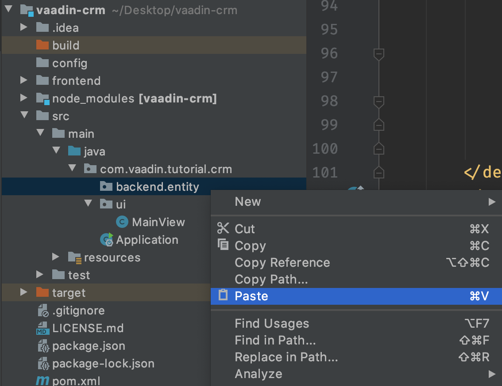

= Setting Up the Backend: Database, Entities, and Services

Most real-life applications need to persist and retrieve data from a database. 
In this tutorial, you use an in-memory H2 database. 
The final chapter shows you how to set up a MySQL database for production.

video::KepUsaX-yag[youtube]

== Installing the Database Dependencies

The applications uses Spring Data for data access. 
Under the hood, Spring Data uses Hibernate to map Java objects to database entities through the Java Persistence API (JPA). 
Spring Boot takes care of configuring all these tools. 

To add database dependencies:

. In the `<dependencies>` tag in your `pom.xml` file, add the following dependencies for H2 and Spring Data:
+
.`pom.xml`
[source,xml]
----
<dependencies>
  <!--all existing dependencies -->
  
  <!--database dependencies -->
  <dependency>
    <groupId>org.springframework.boot</groupId>
    <artifactId>spring-boot-starter-data-jpa</artifactId>
  </dependency>
  <dependency>
    <groupId>com.h2database</groupId>
    <artifactId>h2</artifactId>
    <scope>runtime</scope>
  </dependency>
</dependencies>
----

. Save your file and when IntelliJ asks if you want to enable automatic importing of Maven dependencies, select Enable Auto Import.
+

+
If IntelliJ doesn't ask you to import dependencies, or if you use another IDE, type `mvn install` in the command line (while in the root of your project folder) to download the dependencies.

.Using MySQL or PostgreSQL instead of H2
[NOTE]
====
H2 is a great database for tutorials because you don't need to install external software. 
If you prefer, you can change to another database. 
See:

* https://dzone.com/articles/how-to-connect-a-mysql-database-to-a-vaadin-applic[Setting up MySQL]
* https://www.mkyong.com/spring-boot/spring-boot-spring-data-jpa-postgresql/[Setting up PostgreSQL]
====

The instructions in the remainder of this tutorial are the same, regardless of which database you use. 
To keep things simple, use H2. 

== Defining the Data Model

The application you are building is a customer relationship management (CRM) system that manages contacts and companies. 
To map content to the database, you need to create the following entity classes: 

* `Contact`: An employee at a company.
* `Company`: An entity that can have several employees.
* `AbstractEntity`: A common superclass for both.

To create your entity classes:

. Create a new package: `com.vaadin.tutorial.crm.backend.entity`.
. Create three classes, `AbstractEntity`, `Contact`, and `Company`, in the new package, using the code detailed below.
+
The easiest way to do this is to copy the full class and paste it into the package in the project view. 
IntelliJ (and most other IDEs) automatically create the Java file for you.
+

+
.. Start by adding `AbstractEntity`, the common superclass. 
It defines how objects ids are generated and how object equality is determined. 
+
.`AbstractEntity.java`
[source,java]
----
package com.vaadin.tutorial.crm.backend.entity;

import javax.persistence.GeneratedValue;
import javax.persistence.GenerationType;
import javax.persistence.Id;
import javax.persistence.MappedSuperclass;

@MappedSuperclass
public abstract class AbstractEntity {
  @Id
  @GeneratedValue(strategy= GenerationType.SEQUENCE)
  private Long id;

  public Long getId() {
    return id;
  }

  public boolean isPersisted() {
    return id != null;
  }

  @Override
  public int hashCode() {
    if (getId() != null) {
      return getId().hashCode();
    }
    return super.hashCode();
  }

  @Override
  public boolean equals(Object obj) {
    if (this == obj) {
      return true;
    }
    if (obj == null) {
      return false;
    }
    if (getClass() != obj.getClass()) {
      return false;
    }
    AbstractEntity other = (AbstractEntity) obj;
 if (getId() == null || other.getId() == null) {
      return false;
    }
    return getId().equals(other.getId());
  }
}
----

.. Next, create the `Contact` class:
+
.`Contact.java`
[source,java]
----
package com.vaadin.tutorial.crm.backend.entity;

import javax.persistence.*;
import javax.validation.constraints.Email;
import javax.validation.constraints.NotEmpty;
import javax.validation.constraints.NotNull;

@Entity
public class Contact extends AbstractEntity implements Cloneable {

  public enum Status {
    ImportedLead, NotContacted, Contacted, Customer, ClosedLost
  }

  @NotNull
  @NotEmpty
  private String firstName = "";

  @NotNull
  @NotEmpty
  private String lastName = "";

  @ManyToOne
  @JoinColumn(name = "company_id")
  private Company company;

  @Enumerated(EnumType.STRING)
  @NotNull
  private Contact.Status status;

  @Email
  @NotNull
  @NotEmpty
  private String email = "";

  public String getEmail() {
    return email;
  }

  public void setEmail(String email) {
    this.email = email;
  }

  public Status getStatus() {
    return status;
  }

  public void setStatus(Status status) {
    this.status = status;
  }

  public String getLastName() {
    return lastName;
  }

  public void setLastName(String lastName) {
    this.lastName = lastName;
  }

  public String getFirstName() {
    return firstName;
  }

  public void setFirstName(String firstName) {
    this.firstName = firstName;
  }

  public void setCompany(Company company) {
    this.company = company;
  }

  public Company getCompany() {
    return company;
  }

  @Override
  public String toString() {
    return firstName + " " + lastName;
  }

}
----

+

.. Lastly, copy over the `Company` class:
+
.`Company.java`
[source, java]
----
package com.vaadin.tutorial.crm.backend.entity;

import javax.persistence.*;
import java.util.LinkedList;
import java.util.List;

@Entity
public class Company extends AbstractEntity {
  private String name;

  @OneToMany(mappedBy = "company", fetch = FetchType.EAGER)
  private List<Contact> employees = new LinkedList<>();

  public Company() {
  }

  public Company(String name) {
    setName(name);
  }

  public String getName() {
    return name;
  }

  public void setName(String name) {
    this.name = name;
  }

  public List<Contact> getEmployees() {
    return employees;
  }
}
----

. Verify that you're able to build the project. 
+
If you see errors about missing classes, double check the Maven dependencies and run `mvn install` to make sure they are downloaded.

== Creating Repositories to Access the Database

Now that you have defined the data model, the next step is to create repository classes to access the database. 
Spring Boot makes this a painless process. 
All you need to do is define an interface that describes the entity type and primary key type, and Spring Data configures it for you. 

To create your repository classes: 

. Create a new package `com.vaadin.tutorial.crm.backend.repository`. 

. Copy the following two repository classes into the package:
+
.`ContactRepository.java`
[source, java]
----
package com.vaadin.tutorial.crm.backend.repository;

import com.vaadin.tutorial.crm.backend.entity.Contact;
import org.springframework.data.jpa.repository.JpaRepository;
import org.springframework.data.jpa.repository.Query;
import org.springframework.data.repository.query.Param;

import java.util.List;

public interface ContactRepository extends JpaRepository<Contact, Long> {

}
----
+
.`*CompanyRepository.java*`
[source,java]
----
package com.vaadin.tutorial.crm.backend.repository;

import com.vaadin.tutorial.crm.backend.entity.Company;
import org.springframework.data.jpa.repository.JpaRepository;

public interface CompanyRepository extends JpaRepository<Company, Long> {
}
----

== Creating Service Classes for Business Logic

It's good practice to not let UI code access the database directly. 
Instead, create service classes that handle business logic and database access. 
This makes it easier for you to control access and to keep your data consistent.

To create your service classes:

. Create a new package `com.vaadin.tutorial.crm.backend.service`. 

. Copy the following two service classes into the package:
+
.`ContactService.java`
[source,java]
----
package com.vaadin.tutorial.crm.backend.service;

import com.vaadin.tutorial.crm.backend.entity.Contact;
import com.vaadin.tutorial.crm.backend.repository.CompanyRepository;
import com.vaadin.tutorial.crm.backend.repository.ContactRepository;
import org.springframework.stereotype.Service;

import java.util.List;
import java.util.logging.Level;
import java.util.logging.Logger;

@Service // <1>
public class ContactService {
	private static final Logger LOGGER = Logger.getLogger(ContactService.class.getName());
	private ContactRepository contactRepository;
	private CompanyRepository companyRepository;

	public ContactService(ContactRepository contactRepository,
												CompanyRepository companyRepository) { // <2>
		this.contactRepository = contactRepository;
		this.companyRepository = companyRepository;
	}

	public List<Contact> findAll() { 
		return contactRepository.findAll(); 
	}

	public long count() {
		return contactRepository.count();
	}

	public void delete(Contact contact) {
		contactRepository.delete(contact);
	}

	public void save(Contact contact) {
		if (contact == null) { // <3>
			LOGGER.log(Level.SEVERE,
					"Contact is null. Are you sure you have connected your form to the application?");
			return;
		}
		contactRepository.save(contact);
	}
}
----
+
<1> The `@Service` annotation lets Spring know that this is a service class and makes it available for injection. 
This allows you to use it from your UI code later on.
<2> The constructor takes 2 parameters: `ContactRepository` and `CompanyRepository`. 
Spring provides instances based on the interfaces you defined earlier. 
<3> For now, most operations are just passed through to the repository. 
The only exception is the `save` method, which checks for null values before attempting to save.

.`CompanyService.java`
[source,java]
----
package com.vaadin.tutorial.crm.backend.service;

import com.vaadin.tutorial.crm.backend.entity.Company;
import com.vaadin.tutorial.crm.backend.repository.CompanyRepository;
import org.springframework.stereotype.Service;

import java.util.HashMap;
import java.util.List;
import java.util.Map;

@Service
public class CompanyService {

  private CompanyRepository companyRepository;

  public CompanyService(CompanyRepository companyRepository) {
    this.companyRepository = companyRepository;
  }

  public List<Company> findAll() {
    return companyRepository.findAll();
  }

}
----

== Populating the Database With Test Data

Next, add a method that generates test data to populate the database. 
This makes it easier to work with the application. 

To do this, add the following method at the end of `ContactService`:

.`ContactService.java`
[source,java]
----
@PostConstruct // <1>
public void populateTestData() {
	if (companyRepository.count() == 0) {
		companyRepository.saveAll( // <2>
			Stream.of("Path-Way Electronics", "E-Tech Management", "Path-E-Tech Management")
				.map(Company::new)
				.collect(Collectors.toList()));
	}

	if (contactRepository.count() == 0) {
		Random r = new Random(0);
		List<Company> companies = companyRepository.findAll();
		contactRepository.saveAll( // <3>
			Stream.of("Gabrielle Patel", "Brian Robinson", "Eduardo Haugen",
				"Koen Johansen", "Alejandro Macdonald", "Angel Karlsson", "Yahir Gustavsson", "Haiden Svensson",
				"Emily Stewart", "Corinne Davis", "Ryann Davis", "Yurem Jackson", "Kelly Gustavsson",
				"Eileen Walker", "Katelyn Martin", "Israel Carlsson", "Quinn Hansson", "Makena Smith",
				"Danielle Watson", "Leland Harris", "Gunner Karlsen", "Jamar Olsson", "Lara Martin",
				"Ann Andersson", "Remington Andersson", "Rene Carlsson", "Elvis Olsen", "Solomon Olsen",
				"Jaydan Jackson", "Bernard Nilsen")
				.map(name -> {
					String[] split = name.split(" ");
					Contact contact = new Contact();
					contact.setFirstName(split[0]);
					contact.setLastName(split[1]);
					contact.setCompany(companies.get(r.nextInt(companies.size())));
					contact.setStatus(Contact.Status.values()[r.nextInt(Contact.Status.values().length)]);
					String email = (contact.getFirstName() + "." + contact.getLastName() + "@" + contact.getCompany().getName().replaceAll("[\\s-]", "") + ".com").toLowerCase();
					contact.setEmail(email);
					return contact;
				}).collect(Collectors.toList()));
	}
}
----

<1> The @PostConstruct annotation tells Spring to run this method after constructing ContactService.
<2> Creates 3 test companies.
<3> Creates test contacts.

== Restart the Server to Pick Up All the New Dependencies

You need to stop and restart the application to make sure all the new POM dependencies are picked up.

In the next chapter, you'll use the backend to populate data into a data grid in the browser.

include::{root}/articles/flow/tutorials/in-depth-course/_ebook-banner.adoc[opts=optional]
