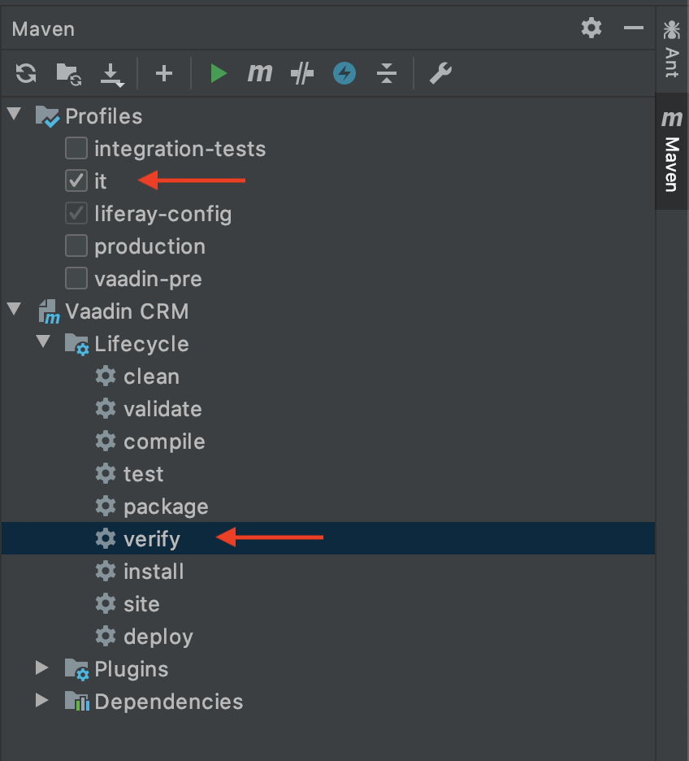
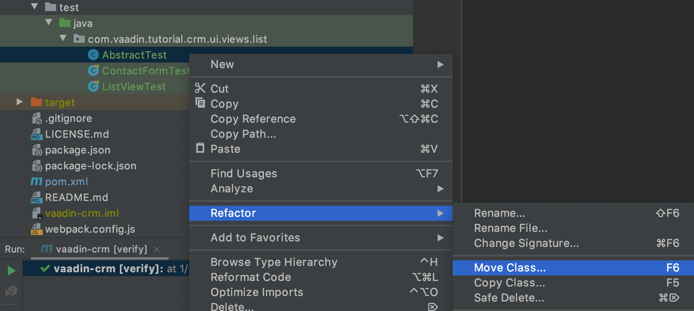
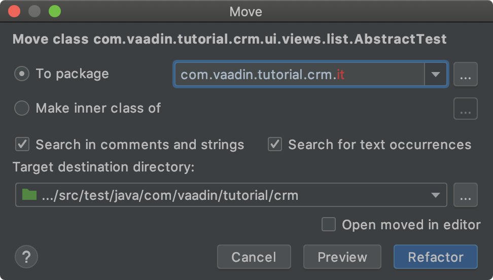
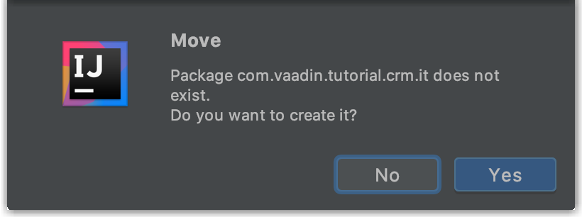

= Testing Vaadin Applications in the Browser With End-To-End Tests

End-to-end (e2e) tests are used to test the entire application.
They're far more coarse grained than unit or integration tests.
This makes them well suited to check that the application works as a whole, and to catch any regressions that may be missed by more specific tests.

End-to-end tests are executed in a browser window, controlled by a web driver and run on the server where the application is deployed.
You need to setup 3 things:

. Configure Maven to start the Spring Boot server before running tests and to stop it afterwards.
. Make sure you have Chrome installed and install a web driver manager that will download the needed web driver.
. Create a base test class that starts a browser and opens the application URL.

video::W-IT96DX8WI[youtube]

.Vaadin TestBench is a commercial product
[NOTE]
====
The end-to-end tests use https://vaadin.com/testbench[Vaadin TestBench], which is a commercial tool that is a part of the Vaadin Pro Subscription.
You can get a free trial at https://vaadin.com/trial?utm_source=github+vaadin.
All Vaadin Pro tools and components are free for students through the https://education.github.com/pack[GitHub Student Developer Pack].
====

== Configuring Maven to Start the Server

To run integration tests, you need to make sure that the Maven configuration starts and stops Spring Boot at the proper times.
If you configure this as a separate profile in your `pom.xml`, you can easily skip running the tests.

In you `pom.xml`, remove the existing `integration-test` profile and add the following profile:

.`pom.xml`
[source,xml]
----
    <profile>
      <id>it</id>
    <build>
        <plugins>
          <plugin>
            <groupId>org.springframework.boot</groupId>
            <artifactId>spring-boot-maven-plugin</artifactId>
            <executions>
              <execution>
                <id>start-spring-boot</id>
                <phase>pre-integration-test</phase>
                <goals>
                  <goal>start</goal>
                </goals>
              </execution>
              <execution>
                <id>stop-spring-boot</id>
                <phase>post-integration-test</phase>
                <goals>
                  <goal>stop</goal>
                </goals>
              </execution>
            </executions>
          </plugin>
          <!-- Runs the integration tests (*IT) after the server is started -->
          <plugin>
            <groupId>org.apache.maven.plugins</groupId>
            <artifactId>maven-failsafe-plugin</artifactId>
            <executions>
              <execution>
                <goals>
                  <goal>integration-test</goal>
                  <goal>verify</goal>
                </goals>
              </execution>
            </executions>
            <configuration>
              <trimStackTrace>false</trimStackTrace>
              <enableAssertions>true</enableAssertions>
            </configuration>
          </plugin>
        </plugins>
      </build>
    </profile>
----

Integration tests are run by executing `mvn -Pit verify` from the command line, or by selecting the `it` profile and running the verify goal from the Maven menu in IntelliJ.

The `pre-integration-test` and `post-integration-test` executions take care of starting and stopping Spring Boot before the `integration test` phase of the build is executed.
In the `integration test` phase, the `maven-failsafe-plugin` runs any tests named `*IT.java` found  in `src/test/java`.
You should set the `trimStackTrace` option to `false` to print full stack traces and ease debugging.

== Setting up Chrome and Its WebDriver to Control the Browser

For browser tests to work, you need Chrome installed on the computer that runs the tests.

To avoid installing the web driver manually, add a dependency to `webdrivermanager` in your `pom.xml`:

.`pom.xml`
[source,xml]
----
<dependency>
    <groupId>io.github.bonigarcia</groupId>
    <artifactId>webdrivermanager</artifactId>
    <version>3.7.1</version>
    <scope>test</scope>
</dependency>
----

* This is used from the JUnit test class and downloads the correct version of the Chrome web driver, if it is missing.

== Creating the Base Test Class

To avoid repetition in each test class, it is a good idea to put common logic in an abstract class and have all tests extend this class.
Most of the heavy lifting about starting browsers etc. is handled by `ParallelTest` in TestBench, but there are a couple of useful things you can add to the abstract class.

. Create a new class, `AbstractTest`. Be sure to place it in `src/test/java` and not `src/main/java`.
+
Note that IntelliJ collapses empty packages by default, so it's easiest to first create the class in the existing test package, and then move it to the correct package.
+

+

+

+
.`AbstractTest.java`
[source,java]
----
package com.vaadin.tutorial.crm.it;

public abstract class AbstractTest extends ParallelTest {
    @BeforeClass
    public static void setupClass() {
        WebDriverManager.chromedriver().setup(); // <1>
    }

    @Rule
    public ScreenshotOnFailureRule rule = new ScreenshotOnFailureRule(this, true); // <2>
}
----
+
<1> Start by invoking the `WebDriverManager` before any test method is invoked.
TestBench does not invoke the web driver manager.
<2> `ScreenshotOnFailureRule` tells TestBench to grab a screenshot before exiting, if a test fails.
This helps you understand what went wrong when tests do not pass.

. Next, add the application URL that the tests should open before trying to interact with the application.
For this you need the host name where the application runs ("localhost" in development), the port the server uses (set to 8080 in application.properties), and information about the route to start from.
+
.`AbstractTest.java`
[source,java]
----
    private static final String SERVER_HOST = IPAddress.findSiteLocalAddress();
    private static final int SERVER_PORT = 8080;
    private final String route;

    @Before
    public void setup() throws Exception {
        super.setup();
        getDriver().get(getURL(route)); // Opens the given URL in the browser
    }

    protected AbstractTest(String route) {
        this.route = route;
    }

    private static String getURL(String route) {
        return String.format("http://%s:%d/%s", SERVER_HOST, SERVER_PORT, route);
    }
----

. To avoid excessive logging from `WebDriverManager` when running the tests, add the following workaround:
+
.`*AbstractTest.java*`
[source,java]
----
	static {
		// Prevent debug logging from Apache HTTP client
		Logger root = (Logger) LoggerFactory.getLogger(Logger.ROOT_LOGGER_NAME);
		root.setLevel(Level.INFO);
    }
----

. Select the following Logger dependencies:
.. `org.slf4j.LoggerFactory`
.. `ch.qos.logback.classic.Level`
.. `ch.qos.logback.classic.Logger`

== Testing the Login View

Now that your setup is complete, you can start developing your first test: ensuring that a user can log in.
For this test you need to open the base URL.

. Create a new class, `LoginIT`, in the same package as `AbstractTest`:
+
.`*LoginIT.java*`
[source,java]
----
package com.vaadin.tutorial.crm.it;

public class LoginIT extends AbstractTest {
    public LoginIT() {
        super("");
    }
}
----
+
.Make sure tests have the correct name
[NOTE]
====
The name of the class should end in `IT` for the test runner to pick it up as an integration test.
If you name it `LoginTest` instead, it will be run as a unit test and the server will not be started and the test will fail.
====
+
. Add an `@Test` method to validate that you can log in as "user":
+
.`LoginIT.java`
[source,java]
----
    @Test
    public void loginAsValidUserSucceeds() {
        // Find the LoginForm used on the page
        LoginFormElement form = $(LoginFormElement.class).first();
        // Enter the credentials and log in
        form.getUsernameField().setValue("user");
        form.getPasswordField().setValue("password");
        form.getSubmitButton().click();
        // Ensure the login form is no longer visible
        Assert.assertFalse($(LoginFormElement.class).exists());
    }
----
+
.Start the server separately to speed up tests
[TIP]
====
While developing tests it is not very efficient to run the tests as `mvn -Pit verify`.
Instead, you can start the server manually by launching the `Application` class or with `spring-boot:run`.
You can then execute the selected test in your IDE and you do not have to wait for the server to start every time.
====
+
. Start the application normally, then right click `LoginIT.java` and select *Run 'LoginIT'*.
+
The first time you run the test, you will be asked to start a trial or validate your existing license. Follow the instructions in the browser window that opens.

== Creating a View Object

You can now add a second test: validating that you cannot log in with an invalid password.

For this text, you need to write the same code to access the components in the view, as you did for the first test.
To make your tests more maintainable, you can create a view object (a.k.a. call page object or element class) for each view.
A view object provides a high-level API to interact with the view and hides the implementation details.

. For the login view, create the `LoginViewElement` class in a new package, `com.vaadin.tutorial.crm.it.elements.login`:
+
.`LoginViewElement.java`
[source,java]
----
package com.vaadin.tutorial.crm.it.elements.login;

@Attribute(name = "class", contains = "login-view") // <1>
public class LoginViewElement extends VerticalLayoutElement {

    public boolean login(String username, String password) {
        LoginFormElement form = $(LoginFormElement.class).first();
        form.getUsernameField().setValue(username);
        form.getPasswordField().setValue(password);
        form.getSubmitButton().click();

        // Return true if we end up on another page
        return !$(LoginViewElement.class).onPage().exists();
    }

}
----
<1> Selects the `com.vaadin.testbench.annotations.Attribute` import.
+
.Class hierarchies must match
[CAUTION]
====
To make the correct functionality available from super classes, the hierarchy of the view object should match the hierarchy of the view (`public class LoginView extends VerticalLayout` vs `public class LoginViewElement extends VerticalLayoutElement`).
====
+
.. Adding the `@Attribute(name = "class", contains = "login-view")` annotation allows you to find the `LoginViewElement` using the TestBench query API, for example:
+
[source,java]
----
LoginViewElement loginView = $(LoginViewElement.class).onPage().first();
----
+
The annotation searches for the `login-view` class name, which is set for the login view in the constructor.
The `onPage()` call ensures that the whole page is searched.
By default a `$` query starts from the active element.

. Now that the `LoginViewElement` class is available, you can refactor your `loginAsValidUserSucceeds` test to be:
+
.`LoginIT.java`
[source,java]
----
@Test
public void loginAsValidUserSucceeds() {
    LoginViewElement loginView = $(LoginViewElement.class).onPage().first();
    Assert.assertTrue(loginView.login("user", "password"));
}
----

. Add a test to use an invalid password as follows:
+
.`LoginIT.java`
[source,java]
----
@Test
public void loginAsInvalidUserFails() {
    LoginViewElement loginView = $(LoginViewElement.class).onPage().first();
    Assert.assertFalse(loginView.login("user", "invalid"));
}
----

. Continue testing the other views by creating similar view objects and IT classes.

The next chapter covers how to make a production build of the application and deploy it to a cloud platform.

include::{root}/articles/flow/tutorials/in-depth-course/_ebook-banner.adoc[opts=optional]
