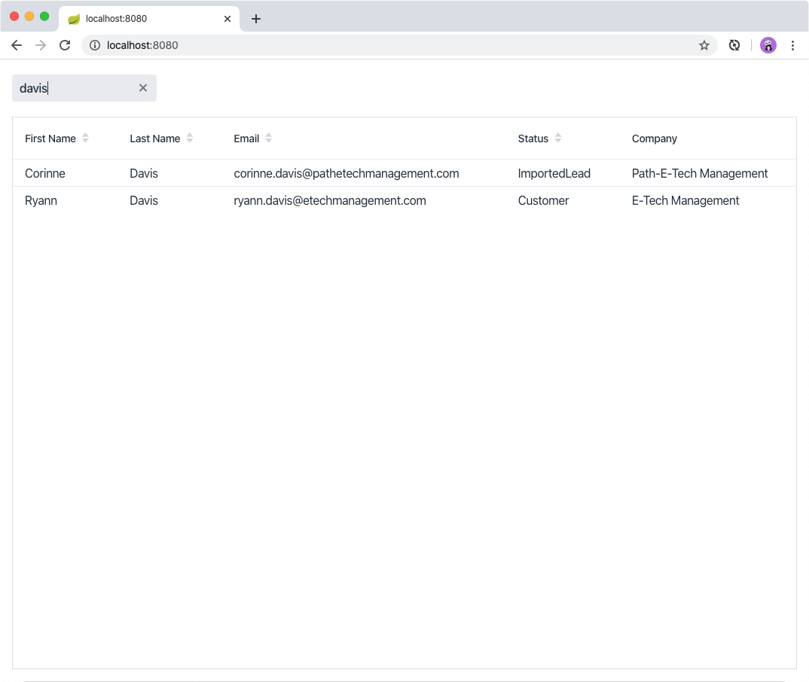

= Filtering Rows in Vaadin Grid

In the previous chapter, you created a data grid and filled it with contact details stored in the database. 
In this tutorial, you continue by adding a text field to filter the contents of the grid.

video::Ty3dhCkQP1E[youtube]

== Adding a Text Field For Filtering

Start by adding a text field above the grid. 
Remember, `MainView` is a `VerticalLayout`, so you need to add the text field before the grid.

.`MainView.java`
[source,java]
----
public class MainView extends VerticalLayout {
    private ContactService contactService;

    private Grid<Contact> grid = new Grid<>(Contact.class);
    private TextField filterText = new TextField(); // <1>

    public MainView(ContactService contactService) {
        this.contactService = contactService;
        addClassName("list-view");
        setSizeFull();
        configureFilter(); // <2> 
        configureGrid(); 

        add(filterText, grid); // <3> 
        updateList();
    }

    private void configureFilter() {
        filterText.setPlaceholder("Filter by name..."); // <4>
        filterText.setClearButtonVisible(true); // <5> 
        filterText.setValueChangeMode(ValueChangeMode.LAZY); // <6>
        filterText.addValueChangeListener(e -> updateList()); // <7>
    }
    // Grid configuration omitted
}
----
<1> Creates a field for the `TextField`.
<2> Calls the `configureFilter()` method to configure what the filter should do.
<3> Updates the `add()` method call to add both `filterText` and `grid`.
<4> Sets placeholder text so users know what to type in the field.
<5> Sets the clear button to visible so users can easily clear the filter.
<6> Sets the value change mode to `LAZY` so the text field will notify you of changes automatically after a short timeout in typing.
<7> Calls the `updateList` method whenever the value changes. You will update the logic to filter the content shortly.

== Implementing Filtering in the Backend

You can implement the filtering in two ways:

. Keep a copy of the contacts list in the view and filter it using Java streams.
. Defer the filtering to the backend (database).

It's a best practice to avoid keeping references to lists of objects in Vaadin views, as this can lead to excessive memory usage. 

Add filtering support to the back end:

. Amend `ContactService` as follows:
+
.`ContactService.java`
[source,java]
----
public class ContactService {
	private static final Logger LOGGER = Logger.getLogger(ContactService.class.getName());
	private ContactRepository contactRepository;
	private CompanyRepository companyRepository;

	public ContactService(ContactRepository contactRepository,
												CompanyRepository companyRepository) {
		this.contactRepository = contactRepository;
		this.companyRepository = companyRepository;
	}

	public List<Contact> findAll() {
		return contactRepository.findAll();
	}

	public List<Contact> findAll(String stringFilter) { // <1> 
		if (stringFilter == null || stringFilter.isEmpty()) { // <2>
			return contactRepository.findAll();
		} else {
			return contactRepository.search(stringFilter); // <3>
		}
	}

  // remaining methods omitted
}
----
<1> Adds a new `findAll` method that takes a filter text as a parameter. 
<2> If the filter text is  empty, return all contacts.
<3> Otherwise, search the database for that text.

. Add the `search` method to the contacts repository.
+
.`ContactRepository.java`
[source,java]
----
public interface ContactRepository extends JpaRepository<Contact, Long> {

  @Query("select c from Contact c " +
      "where lower(c.firstName) like lower(concat('%', :searchTerm, '%')) " +
      "or lower(c.lastName) like lower(concat('%', :searchTerm, '%'))") // <1>
    List<Contact> search(@Param("searchTerm") String searchTerm); // <2>
}
----
<1> Uses the `@Query` annotation to define a custom query. In this case, it checks if the string matches the first or the last name, and ignores the case. The query uses https://en.wikipedia.org/wiki/Java_Persistence_Query_Language[Java Persistence Query Language (JPQL)] which is an SQL-like language for querying JPA managed databases.
<2> Selects the Spring Framework import for `@Param`. 

. Update the way `MainView` updates the contacts. 
This is the method that is called every time the filter text field changes.
+
.`MainView.java`
[source,java]
----
private void updateList() {
    grid.setItems(contactService.findAll(filterText.getValue()));
}
----
. Build the application and try out the filtering. 
You should be able to filter the contacts by entering a term in the text field. 
+

