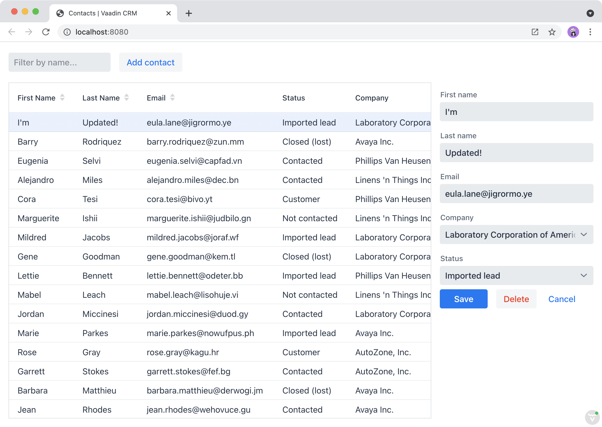

= Passing Data and Events Between Vaadin Components

In the previous chapter, you created a reusable form component to edit contacts.
In this chapter, you hook it up to the rest of the view and manage the view state. 
The form:

* Shows the selected contact in the grid.
* Is hidden when no contact is selected.
* Saves and deletes contacts in the database.

== Showing the Selected Contact in the Form

The first step is to show the selected grid row in the form.

To do this, update `ListView` as follows:

.`ListView.java`
[source,java]
----
package com.example.application.views.list;

import com.example.application.data.entity.Contact;
import com.example.application.data.service.CrmService;
import com.vaadin.flow.component.button.Button;
import com.vaadin.flow.component.grid.Grid;
import com.vaadin.flow.component.orderedlayout.HorizontalLayout;
import com.vaadin.flow.component.orderedlayout.VerticalLayout;
import com.vaadin.flow.component.textfield.TextField;
import com.vaadin.flow.data.value.ValueChangeMode;
import com.vaadin.flow.router.PageTitle;
import com.vaadin.flow.router.Route;

@Route(value = "")
@PageTitle("Contacts | Vaadin CRM")
public class ListView extends VerticalLayout {
    Grid<Contact> grid = new Grid<>(Contact.class);
    TextField filterText = new TextField();
    ContactForm form;
    CrmService service;

    public ListView(CrmService service) {
        this.service = service;
        addClassName("list-view");
        setSizeFull();
        configureGrid();
        configureForm();

        add(getToolbar(), getContent());
        updateList();
        closeEditor(); // <1>
    }

    private HorizontalLayout getContent() {
        HorizontalLayout content = new HorizontalLayout(grid, form);
        content.setFlexGrow(2, grid);
        content.setFlexGrow(1, form);
        content.addClassNames("content");
        content.setSizeFull();
        return content;
    }

    private void configureForm() {
        form = new ContactForm(service.findAllCompanies(), service.findAllStatuses());
        form.setWidth("25em");
    }

    private void configureGrid() {
        grid.addClassNames("contact-grid");
        grid.setSizeFull();
        grid.setColumns("firstName", "lastName", "email");
        grid.addColumn(contact -> contact.getStatus().getName()).setHeader("Status");
        grid.addColumn(contact -> contact.getCompany().getName()).setHeader("Company");
        grid.getColumns().forEach(col -> col.setAutoWidth(true));

        grid.asSingleSelect().addValueChangeListener(event ->
            editContact(event.getValue())); // <2>
    }

    private HorizontalLayout getToolbar() {
        filterText.setPlaceholder("Filter by name...");
        filterText.setClearButtonVisible(true);
        filterText.setValueChangeMode(ValueChangeMode.LAZY);
        filterText.addValueChangeListener(e -> updateList());

        Button addContactButton = new Button("Add contact");
        addContactButton.addClickListener(click -> addContact()); // <3>

        HorizontalLayout toolbar = new HorizontalLayout(filterText, addContactButton);
        toolbar.addClassName("toolbar");
        return toolbar;
    }

    public void editContact(Contact contact) { // <4>
        if (contact == null) {
            closeEditor();
        } else {
            form.setContact(contact);
            form.setVisible(true);
            addClassName("editing");
        }
    }

    private void closeEditor() {
        form.setContact(null);
        form.setVisible(false);
        removeClassName("editing");
    }

    private void addContact() { // <5>
        grid.asSingleSelect().clear();
        editContact(new Contact());
    }

    private void updateList() {
        grid.setItems(service.findAllContacts(filterText.getValue()));
    }
}
----
<1> The `closeEditor()` call at the end of the constructor
* Sets the form contact to `null`, clearing out old values.
* Hides the form.
* Removes the `"editing"` CSS class from the view.
<2> `addValueChangeListener()` adds a listener to the grid. The `Grid` component supports multi- and single-selection modes.
You only need to select a single `Contact`, so you can use the `asSingleSelect()` method.
The `getValue()` method returns the `Contact` in the selected row, or null if there's no selection.
<3> Call `addContact()` when the user clicks on the "Add contact" button.
<4> `editContact()` sets the selected contact in the `ContactForm` and hides or shows the form, depending on the selection.
It also sets the `"editing"` CSS class name when editing.
<5> `addContact()` clears the grid selection and creates a new `Contact`.

Build the application.
You should now be able to select contacts in the grid and see them in the form.
But, none of the buttons work yet.

== Making the Layout Responsive

To make the layout responsive and usable on both mobile and desktop, we need to add CSS.

To do this, replace the contents of `frontend/themes/flowcrmtutorial/views/list-view.css` with the following:

.`list-view.css`
[source,css]
----
@media all and (max-width: 1100px) {
  .list-view.editing .toolbar,
  .list-view.editing .contact-grid {
    display: none;
  }
}
----

The CSS media query will hide the grid and the toolbar when you are editing contacts on a narrow screen.

== Handling Form Events

The `ContactForm` API is designed to be reusable; it is configurable through properties and it fires the necessary events.
So far, you have passed a list of companies, statuses, and the contact to the form.
Now, all you need to do is listen for the events to complete the integration.

To handle event listeners, update `configureForm()` and add `saveContact()` and `deleteContact()` methods.

.`MainView.java`
[source,java]
----
private void configureForm() {
    form = new ContactForm(service.findAllCompanies(), service.findAllStatuses());
    form.setWidth("25em");
    form.addListener(ContactForm.SaveEvent.class, this::saveContact); // <1>
    form.addListener(ContactForm.DeleteEvent.class, this::deleteContact); // <2>
    form.addListener(ContactForm.CloseEvent.class, e -> closeEditor()); // <3>
}

private void saveContact(ContactForm.SaveEvent event) {
    service.saveContact(event.getContact());
    updateList();
    closeEditor();
}

private void deleteContact(ContactForm.DeleteEvent event) {
    service.deleteContact(event.getContact());
    updateList();
    closeEditor();
}
----
<1> The save event listener calls `saveContact()`. It:
.. Uses `contactService` to save the contact in the event to the database.
.. Updates the list.
.. Closes the editor.
<2> The delete event listener calls `deleteContact()`. It:
.. Uses `contactService` to delete the contact from the database.
.. Updates the list.
.. Closes the editor.
<3> The close event listener closes the editor.

Build the application and verify that you are now able to select, add, update, and delete contacts.

include::{articles}/flow/tutorials/in-depth-course/_ebook-banner.adoc[opts=optional]
