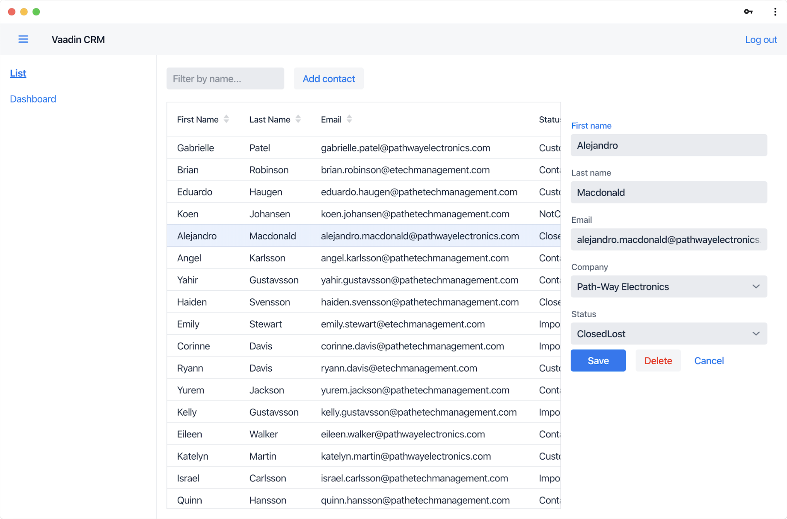

= Building Modern Web Applications With Spring Boot and Vaadin

This guide is a practical introduction to web application development with Spring Boot and Vaadin.

It covers the entire development process, from setup to deployment, following a step-by-step approach. 
You can replicate each section at your own pace as you follow along. 

The content is suitable for anyone familiar with Java who wants to build a web application.
To make sure your development experience is enjoyable and productive, you start right from the beginning with setting up your development environment.

== What You Learn From This Tutorial

This guide teaches you how to build a functional, full-stack web application using modern Java.
It focuses on real-world developer needs, without diving into theory or academics.
Links to relevant further reading are provided for those who are interested. 

The application is a customer relationship management (CRM) system for managing contacts. 
It features:

* A login screen to restrict access.
* A responsive layout with side navigation that works on desktop and mobile.
* A database for persistent data storage.
* A list view that can be sorted and filtered.
* A form to edit and add contacts.
* Data import from a REST API.
* A dashboard view.
* Cloud deployment.
* Application installation on mobile and desktop. 

https://crm.demo.vaadin.com/[Try the completed application here.]

== What You Need to Complete This Tutorial

This tutorial requires approximately 4 hours to complete.

It is intended for developers with a basic understanding of Java.
You don't need to be an expert by any means, but understanding the syntax and basic concepts makes it easier to follow along.

Vaadin Flow runs on Java and you need the following development tools:

* Java JDK 8 or later
* https://www.jetbrains.com/idea/download/[IntelliJ IDEA^] or another IDE that supports Java.

You can find instructions for installing development tools in the <<{articles}/guide/install#,Installing>> documentation.

== Source Code

You can find the full source code for this guide on https://github.com/vaadin-learning-center/crm-tutorial/[GitHub]. 

== Getting help

The best place to get help if you have questions is the https://discord.gg/vaadin[Vaadin Discord^] chat server.

== Tools and Frameworks

This tutorial uses Vaadin and Spring Boot because they are both easy to learn and suitable for production use. 

On the *backend*, the application uses *https://spring.io/projects/spring-boot[Spring Boot]*.
This eliminates most of the hassle of setting up and running a Spring-based application and lets you focus on your own code.
The main features you'll use are:

* https://en.wikipedia.org/wiki/Dependency_injection[Dependency injection] to decouple components.
* https://spring.io/projects/spring-data-jpa[Spring Data JPA] repositories to work with the database.
* https://spring.io/projects/spring-security[Spring Security] to handle access control.
* An embedded http://tomcat.apache.org/[Tomcat] server to serve the application.
* https://docs.spring.io/spring-boot/docs/current/reference/html/using-spring-boot.html#using-boot-devtools[Spring Boot Developer Tools] to provide a smoother development experience.

Don't worry if you don't know these terms, the tutorial covers each topic.

On the *frontend*, the application uses *https://vaadin.com/[Vaadin Flow]* 
Vaadin Flow is an open-source Java web application framework that comes with:

* <<{articles}/ds/components#,A large library of UI components>>. Each component has a Java API and you can customize the look and feel.
* A router for navigating between views.
* A powerful data-binding system for forms and lists.

== Why Use Vaadin Instead of Spring MVC and Thymeleaf, JSP or Freemarker?

Vaadin is an alternative to using Spring MVC and Thymeleaf, JSP or Freemarker when building web applications with Spring Boot. 

The main advantage of Vaadin are:

* Vaadin is designed for building interactive single-page apps (SPA). Spring MVC and templates are better suited for more static content.
* Vaadin offers a Java component API, allowing you to build the entire application in Java.
* Vaadin comes with a large https://vaadin.com/components[library of customizable UI components].
* Vaadin handles the communication between the server and the browser automatically, you don't need to write any JavaScript to update content dynamically.

== Why Use Vaadin Instead of REST and React or Angular?

Combining a Spring Boot based REST backend with a frontend framework like React or Angular is a popular way of building SPAs. 
Vaadin allows you to build similar application experiences with less effort. 

Advantages of using Vaadin:

* Faster development: you do not need to develop the backend and frontend separately.
* You can write the entire application in type safe Java.
* Vaadin comes with a large https://vaadin.com/components[library of customizable UI components].
* Vaadin handles the communication between the server and the browser automatically, you don't need to write any JavaScript to update content dynamically.
* More secure: the Vaadin application runs on the server and doesn't expose application code or extra endpoints to the browser.

You can compare Vaadin, Angular, React, and Vue on the link:https://vaadin.com/comparison[Framework Comparison] page.

include::{root}/articles/flow/tutorials/in-depth-course/_ebook-banner.adoc[opts=optional]
