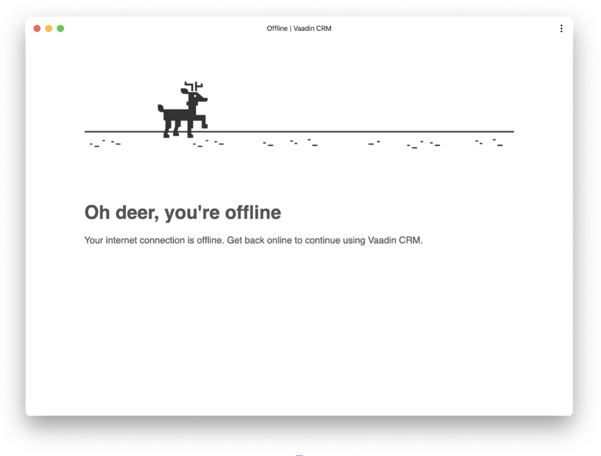

= Turning a Vaadin Flow Application Into an Installable PWA

In this chapter, you turn the completed CRM application into a progressive web application (PWA) so that users can install it. 

video::tqucnVIDaak[youtube]

== What Is a PWA?

The term PWA is used to describe modern web applications that offer a native app-like user experience. 
PWA technologies make applications faster, more reliable, and more engaging. 
PWAs can be installed on most mobile devices and on desktop when using supported browsers. 
They can even be listed in the Microsoft Store and Google Play Store. 
You can learn more about the underlying technologies and features in the <<../../pwa/tutorial-pwa-introduction#,Vaadin PWA documentation>>.

Two main components enable PWA technologies:

* Service Worker: a JavaScript worker file that controls network traffic and enables custom cache control.
* Web app manifest: a JSON file that identifies the web application as an installable application.

== Generating PWA Resources

Vaadin provides the `@PWA` annotation that automatically generates the required PWA resources. 

Add the `@PWA` annotation to `MainLayout` as follows:

.`MainLayout.java`
[source,java]
----
@CssImport("./styles/shared-styles.css")
@PWA( // <1>
    name = "VaadinCRM", // <2>
    shortName = "CRM")  // <3>
public class MainLayout extends AppLayout {
     ...
}
----
<1> The `@PWA` annotation tells Vaadin to create a `ServiceWorker` and a manifest file.
<2> `name` is the full name of the application for the manifest file.
<3> `shortName` should be short enough to fit under an icon when installed, and should not exceed 12 characters. 

=== Customize the Application Icon

. Start by creating a new folder `src/main/webapp`.

. Create a new sub folder  `src/main/webapp/icons` and add your own icon image named `icon.png`. 
The image resolution should be 512px x 512px. 
This overrides the default image in the starter. 

You can use your own icon, or save the image below, by right clicking and selecting *Save Image*.

== Customize the Offline Page 

Vaadin creates a generic offline fallback page that displays when the application is launched offline. 
Replacing this default page with a custom page that follows your own design guidelines makes your app more polished. 

. Use the code below to create `offline.html` in the new `src/main/webapp` folder: 
+
.`offline.html`
[source,html]
----
<!DOCTYPE html>
<html lang="en">
<head>
  <meta charset="UTF-8"/>
  <meta name="viewport" content="width=device-width, initial-scale=1.0"/>
  <meta http-equiv="X-UA-Compatible" content="ie=edge"/>
  <title>Offline | Vaadin CRM</title>
  <link rel="stylesheet" href="./styles/offline.css"> <1>
</head>
<body>

   <2>
  <h1>Oh deer, you're offline</h1>
  
Your internet connection is offline. Get back online to continue using Vaadin CRM.

 <3>
</body>
</html>
----
+
<1> The page loads a CSS file, offline.css. 
<2> The page displays an image, offline.png.
<3> The JavaScript snippet reloads the page if the browser detects that it's back online. 

. Create two new folders, `src/main/webapp/styles` and `src/main/webapp/images`.

. In the `styles` folder, create `offline.css` and add the following styles:
+
.`offline.css`
[source,css]
----
body {
    display: flex; /* <1> */
    flex-direction: column;
    align-items: center;
    font-family: sans-serif;
    color: #555;
}

.content {
    width: 80%;
}

.offline-image {
    width: 100%;
    margin: 4em 0px;
}
----
+
<1> Makes the page a flex box that centers content horizontally.

. Add the following image (or use one of your own) to the `images` folder and name it `offline.png`.
+
image::images/pwa/offline.png[example offline image]

. Make the files available offline by adding them to the `@PWA` annotation in `MainLayout` as follows:
+
.`MainLayout.java`
[source,java]
----
@CssImport("./styles/shared-styles.css")
@PWA(
    name = "VaadinCRM",
    shortName = "VaadinCRM",
    offlineResources = { // <1>
        "./styles/offline.css",
        "./images/offline.png"})
public class MainLayout extends AppLayout {
    ...
}
----
+
<1> `offlineResources` is a list of files that Vaadin makes available offline through the `ServiceWorker`.
+
.Load CSS from the right location
[WARNING] 
====
Even though the paths for the CSS files is identical in the Java file, `shared-styles.css` is loaded from `frontend/styles/shared-styles.css`, whereas `offline.css` is loaded from `src/main/java/webapp/styles/offline.css`. 
If you have trouble accessing files while offline, check that these files are in the correct folders. 
====

. Restart the app. 
You can now install the application on supported browsers.

== Testing the Offline Page

Shut down the server in IntelliJ and refresh the browser (or launch the installed app). 
You should now see the custom offline page.

In the next chapter, you will add tests to the application: both unit tests and in-browser tests. 