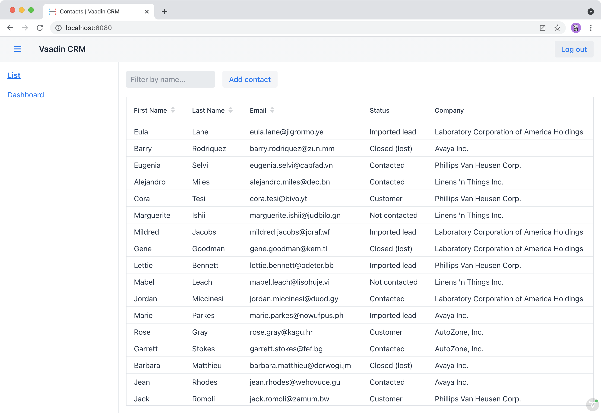

= Adding a Login Screen to a Vaadin Application Using Spring Security

In this chapter, you secure the CRM application by setting up Spring Security and adding a login screen to limit access to logged-in users. 

== Creating a Login View
Start by creating a new view, `LoginView`, in the `views` package.

.`LoginView.java`
[source,java]
----
package com.example.application.views;

import com.vaadin.flow.component.html.H1;
import com.vaadin.flow.component.login.LoginForm;
import com.vaadin.flow.component.orderedlayout.VerticalLayout;
import com.vaadin.flow.router.BeforeEnterEvent;
import com.vaadin.flow.router.BeforeEnterObserver;
import com.vaadin.flow.router.PageTitle;
import com.vaadin.flow.router.Route;

@Route("login") // <1>
@PageTitle("Login | Vaadin CRM")
public class LoginView extends VerticalLayout implements BeforeEnterObserver {

	private final LoginForm login = new LoginForm(); // <2> 

	public LoginView(){
		addClassName("login-view");
		setSizeFull(); // <3>
		setAlignItems(Alignment.CENTER); 
		setJustifyContentMode(JustifyContentMode.CENTER);

		login.setAction("login"); // <4>

		add(new H1("Vaadin CRM"), login);
	}

	@Override
	public void beforeEnter(BeforeEnterEvent beforeEnterEvent) {
		// inform the user about an authentication error
		if(beforeEnterEvent.getLocation()  // <5>
        .getQueryParameters()
        .getParameters()
        .containsKey("error")) {
            login.setError(true);
        }
	}
}
----
<1> Map the view to the `"login"` path. 
`LoginView` should take up the whole browser window, so don't use `MainLayout` as the parent.
<2> Instantiate a `LoginForm` component to capture username and password.
<3> Make `LoginView` full size and center its content both horizontally and vertically, by calling setAlignItems(`Alignment.CENTER`) and setJustifyContentMode(`JustifyContentMode.CENTER`).
<4> Set the `LoginForm` action to `"login"` to post the login form to Spring Security.
<5> Read query parameters and show an error if a login attempt fails. 

Build the application and navigate to http://localhost/login. You should see a centered login form. 

image::images/login/login-form.png[Login view]

== Setting up Spring Security to Handle Logins

With the login screen in place, you now need to configure Spring Security to perform the authentication and to prevent unauthorized users from accessing views. 

=== Installing Spring Security Dependencies

Add the Spring Security dependency in `pom.xml`:

.`pom.xml`
[source,xml]
----
<dependency>
    <groupId>org.springframework.boot</groupId>
    <artifactId>spring-boot-starter-security</artifactId>
</dependency>
----

Check that the dependency is downloaded. 
If you are unsure, run `./mvnw install` from the command line to download the dependency.

=== Configuring Spring Security

Create a new package `com.example.application.security` for classes related to security.

.Create Classes Automatically
[TIP]
====
Paste the class code into the `security` package to have IntelliJ automatically create the class for you.
====

Enable and configure Spring Security with a new class, `SecurityConfig.java`:

.`SecurityConfig.java`
[source,java]
----
package com.example.application.security;

import com.example.application.views.LoginView;
import com.vaadin.flow.spring.security.VaadinWebSecurityConfigurerAdapter;
import org.springframework.context.annotation.Bean;
import org.springframework.context.annotation.Configuration;
import org.springframework.security.config.annotation.web.builders.HttpSecurity;
import org.springframework.security.config.annotation.web.builders.WebSecurity;
import org.springframework.security.config.annotation.web.configuration.EnableWebSecurity;
import org.springframework.security.core.userdetails.User;
import org.springframework.security.core.userdetails.UserDetailsService;
import org.springframework.security.provisioning.InMemoryUserDetailsManager;

@EnableWebSecurity // <1>
@Configuration
public class SecurityConfig extends VaadinWebSecurityConfigurerAdapter { // <2>

    @Override
    protected void configure(HttpSecurity http) throws Exception {
        super.configure(http);

        setLoginView(http, LoginView.class); // <3>
    }

    /**
     * Allows access to static resources, bypassing Spring security.
     */
    @Override
    public void configure(WebSecurity web) throws Exception {
        web.ignoring().antMatchers("/images/**"); // <4>
        super.configure(web);
    }

    /**
     * Demo UserDetailService which only provides two hardcoded
     * in memory users and their roles.
     * NOTE: This should not be used in real-world applications.
     */
    @Bean
    @Override
    public UserDetailsService userDetailsService() {
        return new InMemoryUserDetailsManager(User.withUsername("user") // <5>
            .password("{noop}userpass")
            .roles("USER")
            .build());
    }
}
----
<1> Enable Spring Security.
<2> Extend from `VaadinWebSecurityConfigurerAdapter` to configure Spring Security for Vaadin. 
<3> Allow access to the login view.
<4> Exclude the image directory to allow public access.
<5> Configure an in-memory user for testing (see note below).

.Never use hard-coded credentials in production
[WARNING]
====
Do not use hard-coded credentials in real applications. 
You can change the Spring Security configuration to use an authentication provider for LDAP, JAAS, and other real-world sources. 
https://dzone.com/articles/spring-security-authentication[Read more about Spring Security authentication providers].
====

Then, in the same package, create a service for accessing information on the logged-in user and for logging out the user. 

.`SecurityService.java`
[source,java]
----
package com.example.application.security;

import com.vaadin.flow.component.UI;
import com.vaadin.flow.server.VaadinServletRequest;
import org.springframework.security.core.context.SecurityContext;
import org.springframework.security.core.context.SecurityContextHolder;
import org.springframework.security.core.userdetails.UserDetails;
import org.springframework.security.web.authentication.logout.SecurityContextLogoutHandler;
import org.springframework.stereotype.Component;

@Component
public class SecurityService {

    private static final String LOGOUT_SUCCESS_URL = "/";

    public UserDetails getAuthenticatedUser() { 
        SecurityContext context = SecurityContextHolder.getContext();
        Object principal = context.getAuthentication().getPrincipal();
        if (principal instanceof UserDetails) {
            return (UserDetails) context.getAuthentication().getPrincipal();
        }
        // Anonymous or no authentication.
        return null;
    }

    public void logout() {
        SecurityContextLogoutHandler logoutHandler = new SecurityContextLogoutHandler();
        logoutHandler.setInvalidateHttpSession(false);
        logoutHandler.logout(
                VaadinServletRequest.getCurrent().getHttpServletRequest(), null,
                null);
        UI.getCurrent().getPage().setLocation(LOGOUT_SUCCESS_URL);
    }
}
----

Finally, add `@PermitAll` annotations to both views to allow all logged-in users to access them.

.`ListView.java`
[source,java]
----
@PermitAll
@Route(value="", layout = MainLayout.class) 
@PageTitle("Contacts | Vaadin CRM")
public class ListView extends VerticalLayout {
    // omitted
}
----

.`DashboardView.java`
[source,java]
----
@PermitAll
@Route(value = "dashboard", layout = MainLayout.class)
@PageTitle("Dashboard | Vaadin CRM")
public class DashboardView extends VerticalLayout {
    // omitted
}
----

== Adding a Logout Button

You can now log in to the application. 
The final thing that is needed is a logout button in the application header.

In `MainLayout`, add a link to the header:

.`MainLayout.java`
[source,java]
----
package com.example.application.views;

import com.example.application.security.SecurityService;
import com.example.application.views.list.ListView;
import com.vaadin.flow.component.applayout.AppLayout;
import com.vaadin.flow.component.applayout.DrawerToggle;
import com.vaadin.flow.component.button.Button;
import com.vaadin.flow.component.html.H1;
import com.vaadin.flow.component.orderedlayout.FlexComponent;
import com.vaadin.flow.component.orderedlayout.HorizontalLayout;
import com.vaadin.flow.component.orderedlayout.VerticalLayout;
import com.vaadin.flow.router.HighlightConditions;
import com.vaadin.flow.router.RouterLink;

public class MainLayout extends AppLayout {
    private final SecurityService securityService;

    public MainLayout(SecurityService securityService) { // <1>
        this.securityService = securityService;
        createHeader();
        createDrawer();
    }

    private void createHeader() {
        H1 logo = new H1("Vaadin CRM");
        logo.addClassNames("text-l", "m-m");

        Button logout = new Button("Log out", e -> securityService.logout()); // <2>

        HorizontalLayout header = new HorizontalLayout(new DrawerToggle(), logo, logout); // <3>

        header.setDefaultVerticalComponentAlignment(FlexComponent.Alignment.CENTER);
        header.expand(logo); // <4>
        header.setWidth("100%");
        header.addClassNames("py-0", "px-m");

        addToNavbar(header);

    }

    private void createDrawer() {
        RouterLink listLink = new RouterLink("List", ListView.class);
        listLink.setHighlightCondition(HighlightConditions.sameLocation());

        addToDrawer(new VerticalLayout(
            listLink,
            new RouterLink("Dashboard", DashboardView.class)
        ));
    }
}
----
<1> Autowire the `SecurityService` and save it in a field.
<2> Create a logout button that calls the `logout()` method in the service.
<3> Add the button to the header layout.
<4> Call `header.expand(logo)` to make the logo take up all the extra space in the layout. 
This pushes the logout button to the far right.

**Stop and restart the server to pick up the new Maven dependencies.** 
You should now be able to log in and out of the app. 
Verify that you can't access http://localhost/dashboard without being logged in.
You can log in with:

* Username: `user`
* Password: `userpass`

You have now built a full-stack CRM application with navigation and authentication. 
In the next chapter, you'll learn how to turn it into a PWA to make it installable on mobile and desktop.

include::{articles}/flow/tutorials/in-depth-course/_ebook-banner.adoc[opts=optional]
