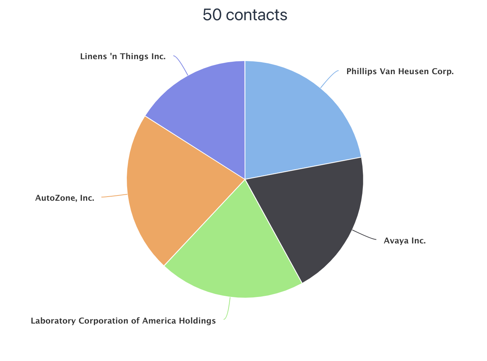

= Navigating Between Views in Vaadin

In this tutorial series, you've built a CRM application for listing and editing contacts. 
In this chapter, you add a dashboard view to the application. 
You also add a responsive application layout, with a header and a navigation sidebar that can be toggled on small screens. 

video::-J4RZXfgLRc[youtube]

== Defining View Routes

Any Vaadin component can be made a navigation target by adding an `@Route("<path>")` annotation. 
Routes can be nested by defining the parent layout in the annotation: `@Route(value = "list", parent=MainView.class)`.

== Creating the Parent Layout and Child Views

The application should have:

* A shared parent layout with two child views:
+
`MainLayout`: App Layout with header and navigation:
+
.. `ListView`: The default view, mapped to `""`. 
.. `DashboardView`: Mapped to `"dashboard"`.
* A responsive app layout and navigation links.

Begin by creating the child views. 

. Start by renaming `MainView` to `ListView`. Right click `MainView` and select *Refactor > Rename*. When IntelliJ asks if you want to rename the file, answer yes.
+
image::images/navigation/rename-class.png[Refactor rename]

. Create a new Java class named `MainLayout` with the following content. This is the shared parent layout of both views in the application. 
+
.`MainLayout.java`
[source, java]
----
@CssImport("./styles/shared-styles.css") // <1>
public class MainLayout extends AppLayout { // <2>
    public MainLayout() {
        createHeader();
        createDrawer();
    }

    private void createHeader() {
        H1 logo = new H1("Vaadin CRM");
        logo.addClassName("logo");
        
        HorizontalLayout header = new HorizontalLayout(new DrawerToggle(), logo); // <3> 
          
        header.setDefaultVerticalComponentAlignment(
             FlexComponent.Alignment.CENTER); // <4> 
        header.setWidth("100%");
        header.addClassName("header");

        addToNavbar(header); // <5>

    }

    private void createDrawer() {
        RouterLink listLink = new RouterLink("List", ListView.class); // <6>
        listLink.setHighlightCondition(HighlightConditions.sameLocation()); // <7>

        addToDrawer(new VerticalLayout(listLink)); // <8>
    }
}
----
+
<1> Move the `@CssImport` annotation to `MainLayout`. 
<2> `AppLayout` is a Vaadin layout with a header and a responsive drawer. 
<3>  `DrawerToggle` is a menu button that toggles the visibility of the sidebar.
<4> Centers the components in the `header` along the vertical axis.
<5> Adds the `header` layout to the app layout's nav bar.
<6> Creates a `RouterLink` with the text "List" and `ListView.class` as the destination view
<7> Sets setHighlightCondition(HighlightConditions.sameLocation()) to avoid highlighting the link for partial route matches. 
(Technically, every route starts with an empty route, so without this it would always show up as active even though the user is not on the view.)
<8> Wraps the link in a `VerticalLayout` and adds it to the `AppLayout`'s drawer

. Add the following CSS to `frontend/styles/shared-styles.css`
+
.`shared-styles.css`
[source,css]
----
/* Main layout */

a[highlight] {
    font-weight: bold;
    text-decoration: underline;
}

.header {
    padding: 0 var(--lumo-space-m);
}

.header h1.logo {
    font-size: 1em;
    margin: var(--lumo-space-m);
}
----
. Create a new package for the list view, `com.vaadin.tutorial.crm.ui.view.list`. 
Separate packages for each view makes it easier to keep the project organized. 
+

. Move `ListView` and `ContactForm` into the new package. 
The resulting package structure should look like this:
+

. Lastly, in `ListView` update the `@Route` mapping to use the new `MainLayout` and delete the `@CSSImport` annotation.
+
.`ListView.java`
[source,java]
----
@Route(value="", layout = MainLayout.class) // <1>
// <2>
@PageTitle("Contacts | Vaadin CRM") // <3> 
public class ListView extends VerticalLayout {
     ...
}
----
+
<1> `ListView` still matches the empty path, but now uses `MainLayout` as its parent.
<2> The @CSSImport annotation is now removed, as it is now on `MainLayout` instead. 
<3> Adds a title to the page. 

. Run the application. 
You should now see a header and a sidebar on the list view. 
+

== Creating the Dashboard View

Next, create a new dashboard view. 
This view shows stats: the number of contacts in the system and a pie chart of the number of contacts per company.

. Create a new package `com.vaadin.tutorial.crm.ui.view.dashboard` by right clicking the list package and selecting *New > Package*.

. In the new package, create a new Java class named `DashboardView`.
+
.`DashboardView.java`
[source,java]
----
package com.vaadin.tutorial.crm.ui.view.dashboard;

import com.vaadin.flow.component.orderedlayout.VerticalLayout;
import com.vaadin.flow.router.Route;
import com.vaadin.tutorial.crm.backend.service.CompanyService;
import com.vaadin.tutorial.crm.backend.service.ContactService;
import com.vaadin.tutorial.crm.ui.MainLayout;

@Route(value = "dashboard", layout = MainLayout.class) // <1> 
@PageTitle("Dashboard | Vaadin CRM") // <2> 
public class DashboardView extends VerticalLayout {

    private ContactService contactService;
    private CompanyService companyService;

    public DashboardView(ContactService contactService, CompanyService companyService) { // <3>
        this.contactService = contactService;
        this.companyService = companyService;
        addClassName("dashboard-view");
        setDefaultHorizontalComponentAlignment(Alignment.CENTER); // <4>
    }
}
----
+
<1> `DashboardView` is mapped to the `"dashboard"` path and uses `MainLayout` as a parent layout.
<2> Sets the page title.
<3> Takes both `ContactService` and `CompanyService` as constructor parameters and save them as fields.
<4> Centers the contents of the layout.

. Create a method to display the number of contacts in the system. 
+
.`DashboardView.java`
[source,java]
----
private Component getContactStats() {
    Span stats = new Span(contactService.count() + " contacts"); // <1>
    stats.addClassName("contact-stats");
    return stats;
}
----
+
<1> contactService.count() gives you the number of contacts in the database. 
It returns a `Span` with the count and a text explanation.

. Add the following CSS to `frontend/styles/shared-styles.css`
+
.`shared-styles.css`
[source,css]
----
/* Dashboard view */

.dashboard-view .contact-stats {
    font-size: 4em;
    margin: 1em 0;
}
----
. In  `CompanyService`, add the following method to create the pie chart.  
As an alternative, you could calculate the number of employees per company right in the view, but it's better to move this logic into `CompanyService` so it can be reused later in other views.
+
.Vaadin Charts is a Commercial Component Set
[NOTE]
====
<<{articles}/ds/charts#,Vaadin charts>> is a collection of data visualization components that is a part of the https://vaadin.com/pricing[Vaadin Pro subscription]. Vaadin charts comes with a free trial that you can activate in the browser. All Vaadin Pro tools and components are free for students through the https://education.github.com/pack?utm_source=github+vaadin[GitHub Student Developer Pack]. 
====
+
.`CompanyService.java`
[source,java]
----
public Map<String, Integer> getStats() {
  HashMap<String, Integer> stats = new HashMap<>();
  findAll().forEach(company -> stats.put(company.getName(), company.getEmployees().size())); // <1>
  return stats;
}
----
<1> Loops through each company and returns a `Map` containing the company name and number of employees.

. In `DashboardView`, create a method to construct the chart:
+
.`DashboardView.java`
[source,java]
----
private Chart getCompaniesChart() {
    Chart chart = new Chart(ChartType.PIE); // <1> 

    DataSeries dataSeries = new DataSeries(); // <2> 
    Map<String, Integer> companies = companyService.getStats();
    companies.forEach((company, employees) ->
        dataSeries.add(new DataSeriesItem(company, employees))); // <3> 
    chart.getConfiguration().setSeries(dataSeries); // <4>
    return chart;
}
----
+
<1> Creates a new pie chart.
<2> Charts use a DataSeries for data.
<3> Adds a DataSeriesItem, containing the company name and number of employees, for each company.
<4> Sets the data series to the chart configuration.

. Add both components to the `DashboadView` in the constructor to display the company stats.
+
.`DashboardView.java`
[source,java]
----
public DashboardView(ContactService contactService, CompanyService companyService) {
    this.contactService = contactService;
    this.companyService = companyService;

    add(getContactStats(), getCompaniesChart());
}
----
. Add a navigation link to `DashboardView` in the `MainLayout` drawer:
+
.`MainLayout.java`
[source,java]
----
private void createDrawer() {
    RouterLink listLink = new RouterLink("List", ListView.class);
    listLink.setHighlightCondition(HighlightConditions.sameLocation());

    addToDrawer(new VerticalLayout(
        listLink,
        new RouterLink("Dashboard", DashboardView.class)
    ));
}
----
. Build and run the application. 
You should now be able to navigate to the dashboard view and see stats on your CRM contacts. 
If you want to, go ahead and add or remove contacts in the list view to see that the dashboard reflects your changes.
+
image::images/navigation/dashboard-completed.png[Complete dashboard view]

In the next chapter, you'll secure the application by adding a login screen.