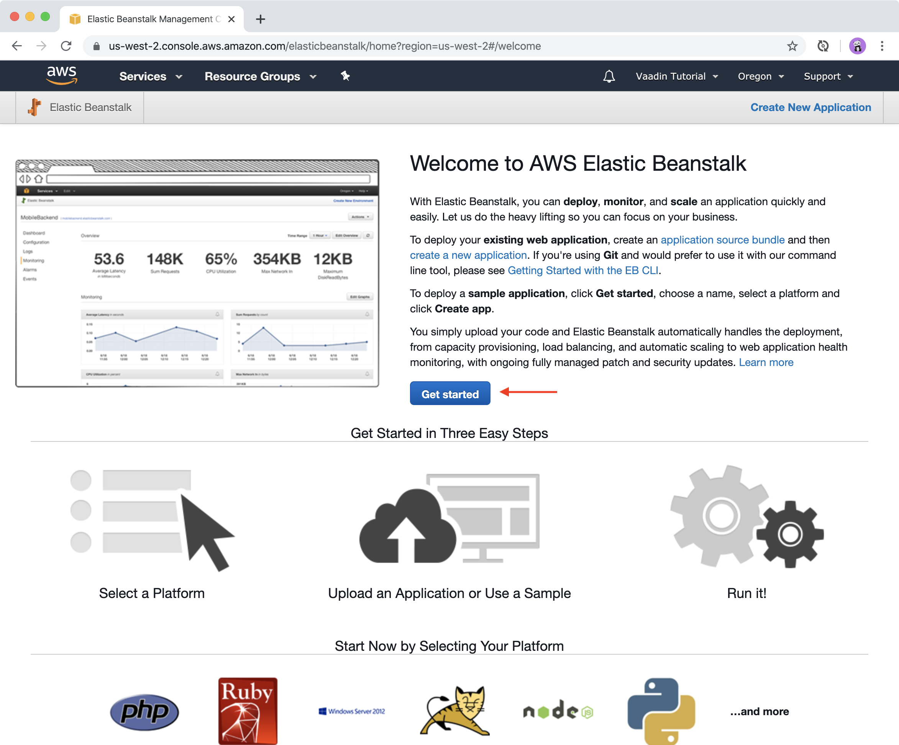
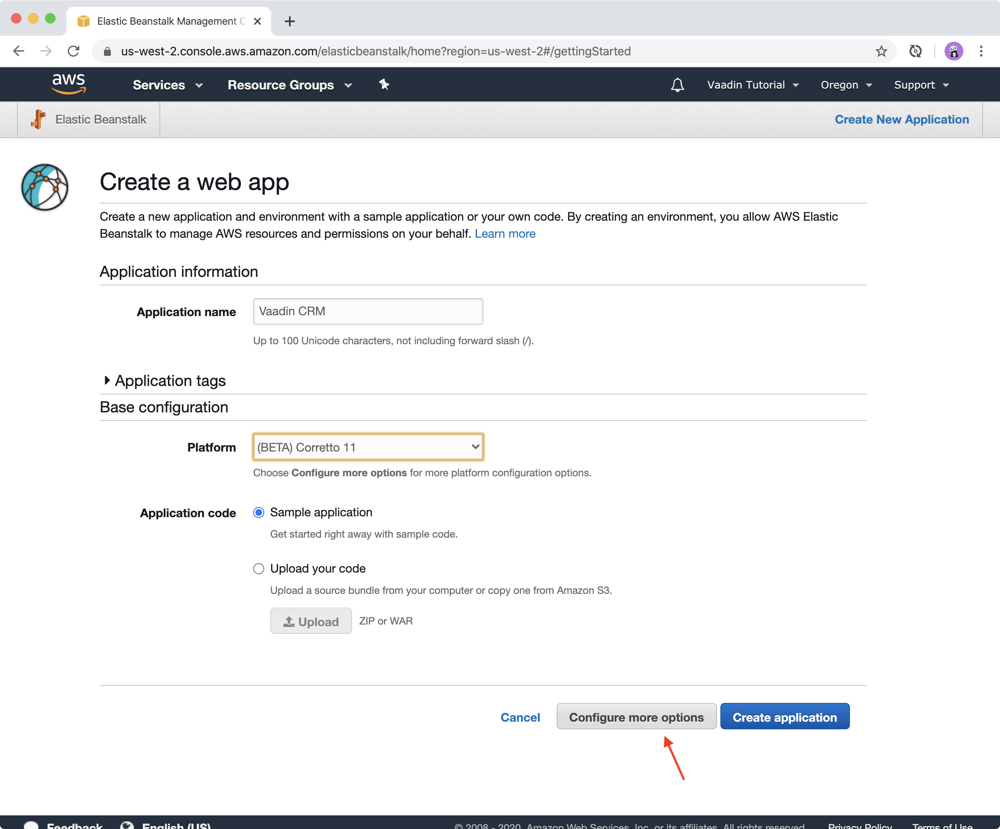
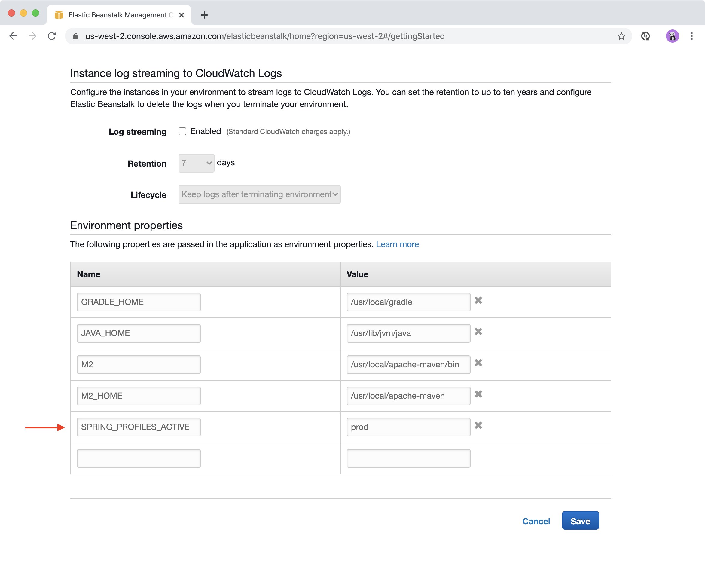
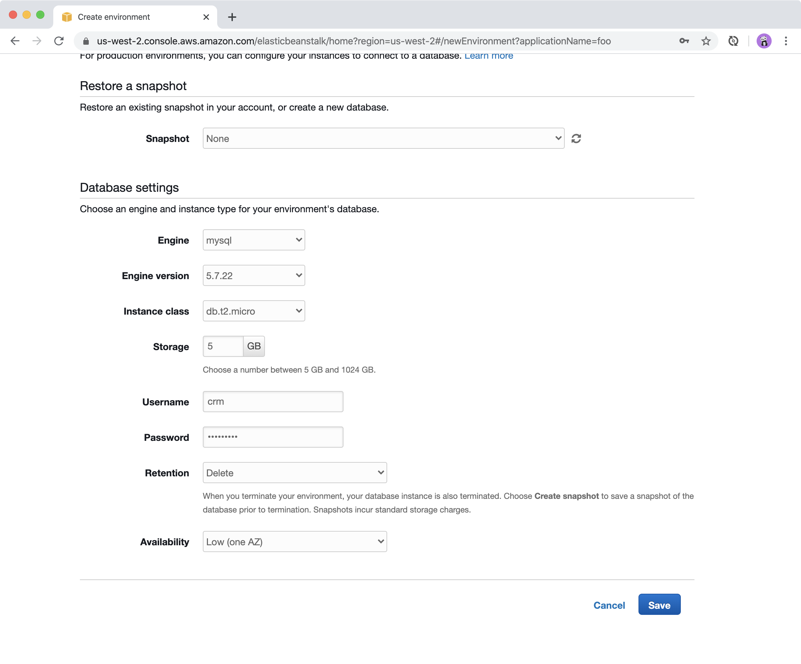
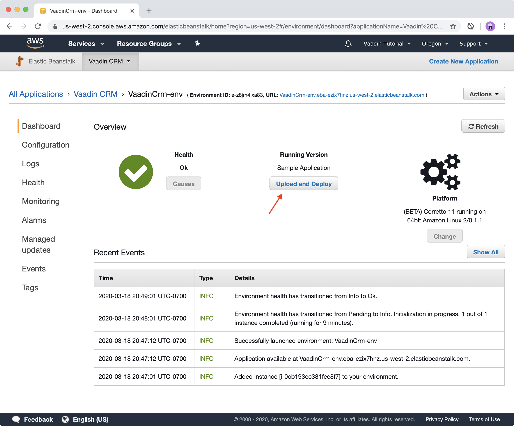
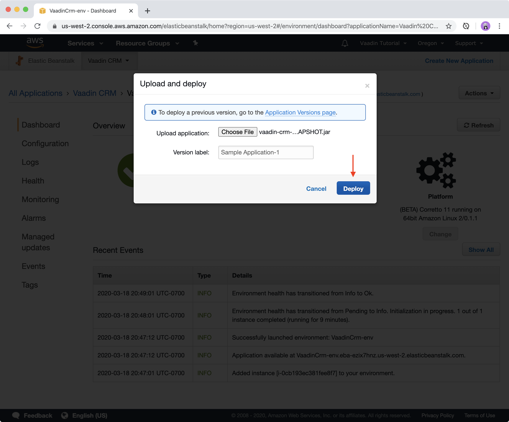
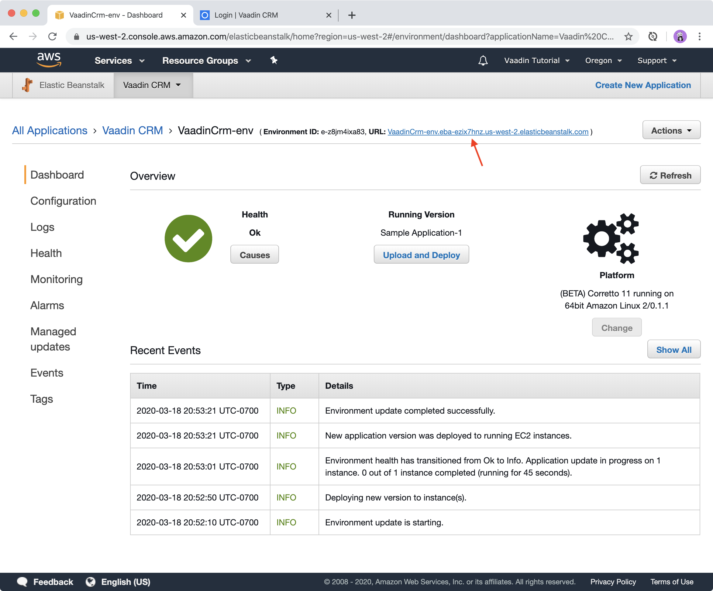
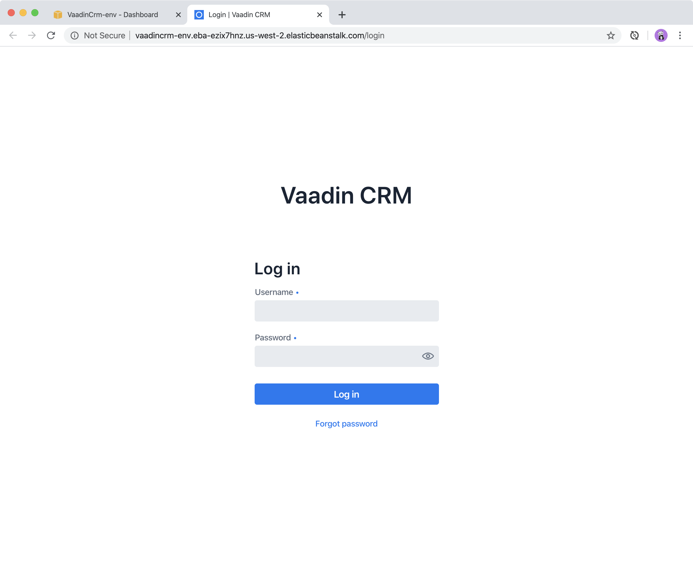

= Deploying a Vaadin Application on AWS Elastic Beanstalk

In this final chapter in the series, you learn how to deploy a Spring Boot application on https://aws.amazon.com/[Amazon Web Services (AWS)] with https://aws.amazon.com/elasticbeanstalk/[AWS Elastic Beanstalk (EB)]. 
EB is a service that orchestrates other AWS services like virtual servers, load balancers, storage, and databases.

.Vaadin can be deployed on any cloud provider
[TIP]
====
You can also deploy your application onto other cloud platforms. Read the link:https://vaadin.com/learn/tutorials/cloud-deployment[Cloud Deployment tutorials] for more options. 
====

Until now, the application has used an in-memory H2 database. 
For the deployed application, you can use a MySQL server for persistent storage instead. 

video::EtDSJRdpJM4[youtube]

== Preparing the Application for Production

Before you can deploy the application, you need to make it ready for production. 
More specifically, you need to build the application with Vaadin production mode enabled and add a separate configuration file to configure the production database and ports. 

When you build a production version of a Vaadin app, the following happens:

* All the front-end resources are bundled and minified to speed up the app load time.
* Vaadin runs in production mode to hide debugging and other sensitive information from the browser.

=== Creating a Separate Configuration For Production

The application uses different databases during development and in production. 
To support this, you need to create a separate configuration file for the production build.

Create a new file, `application-prod.properties`, in `src/main/resources`.

.Do not store sensitive information in properties files
[TIP] 
====
Do not store sensitive information like passwords in properties files that get committed to a version control system like Git. 
Instead, use environment variables and keep them on the server. 
====

.`application-prod.properties`
[source]
----
server.port=5000 <1>
spring.datasource.url=jdbc:mysql://${RDS_HOSTNAME}:${RDS_PORT}/${RDS_DB_NAME} <2>
spring.datasource.username=${RDS_USERNAME}
spring.datasource.password=${RDS_PASSWORD}
spring.jpa.hibernate.ddl-auto=create
----
<1> Elastic Beanstalk maps the internal port 5000 to the external port 80 to expose the application to the internet.
<2>  Elastic Beanstalk provides environment variables with information about the database so you don't need to store them in the property file. 

.Use a database migration tool in production
[WARNING]  
====
`spring.jpa.hibernate.ddl-auto=create` deletes and re-creates the database on every deployment. A more proper solution is to use a database migration tool like https://www.liquibase.org/[Liquibase].
====

=== Adding MySQL Support

Add MySQL as a dependency to your project's `pom.xml` file. 

.`pom.xml`
[source,xml]
----
<dependency>
    <groupId>mysql</groupId>
    <artifactId>mysql-connector-java</artifactId>
    <scope>runtime</scope>
</dependency>
----

=== Creating a Production Build of the Vaadin Application

Use the Maven `production` profile to create a production-optimized build. 
Add the `skipTests` parameter to avoid running tests. 

.Create a production optimized build
[source]
----
mvn clean package -Pproduction -DskipTests
----

You now have a production-ready application JAR in `target/vaadin-crm-<version>.jar`. 
Next, set up the AWS environment for deploying it. 

== Creating an AWS Account

The first thing you need to do is create an link:https://aws.amazon.com/premiumsupport/knowledge-center/create-and-activate-aws-account/[AWS account], if you don’t already have one. 
You can sign up for an AWS Free Tier account that provides limited usage of many AWS products.

.AWS is a paid service
[WARNING] 
====
AWS is a paid service and following the instructions below may result in charges. 
Carefully review the billing costs on AWS to avoid any surprises.
====

== Setting Up a Java Application on Elastic Beanstalk

First create the application environment on Elastic Beanstalk:

1. Create a new application in the https://console.aws.amazon.com/elasticbeanstalk[Elastic Beanstalk console]. 
+

2. Create an environment for the application with the following configurations, and then click *Configure more options*:
+
- *Application name*: Vaadin CRM
- *Environment tier*: Web server environment.
- *Platform*: Corretto 11.
- *Application code*: Sample application.
You can leave the other fields empty.
+

3. Go to *Software > Modify* and add an environment property, and then click *Save*:
+
- *Name*: SPRING_PROFILES_ACTIVE
- *Value*: prod
+

4. Go to *Database > Modify* and set up an Amazon RDS SQL database with the following configurations, and then click *Save*:
+
- The defaults are fine for this application.
- Add a username and password. 
Elastic Beanstalk makes these available to your application through the environment variables you set up in the properties file.
+

+
.Production database setup
[CAUTION]
====
This database setup is suitable for the tutorial, but in a real production application, the database should not be tied to the lifecycle of the environment. 
Otherwise you may inadvertently delete the database if you remove the server. 
See https://docs.aws.amazon.com/elasticbeanstalk/latest/dg/AWSHowTo.RDS.html[Using Elastic Beanstalk with Amazon Relational Database Service]. 
====

5. Click Create app. 

NOTE: Creating the application environment and database can take up to 15 minutes.

== Deploying the Elastic Beanstalk Application

1. In the EB console Dashboard, click Upload and Deploy and upload your newly built JAR file, `target/vaadin-crm-<version>.jar`.
+

+

2. After the environment has updated (this can take several minutes), the environment Health should indicate as Ok (green tick) and your application should run and be accessible on the web through the link at the top of the dashboard. 
If the health is not Ok, go to Logs (in the EB console) to troubleshoot the problem.
+

+

You can find the completed source code for this tutorial on https://github.com/vaadin-learning-center/crm-tutorial[GitHub].

== Next Steps

Good job on completing the tutorial series! 
You now have all the skills you need to get started building real-life applications with Spring Boot and Vaadin.

== Share Your Experience 

Please let us know what you thought of the tutorial series and if you have ideas for other topics you want us to cover. 
You can reach us on https://twitter.com/vaadin[Twitter].
