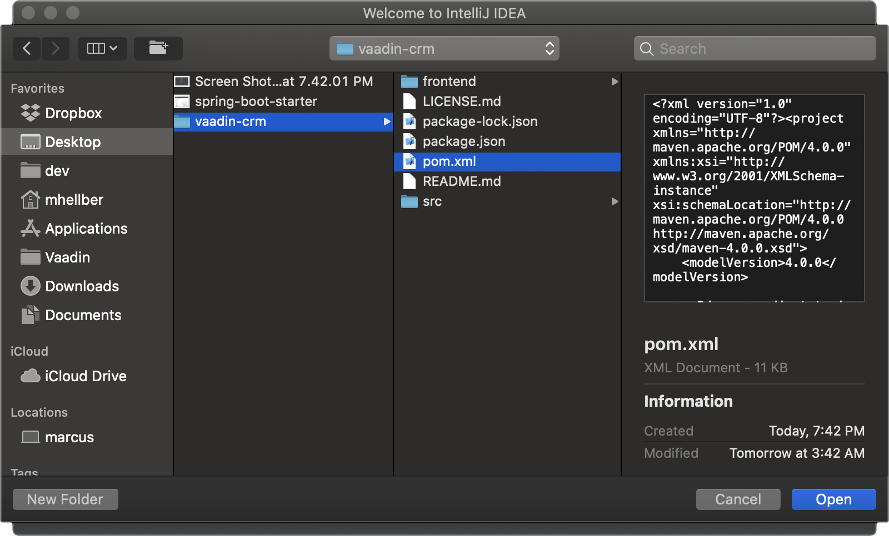

= Vaadin Flow Project Setup

This chapter covers:

* Installing the required development tools.
* Downloading and importing a Vaadin starter project.
* Running and debugging in IntelliJ.
* Configuring IntelliJ for productive development.

== Installing the Required Development Tools

Before you can start developing your Java app, you need to install the necessary development tools and set up your development environment. 

For this tutorial, you need:

* Java JDK (8 or newer).
* Maven (3 or newer). 
* An IDE for editing code.

You can complete this guide using any IDE, but for the sake of simplicity, the tutorial uses https://www.jetbrains.com/idea/[IntelliJ Idea] throughout. 
The IntelliJ Community Edition is free to use and a great choice if you don't already have an IDE setup. 

If you don't have these installed, follow the <<{articles}/guide/install#,development environment instructions>> for your operating system. 

== Importing a Maven project into IntelliJ

video::pMWw_HktG3M[youtube]

https://maven.apache.org/[Maven] is the most popular project management tool for Java. It takes care of managing your project structure and dependencies, and builds runnable artifacts. 

. To start, download a Spring Boot-based Vaadin starter project:
+ 
++++
<a href="https://vaadin.com/vaadincom/start-service/lts/project-base?appName=Vaadin%20CRM&groupId=com.vaadin.tutorial.crm&techStack=spring" class="button button--bordered quickstart-download-project"
 onClick="function test(){ _hsq && _hsq.push(['trackEvent', { id: '000007517662', value: null }]); } test(); return true;">Download</a>
++++

. Unzip the downloaded archive to a file location of your choice. 
TIP: Avoid unzipping to the download folder, as you could unintentionally delete your project when clearing out old downloads.

. In IntelliJ, select *Open* in the Welcome screen or *File* menu.
+

. Find the extracted folder, and select the pom.xml file.
+

. Select *Open as Project*.
This imports a project based on the POM file.
+

. IntelliJ imports the project and downloads all necessary dependencies. 
This can take several minutes, depending on your internet connection speed.

When the import is complete, your project structure will be similar to this:

* Java source files are in the `src/main/java` folder. 
* Test files are in the `src/test` folder (we'll refer to these later).

== Running a Spring Boot project in IntelliJ

Spring Boot makes it easier to run a Java web application, because it takes care of starting and configuring the server. 

To run your application, run the Application class that contains the main method that starts Spring Boot. IntelliJ automatically detects that you have a class with a main method and displays it in the run configurations dropdown. 

To start your application:

* Open `Application.java` and click the play button next to the code line containing the main method.
* After you have run the app once from the main method, it will show up in run configurations dropdown in the main toolbar. On subsequent runs, you can run the app from there.

The first time you start a Vaadin application, it downloads front-end dependencies and builds a JavaScript bundle. This can take several minutes, depending on your computer and internet speed.

You’ll know that your application has started when you see the following output in the console:

----
Tomcat started on port(s): 8080 (http) with context path ''
Started Application in 80.189 seconds (JVM running for 83.42)
----

You can now open localhost:8080 in your browser. You’ll see a *Say hello* button and *Your name* field on the screen. Enter your name and click the button to see the notification that displays. 

image::images/setup/running-app.png[running app view]

== Debugging a Java Application With IntelliJ

The debugger is a useful tool to understand what's happening in your code when things are not working as expected. Knowing how to use the debugger saves you from having to use a lot of `System.out.println`'s.

To use the debugger in IntelliJ:

. If your application is still running from the previous step, click the red stop-button to terminate it.
+

. Start your application in debug mode, by clicking the bug icon next to the play button.
You can now insert a debug point. This tells the debugger to pause the app whenever it gets to the line marked in the code.
+

+
You can now insert a debug point. This tells the debugger to pause the app whenever it gets to the line marked in the code. 

. In MainView.java, on the line containing Notification.show, click next to the line number to add a breakpoint (debug point). 
When you click, the code line is highlighted and a red dot displays. 
+

+
If you now open http://localhost:8080 in your browser, and click the Say hello button, nothing happens. This is because the application stops on the line indicated in the IDE. 

. In IntelliJ, have a look at the highlighted code line and the debug panel in the lower part of the screen.
+

+
In the debug panel, you can see values for all variables. There are also controls that allow you to run the app one step at a time, to better understand what's happening. The most important controls are:

* *Step over*: Continue to the next line in the same file.
+

* *Step into*: Drill into a method call (for instance, if you wanted to see what's going on inside service.greet()).
+

* *Step out*: Go back to the line of code that called the methodyou're currently in.
+
image::images/setup/step-out.png[step out icon]
+
Play around with the debugger to familiarize yourself with it. If you want to learn more, JetBrains has an https://www.jetbrains.com/help/idea/debugging-code.html[excellent resource on using the debugger]. 

. Click  Resume Program when you are done. 
+

+
Your code will now run normally and you'll see the notification in your browser.

== Enabling Auto Import 

You can configure IntelliJ to automatically resolve imports for Java classes. This makes it easier to copy code from this tutorial into your IDE. 

To enable auto import in IntelliJ:

. Open the *Preferences/Settings* window and navigate to *Editor > General > Auto Import*. 
. Enable the following two options:

* *Add unambiguous imports on the fly*.
* *Optimize imports on the fly*.
+

+
Vaadin shares many class names (like Button) with Swing, AWT, and JavaFX. 

. If you don't use Swing, AWT, or JavaFX in other projects, add the following packages to the *Exclude from import and completion* list to help IntelliJ select the correct classes automatically.

* `com.sun`
* `java.awt`
* `javafx.scene`
* `javax.swing`
* `jdk.internal`
* `sun.plugin`

Now that you have a working development environment, you are ready to start building a web application.
