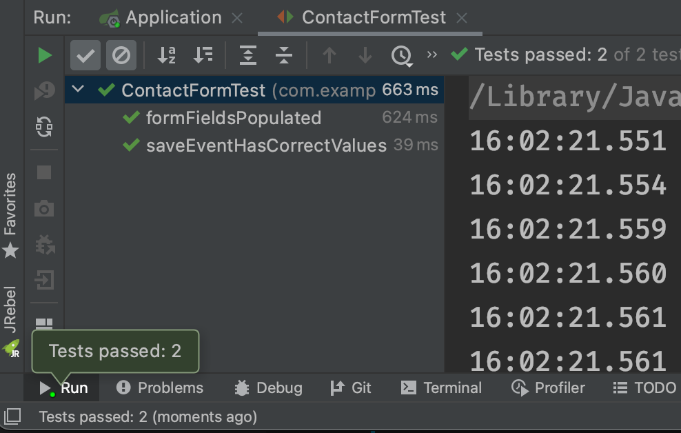
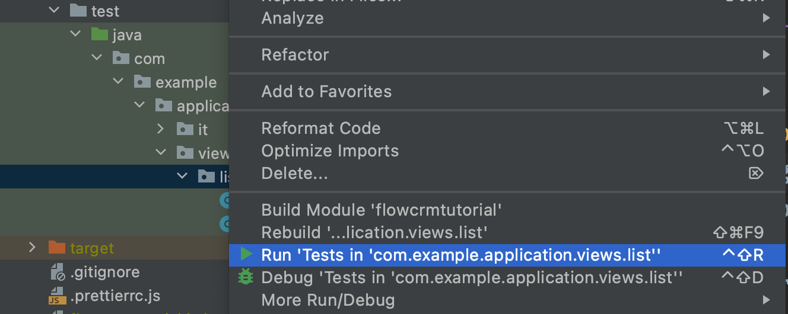

= Testing Vaadin With Unit and Integration Tests

It is a common best practice to test as little code as possible in a single test. 
In this way, when things go wrong, only relevant tests fail. 
For UI testing, there are three main approaches:

* Unit tests: for simple UI logic.
* Integration tests: for more advanced UI logic. 
* End-to-end tests: to test what the user sees.

You can run unit and integration tests standalone, that is, without any external dependencies, such as a running server or database. 

End-to-end tests require the application to be deployed and are run in a browser window to simulate an actual user. 

In this chapter, you write and run unit and integration tests. 
The tutorial covers end-to-end tests in the next chapter.

video::zz3AcFpXSFI[youtube]

== Creating and Running Unit Tests For Simple UI Logic

The most minimal way of testing is to create a plain Java unit test. 
This only works with UI classes with no dependencies, no auto wiring etc. 
For the `ContactForm`, you can create a unit test to verify that the form fields are correctly populated, based on the given bean. 

.Put tests in the correct folder
[NOTE] 
====
All test classes should go in the test folder, `src/test/java`. 
Pay special attention to the package names. 
Use package-access for class fields. 
If the test isn't in the same package as the class that's being tested, you will get errors.
====

. Start by deleting the tests included with the starter: AbstractViewTest.java` and `LoginViewIT.java`.

. In the `test` folder, create a new package, `com.vaadin.tutorial.crm.ui.view.list`, and add a new `ContactFormTest.java` file with the code below. 
When prompted, select the `org.junit` import of `@Before`.
+
.`ContactFormTest.java`
[source,java]
----
public class ContactFormTest {
    private List<Company> companies;
    private Contact marcUsher;
    private Company company1;
    private Company company2;

    @Before
    public void setupData() {
        companies = new ArrayList<>();
        company1 = new Company("Vaadin Ltd");
        company2 = new Company("IT Mill");
        companies.add(company1);
        companies.add(company2);

        marcUsher = new Contact();
        marcUsher.setFirstName("Marc");
        marcUsher.setLastName("Usher");
        marcUsher.setEmail("marc@usher.com");
        marcUsher.setStatus(Contact.Status.NotContacted);
        marcUsher.setCompany(company2);
    }
}
----
+
* The `@Before` annotation adds dummy data that is used for testing. This method is executed before each `@Test` method. 

. Now, add a test method that uses `ContactForm`:
+
.`ContactFormTest.java`
[source,java]
----
@Test
public void formFieldsPopulated() {
    ContactForm form = new ContactForm(companies);
    form.setContact(marcUsher); // <1>
    Assert.assertEquals("Marc", form.firstName.getValue());
    Assert.assertEquals("Usher", form.lastName.getValue());
    Assert.assertEquals("marc@usher.com", form.email.getValue());
    Assert.assertEquals(company2, form.company.getValue());
    Assert.assertEquals(Contact.Status.NotContacted, form.status.getValue()); // <2>
}
----
+
<1> Validates that the fields are populated correctly, by first initializing the contact form with some companies, and then setting a contact bean for the form. 
<2> Uses standard JUnit `assertEquals` methods to compare the values from the fields available through the `ContactForm` instance:

. Similarly, test the save functionality of `ContactForm`:

.. First, initialize a `ContactForm` with an empty contact:
+
.`ContactFormTest.java`
[source,java]
----
@Test
public void saveEventHasCorrectValues() {
    ContactForm form = new ContactForm(companies);
    Contact contact = new Contact();
    form.setContact(contact);
}
----
+
.. Continue the method by populating values into the form:
+
.`saveEventHasCorrectValues()`
[source,java]
----
form.firstName.setValue("John");
form.lastName.setValue("Doe");
form.company.setValue(company1);
form.email.setValue("john@doe.com");
form.status.setValue(Contact.Status.Customer);       
----
+
.. Finally, add the following code to the end of `saveEventHasCorrectValues()` to click the save button and assert that the values from the fields end up in the bean: 
+
.`saveEventHasCorrectValues()`
[source,java]
----
AtomicReference<Contact> savedContactRef = new AtomicReference<>(null);
form.addListener(ContactForm.SaveEvent.class, e -> {
    savedContactRef.set(e.getContact()); // <1>
});
form.save.click();
Contact savedContact = savedContactRef.get(); // <2>

Assert.assertEquals("John", savedContact.getFirstName());
Assert.assertEquals("Doe", savedContact.getLastName());
Assert.assertEquals("john@doe.com", savedContact.getEmail());
Assert.assertEquals(company1, savedContact.getCompany());
Assert.assertEquals(Contact.Status.Customer, savedContact.getStatus()); // <3>
----
+
<1> As `ContactForm` fires an event on save and the event data is needed for the test, an `AtomicReference` is used to store the event data, without using a class field. 
<2> Clicks the save button and asserts that the values from the fields end up in the bean. 
<3> Once the event data is available, you can use standard `assertEquals` calls to verify that the bean contains the expected values.

. To run the unit test, right click `ContactFormTest` and Select *Run 'ContactFormTest'*.
+

. When the test finishes, you will see the results at the bottom of the IDE window in the test runner panel. 
As you can see, both tests passed.
+

== Creating and Running Integration Tests For More Advanced UI Logic

To test a class that uses `@Autowire`, a database, or any other feature provided by Spring Boot, you can no longer use plain JUnit tests. 
Instead, you can use the Spring Boot test runner. 
This does add a little overhead, but it makes more features available to your test. 

. First, add the `spring-boot-starter-test` dependency to the project's `pom.xml` to be able to use the features:
+
.`pom.xml`
[source,xml]
----
<dependency>
  <groupId>org.springframework.boot</groupId>
  <artifactId>spring-boot-starter-test</artifactId>
  <scope>test</scope>
  <exclusions>
    <exclusion>
      <groupId>org.junit.vintage</groupId>
      <artifactId>junit-vintage-engine</artifactId>
    </exclusion>
  </exclusions>
</dependency>
----
. To set up a unit test for `ListView`, create a new file, `ListViewTest`, in the `com.vaadin.tutorial.crm.ui.views.list` package:
+
.`ListViewTest.java`
[source,java]
----
@RunWith(SpringRunner.class)
@SpringBootTest
public class ListViewTest {

    @Autowired
    private ListView listView;

    @Test
    public void formShownWhenContactSelected() {
    }
}
----
+
* The `@RunWith(SpringRunner.class)` and `@SpringBootTest` annotations make sure that the Spring Boot application is initialized before the tests are run and allow you to use `@Autowire` in the test.

. In the `ListView` class:
.. Add the Spring `@Component` annotation to make it possible to `@Autowire` it. 
Also add `@Scope("prototype")` to ensure every test run gets a fresh instance.
+
Side note: you didn’t need to add the annotation for normal application usage, as all `@Route` classes are automatically instantiated by Vaadin in a Spring-compatible way.
+
.. Remove the `private` keyword. This changes the private fields to package private, and allows you to access the grid and form of the `ListView` in your test case.
+
.`*ListView.java*`
[source,java]
----
@Component
@Scope("prototype")
@Route(value = "", layout = MainLayout.class)
@PageTitle("Contacts | Vaadin CRM")
public class ListView extends VerticalLayout {

    ContactForm form;
    Grid<Contact> grid = new Grid<>(Contact.class);
    TextField filterText = new TextField();

    ContactService contactService;

    // rest omitted
}
----

. Right click the package that contains both tests, and select *Run tests in 'com.vaadin.tutorial.crm.ui.views.list'*.
+

. You should see that both test classes run and result in 3 successful tests. 
+

+
.Integration tests take longer to run
[NOTE]
====
You probably noticed that running the tests the second time took much longer. 
This is the price of being able to use `@Autowire` and other Spring features and can cost many seconds of startup time. 

You can improve the startup time by explicitly listing the needed dependencies in the `@SpringBootTest` annotation using `classes={...}`, mock parts of the application, or using other advanced techniques which are out of scope for this tutorial. 
Pivotal's https://pivotal.io/application-modernization-recipes/testing/spring-boot-testing-best-practices[Spring Boot Testing Best Practices] has tips to speed up your tests.
====

. You can now add the actual test implementation, which selects the first row in the grid and validates that this shows the form with the selected `Contact`:
+
.`ListViewTest.java`
[source,java]
----
    @Test
    public void formShownWhenContactSelected() {
        Grid<Contact> grid = listView.grid;
        Contact firstContact = getFirstItem(grid);

        ContactForm form = listView.form;

        Assert.assertFalse(form.isVisible());
		grid.asSingleSelect().setValue(firstContact);
        Assert.assertTrue(form.isVisible());
        Assert.assertEquals(firstContact.getFirstName(), form.firstName.getValue());
    }
private Contact getFirstItem(Grid<Contact> grid) {
		return( (ListDataProvider<Contact>) grid.getDataProvider()).getItems().iterator().next();
	}
----
+
* The test verifies that the form logic works by: 
** Asserting that the form is initially hidden.
** Selecting the first item in the grid and verifying that:
*** The form is visible.
*** The form is bound to the correct `Contact` by ensuring the right name is visible in the field.

. Rerun the tests. They should all pass.

You now know how to test the application logic both in isolation with unit tests and by injecting dependencies to test the integration between several components. 
In the next chapter, the tutorial covers how to test the entire application in the browser. 
