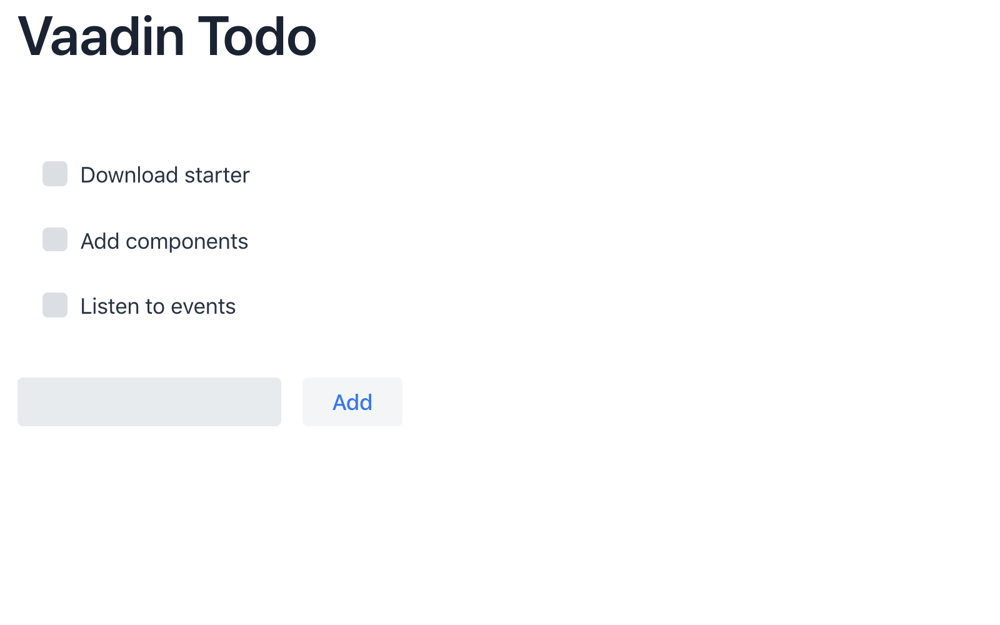
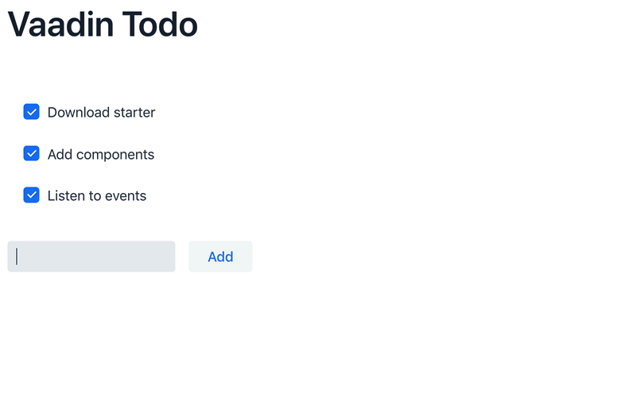

= Vaadin Flow Quick Start Tutorial

Vaadin Flow enables you to quickly build web apps in _pure Java_ (without writing any HTML or JavaScript).

In this tutorial, you learn how to build a small but fully functional Todo application using Vaadin Flow.

[discrete]
== What You Need

- About 5 minutes
- JDK 8 or higher (For example, https://adoptium.net/[Eclipse Temurin JDK]).

== Step 1: Download a Vaadin Project

++++

<a href="https://vaadin.com/vaadincom/start-service/lts/project-base?appName=My Todo&groupId=org.vaadin.example&techStack=spring" class="button secondary water quickstart-download-project"
 onClick="function test(){ _hsq && _hsq.push(['trackEvent', { id: '000007517662', value: null }]); } test(); return true;">Download</a>
&nbsp;
<a href="https://gitpod.io/#/https://github.com/vaadin/skeleton-starter-flow-spring/tree/v14" class="button secondary water" target="_blank" rel="noreferrer noopener">Open in online IDE</a>

++++

Unpack the downloaded zip into a folder on your computer, and import the project in the IDE of your choice. (Alternatively, open the project in an online IDE).

== Step 2: Add Your Code

Open `src/main/java/org/vaadin/example/MainView.java`.
Replace the code in MainView with the code below:

.`MainView.java`
[source,java]
----
package org.vaadin.example;

import com.vaadin.flow.component.Key;
import com.vaadin.flow.component.button.Button;
import com.vaadin.flow.component.checkbox.Checkbox;
import com.vaadin.flow.component.html.H1;
import com.vaadin.flow.component.orderedlayout.HorizontalLayout;
import com.vaadin.flow.component.orderedlayout.VerticalLayout;
import com.vaadin.flow.component.textfield.TextField;
import com.vaadin.flow.router.Route;

@Route("") // <1>
public class MainView extends VerticalLayout { // <2>

  public MainView() {
    VerticalLayout todosList = new VerticalLayout(); // <3>
    TextField taskField = new TextField(); // <4>
    Button addButton = new Button("Add"); // <5>
    addButton.addClickListener(click -> { // <6>
      Checkbox checkbox = new Checkbox(taskField.getValue());
      todosList.add(checkbox);
    });
    addButton.addClickShortcut(Key.ENTER); // <7>
    
    add( // <8>
      new H1("Vaadin Todo"),
      todosList,
      new HorizontalLayout(
        taskField,
        addButton
      )
    );
  }
}
----
<1> This `@Route` annotation makes the view accessible to the end user (in this case, via the empty `` route).
<2> As it extends `VerticalLayout`, components added to the `MainView` class will be ordered vertically.
<3> `todosList` is a vertical layout that displays the task and checkboxes
<4> `taskField` is the text input field for new tasks
<5> `addButton` is the button user to trigger the logic of adding new todo item
<6> In the listener for the button click, first create a checkbox with the value from the `taskField` as its label, then add that new checkbox to the `todosList`.
<7> Add a shortcut which clicks the `addButton` when the `Enter` key is pressed.
<8> Call `add()` on the `VerticalLayout` to display the components vertically. Notice that `taskField` and `addButton` are in a `HorizontalLayout`, which puts them next to each other.

== Step 3: Run the Application

To run the project in your IDE, launch `Application.java` which is located under `src/main/java/org/vaadin/example`. 

Alternatively, you can run the project from the command line by typing `mvnw` (on Windows), or `./mvnw` (on macOS or Linux). 

Then, in your browser, open `http://localhost:8080[localhost:8080, rel="nofollow"]` and you should see the following:

[discrete]
== Go further

Now you have a taste of how Vaadin Flow empowers you to quickly build web apps in pure Java, without writing any HTML or JavaScript. 

Continue exploring Vaadin Flow in the documentation, tutorials, and video courses:

- <<../overview#, Flow framework overview>>
- <<in-depth-course#, In-depth course: learn Vaadin Flow development in 4 hours>>
- link:https://vaadin.com/learn/training[Free online video courses covering Vaadin basics]

Source code on link:https://github.com/vaadin-learning-center/vaadin-todo[GitHub].
