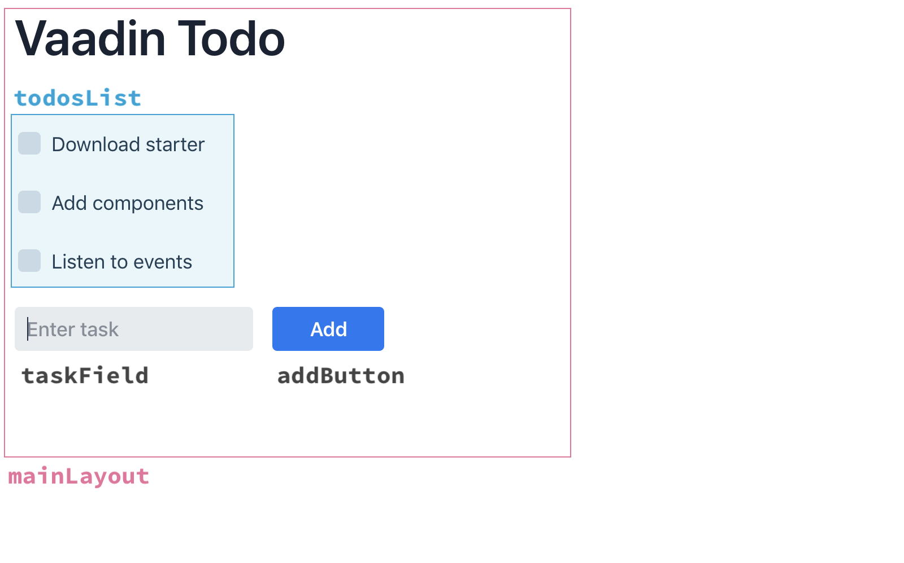

= Vaadin Flow Quick Start tutorial 

Vaadin is a great way to build a modern web app, combining web components with the power of server-side Java.

In this tutorial, you learn how to build a small but fully functional Vaadin application. This example teaches you the basics of component-based development and listening to events.

The application you build is the classic Todo application.

image::images/app-overview.png[Todo application with a header, checkboxes for todo items and a form for entering new items]

== Prerequisites

To continue make sure that at least the following tools are installed:

- Java Development Kit (JDK) 8 or later. Follow the link:/guide/install/[development evironment installation instructions] if you do not have Java installed yet.

== Download a minimal Vaadin project

++++
<a href="https://vaadin.com/vaadincom/start-service/lts/project-base?appName=My Todo&groupId=com.example&techStack=spring" class="button button--bordered quickstart-download-project"
 onClick="function test(){ _hsq && _hsq.push(['trackEvent', { id: '000007517662', value: null }]); } test(); return true;">Download</a>
++++

++++
<a href="https://gitpod.io/#/https://github.com/vaadin/skeleton-starter-flow-spring/tree/v14" class="button button--bordered" target="_blank" rel="noreferrer noopener">Open in online IDE</a>
++++
Once you have the project downloaded, unzip the file somewhere, for instance your home directory.

Next, you should import the project into your IDE. For IntelliJ IDEA, you can follow the steps described in https://vaadin.com/learn/tutorials/import-maven-project-intellij-idea#_import_the_project[import the project] tutorial.

The project folder has a few files and folders, many of them related to dependency and project configuration. In this tutorial, we are only interested in our UI code in `src/main/java/com/example/MainView.java`

To run the application, you should run the `src/main/java/com/example/Application.java` class. Running the main method in the class, will start an embedded server and trigger the frontend resources build. Starting up the build for the first time, might take a while.

Navigate to `http://localhost:8080[localhost:8080, rel="nofollow"]`, and you should see a basic Vaadin application with a button.

We are now ready to start building the app.

== Building UIs with components and layouts
Vaadin is a component-based framework. You construct user interfaces by instantiating components and putting them into layouts that determine how they get shown. `MainView` extends `VerticalLayout`. It means that each added component gets placed underneath the previous one. Vaadin adds padding around the layout and components for visual clarity.

Here is the breakdown of the different components and layouts of the app we are creating.

Open `src/main/java/com/example/MainView.java`. Replace the code in MainView with the code below:

.MainView.java
[source,java]
----
package com.example;

import com.vaadin.flow.component.Key;
import com.vaadin.flow.component.button.Button;
import com.vaadin.flow.component.button.ButtonVariant;
import com.vaadin.flow.component.checkbox.Checkbox;
import com.vaadin.flow.component.dependency.CssImport;
import com.vaadin.flow.component.html.H1;
import com.vaadin.flow.component.orderedlayout.HorizontalLayout;
import com.vaadin.flow.component.orderedlayout.VerticalLayout;
import com.vaadin.flow.component.textfield.TextField;
import com.vaadin.flow.router.Route;

@Route
public class MainView extends VerticalLayout {

  public MainView() {
    VerticalLayout todosList = new VerticalLayout(); <1>
    TextField taskField = new TextField(); <2>
    Button addButton = new Button("Add"); <3>
    addButton.addClickShortcut(Key.ENTER);
    addButton.addClickListener(click -> {
      <4>
      Checkbox checkbox = new Checkbox(taskField.getValue());
      todosList.add(checkbox);
    });
    add( <5>
      new H1("Vaadin Todo"),
      todosList,
      new HorizontalLayout(
        taskField,
        addButton
      )
    );
  }
}
----
<1> `todosList` is a vertical layout that displays the task and checkboxes
<2> `taskField` is the text input field for new tasks
<3> `addButton` triggers logic to add new items to our list of todo items
<4> In the listener for the button click, create a checkbox with the value from the `taskField` as its label.
<5> Call `add` on the VerticalLayout to define how the components should be displayed. Notice that `taskField` and `addButton` are in a `HorizontalLayout`, which puts them next to each other.

If you still have the app running, kill the process and rerun the main method in `Application.java`.

Navigate to `http://localhost:8080[localhost:8080, rel="nofollow"]` and you should see the following:

image::images/completed-app.gif[Animation of adding a new todo item and checking it.]

== Adding styling

Many Vaadin components have built-in style variants that can be easily added with Java. For instance, we can highlight the Button by giving it the `primary` style attribute. We do this with adding the following line after we create the button (the line with `new Button`):

[source,java]
----
addButton.addThemeVariants(ButtonVariant.LUMO_PRIMARY);
----

There are more variants you can add, and most other components have their own styles too; you can explore the Variant classes for ideas, such as the  `TextFieldVariant`.

Vaadin apps also support styling with CSS. Any style can be applied, but for the sake of simplicity lets just bold the text for the CheckBoxes for some visual flair. To add some styles to the app, add the following annotation under the `@Route` line:

[source,java]
----
@CssImport("styles/shared-styles.css")
----

The `@CssImport` annotation looks in a folder in the project root called `frontend`, so the full path of the file is `{project root}/frontend/styles/shared-styles.css`. This file is already created for you, but you can add additional style files if you wish. In case of our demo, one is enough for now. The file already contains some styles, but you can add the one below after that :

[source,css]
----
vaadin-checkbox {
	font-weight: bold;
}
----

Save all files, close the server and run the application again. The Button should now be blue, and the text for all CheckBoxes is bolded. 

== Next steps
- In a real application, you would have some backend and use the Vaadin data binding APIs. An example form with cross-field validation and form error handling can be found at link:https://github.com/vaadin/vaadin-form-example[Vaadin Form Example]
- Make a custom look and feel of your application link:https://vaadin.com/docs/flow/theme/application-theming-basics.html[Application Theming Basics]
- Once you have developed your app you want to deploy it somewhere. Further documentation on the topic can be found at the official documentation link:https://vaadin.com/docs/flow/production/tutorial-production-mode-basic.html[Deploying Vaadin Applications]

These topics and many more are covered in our documentation, tutorials and video courses:

- link:https://vaadin.com/docs/flow/introduction/introduction-concepts.html[Core concepts]
- link:/learn/tutorials/getting-started-with-flow[CRUD application tutorial] 
- link:/learn/training[Free online video course covering Vaadin basics]

Source code on link:https://github.com/vaadin-learning-center/vaadin-todo[GitHub].
