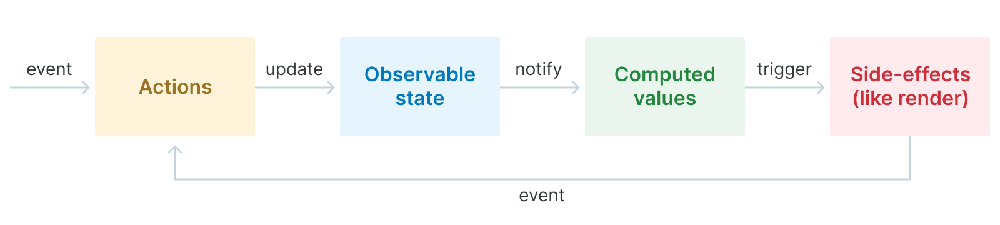
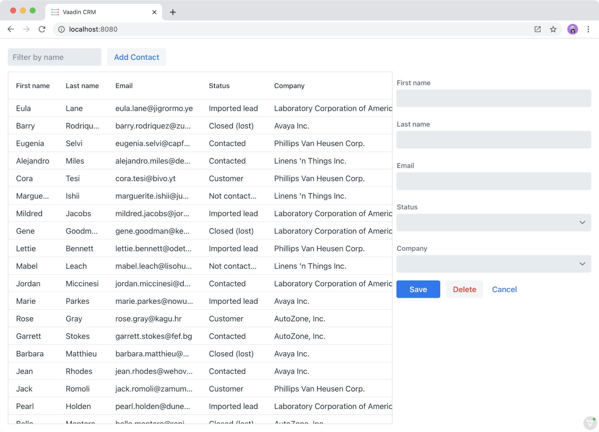

= Application state management with MobX 

Vaadin Fusion uses a reactive programming model for views and components. In a reactive UI programming model, the view has a declarative template that takes in a state and produces the HTML that should be rendered. In programming terms, you can think of the process as:

----
renderedHtml = template(state)
----

That is: the view is a function of the state. Any time the state changes, the rendered HTML is updated.

In this chapter, we cover:

- Application state management with MobX. 
- Creating MobX stores.
- Fetching endpoint data and saving it in a store.
- Using application state in a template.

== Component vs application state 
There are two places where you can store state in a Vaadin Fusion application: component properties (`@property` or `@state`) or MobX stores. _We recommend storing state primarily in MobX stores_. 

Component properties are appropriate for storing state that is only relevant to a single component and doesn't depend on the application state. 

== An introduction to state management with MobX
https://mobx.js.org/[MobX] is a simple and scalable state management library that is used widely in the LitElement and React communities. 

What makes MobX stand out among other state management libraries, like Redux, is that it requires almost no boilerplate and it uses normal TypeScript syntax for updating state. This makes it easy to learn and use. 

At the core of MobX is the _observable state_: the state that gets updated through _actions_ (methods) that get triggered by events. When the state changes, additional _computed values_ are updated, and finally any _side-effects_ are run. The most common side effects in a Fusion application are rendering the view template and using https://mobx.js.org/reactions.html[`autorun`] functions. 

[link=images/diagram.png]

MobX uses _stores_ for storing state and logic. A store is similar to a controller in the MVC pattern or a presenter in a MVP pattern. Stores can be composed of other stores and can be extended dynamically. 

Try to keep the state as small as possible and avoid duplication. Use computed properties to derive values out of the existing state. For instance: don't store a separate `contactCount` value, rather compute this based on the contacts array. 

MobX caches computed values and only evaluates them if they are used, and if any observables they depend on have changed since they were last computed. 

https://mobx.js.org/defining-data-stores.html#combining-multiple-stores[MobX recommends] using at least two stores: one for domain objects and one for the application state. It's best to keep business and app state separate for easier testing and reuse. These two stores are managed by a central store called the `AppStore`.

== Creating the CRM application state stores
The Vaadin CRM application has three main stores: 

* `AppStore` - Container for other stores.
** `UiStore` - App state (logged in, offline). 
** `CrmStore` - Domain objects and logic (contacts, companies, states).

For now, we only need the `AppStore` and `CrmStore`, we add the `UiStore` later in the Adding a login screen and authentication chapter. As we only have a single-domain store now, we don't strictly need an `AppStore` yet, but we add it now to avoid having to refactor code later on. 

Begin by creating the `CrmStore` to manage domain objects. Create a new file, `frontend/stores/crm-store.ts` with the following content. 

.crm-store.ts
[source,typescript]
----
import { makeAutoObservable, observable, runInAction } from 'mobx';
 
import Company from 'Frontend/generated/com/example/application/data/entity/Company';
import Contact from 'Frontend/generated/com/example/application/data/entity/Contact';
import Status from 'Frontend/generated/com/example/application/data/entity/Status';
import * as endpoint from 'Frontend/generated/CrmEndpoint';
 
export class CrmStore {
 contacts: Contact[] = [];
 companies: Company[] = [];
 statuses: Status[] = [];
}
----

Notice that import generated TypeScript types for `Contact`, `Company`, and `Status`. We also import all methods from `CrmEndpoint` as `endpoint`. 

The state consists of three arrays: `contacts`, `companies`, and `statuses`.

Turn the class into a MobX observable (store) by calling `makeAutoObservable` in the constructor: 

.crm-store.ts
[source,typescript]
----
constructor() {
 makeAutoObservable(
   this,
   {
     initFromServer: false,
     contacts: observable.shallow,
     companies: observable.shallow,
     statuses: observable.shallow,
   },
   { autoBind: true }
 );
 
 this.initFromServer();
}
----

`makeAutoObservable` takes in three arguments:

1. The class that should be made observable.
2. Overrides. By default, all fields are made into observed values, all functions into actions, and all getters into computed values. In our case, we only want to observe changes to the array content, not the content of the objects in the array. This way, MobX doesn't create proxy objects for all objects. We also don't need the `initFromServer` method to be turned into an action. 
3. Options. Here, we enable `autoBind`, which will bind all actions to this class. It makes it easier to use them in listeners later on.

Add a method that initializes the store from the server. 

.crm-store.ts
[source,typescript]
----
async initFromServer() {
 const data = await endpoint.getCrmData();
 
 runInAction(() => {
   this.contacts = data.contacts;
   this.companies = data.companies;
   this.statuses = data.statuses;
 });
}
----

`initFromServer` is an https://developer.mozilla.org/en-US/docs/Learn/JavaScript/Asynchronous/Async_await[async] method. Async methods can use the `await` keyword to suspend the execution until a `Promise` resolves. Async methods make it easier to write non-blocking asynchronous code. 

Observables need to be updated through actions. Normally, all methods on the store are actions. But asynchronous code needs to be handled slightly differently. Because the `await` keyword causes the execution to suspend, the original action is no longer active when the value is returned. You can work around this by either having a separate method just for setting the values, or by using `runInAction` to explicitly run the state update in an action. 

Finally, add the following to `frontend/stores/app-store.ts: 

.app-store.ts
[source,typescript]
----
import { CrmStore } from "./crm-store";
 
export class AppStore {
 crmStore = new CrmStore();
}
 
export const appStore = new AppStore();
export const crmStore = appStore.crmStore;
----

The purpose of the app store is to ensure that we only have one instance of the stores and that they are in sync. We export the `crmStore` member for convenience. This way, we can import and use `crmStore` instead of `appStore.crmStore`, while still ensuring we only work with one set of stores. 

== Using a MobX store from a view template
Now that we have a store that contains the state, we can use it to display contacts in the list view grid. 

First, import the store into the list view: 

.list-view.ts
[source,typescript]
----
import { crmStore } from 'Frontend/stores/app-store';
----

Next, update the template. Use a property binding on `vaadin-grid` to bind the contacts state to the `items` property. 

.list-view.ts
[source,html]
----
<vaadin-grid class="grid h-full" .items=${crmStore.contacts}>
----

In your browser, you should now see all the contacts listed in the grid. If you don't have the development server running, start it with the `mvn` command from the command line. 

