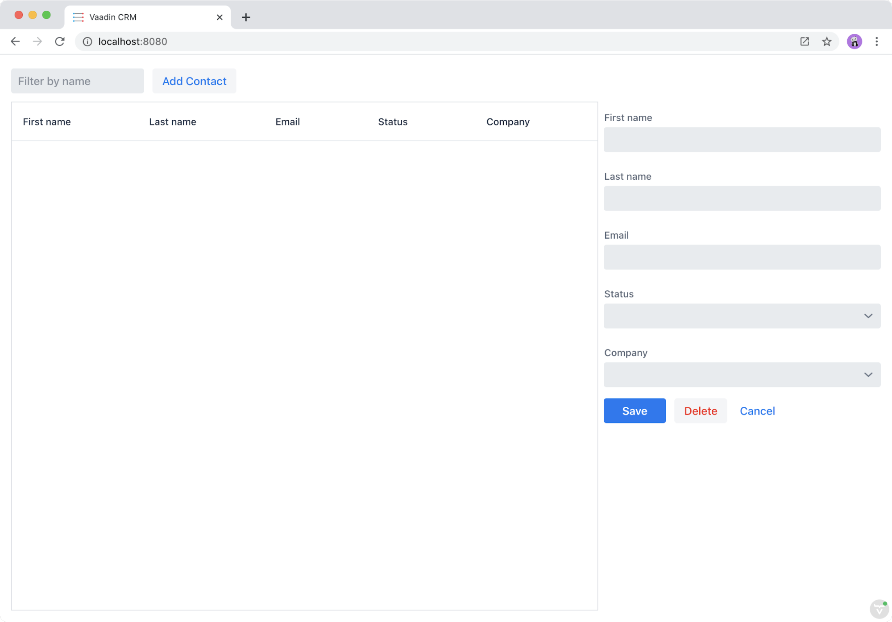

= Creating a reusable form component for editing contacts

The list view now has a grid to display `Contact`s. To complete the view, we need to create a form for editing contacts. 

image::images/contact-form.png[A screenshot of the application highlighting the contact editing form]

In this chapter we cover:

- Creating a new component.
- Importing and using a custom component. 

== Creating a new component
Create a new file in the same directory as the list view: `frontend/views/list/contact-form.ts`.

Add the following content to the file:

.contact-form.ts
[source, typescript]
----
import { customElement, html } from 'lit-element';
import { View } from '../view';
import '@vaadin/vaadin-text-field';
import '@vaadin/vaadin-combo-box';
import '@vaadin/vaadin-button';
 
@customElement('contact-form') 
export class ContactForm extends View { 
 render() {
   return html`
     <vaadin-text-field label="First name"></vaadin-text-field>
     <vaadin-text-field label="Last name"></vaadin-text-field>
     <vaadin-text-field label="Email"></vaadin-text-field>
     <vaadin-combo-box label="Status"></vaadin-combo-box>
     <vaadin-combo-box label="Company"> </vaadin-combo-box>
 
     

       <vaadin-button theme="primary">Save</vaadin-button>
       <vaadin-button theme="error">Delete</vaadin-button>
       <vaadin-button theme="tertiary">Cancel</vaadin-button>
     

   `;
 }
}
----

As stated in the Introduction to LitElement section, there are three main parts to defining a LitElement component: 

1. Creating a class that extends from `LitElement`.
2. Defining the tag name and registering the element with `@customElement`.
3. Defining a template as a tagged `html` template literal as a return value of the `render()` method.

In this case, instead of directly extending `LitElement`, we use `View`. `View` turns off the Shadow DOM for easier app-wide theming and adds support for MobX state management that we need later on. 

The tag name in `@customElement` needs to include a dash (`-`). It's good practice to use the same name for the file and the tag name, `contact-form` in this case. 

The template uses three components from the Vaadin component set: text field, combo box and button. The buttons specify different theme variants using the `theme="variant"` attribute. 

== Using a custom component in another view
In order to use the new `contact-form` component in `list-view`, you first need to import it. 

Add the following import at the end of the imports in `list-view.ts`:

.list-view.ts
[source,typescript]
----
import './contact-form';
----

Then, add the component to the template right after the `</vaadin-grid>` end tag. 

.list-view.ts
[source,html]
----
<contact-form class="flex flex-column sb-s"></contact-form>
----

Here, we again use the Lumo utility CSS classes to turn the form into a flex container with spacing between components. 

Finally, make the form wider with some CSS: 

.frontend/views/list/list-view.css
[source,css]
----
list-view contact-form {
 flex-shrink: 0;
 width: 25em;
}
----

The `themes` folder contains the CSS for the project. Be sure to scope your CSS selectors with the component name when using `View` as the base class. This ensures you don't accidentally apply styles to other components. 

Open your browser to localhost:8080, and you should see the following:

If your development server isn't running, start it with the `mvn` command from the command line. 

Now that we have the view ready, we can turn our focus to the backend and create an endpoint for fetching and persisting data to the server.
