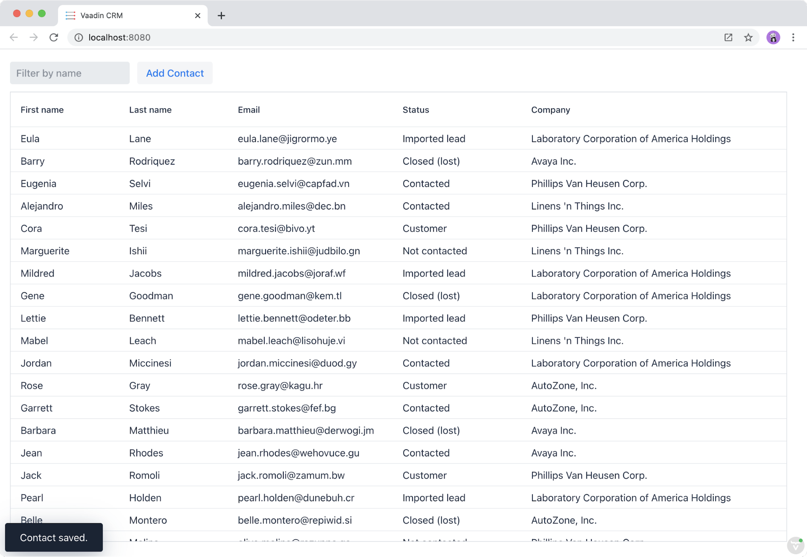

= Creating, Updating, and Deleting Contacts (CRUD)

The form component can now load and display contacts in a form, but it's still missing a key feature: saving changes. 

This chapter covers:

* Saving contacts to the server.
* Deleting contacts.
* Error handling.
* Showing success and error messages.

== Implementing Save and Delete Actions in the Store

The MobX `CrmStore` contains the state of the domain objects. 
All save and delete operations are handled by the store. 
When the store updates its internal state, the views automatically reflect the updated state. 

The save and delete operations happen in two stages: first the store calls the endpoint to update the backend. 
Next, if the backend operation succeeds, it updates the local state that the views use. 

=== Saving and Deleting on the Server

Add two new actions to `crm-store.ts`: 

.crm-store.ts
[source,typescript]
----
async saveContact(contact: Contact) {
 try {
   this.saveLocal(await endpoint.saveContact(contact));
 } catch (e) {
   console.log(e);
 }
}
 
async deleteContact(contact: Contact) {
 if (!contact.id) return;
 
 try {
   await endpoint.deleteContact(contact.id);
   this.deleteLocal(contact);
 } catch (e) {
   console.log(e);
 }
}
----

The actions call the endpoint in a try/catch block. 
If all goes well, they call another action to update or delete the contact locally (you implement these actions next). 
If something goes wrong, the actions log the error to the console and do not update the state. 

[TIP]
.Latency compensation
====
You can make your application faster by using _latency compensation_. 
Essentially, this means that you update the local state before calling the server, and revert the change in if the server call fails. 

Assuming that the server calls succeed most of the time, it makes updates appear instantaneous, even if the user is on a high-latency network or the server is slow. 
====

=== Saving and Deleting Locally

Next, add two private actions for updating the state. 

.crm-store.ts
[source,typescript]
----
private saveLocal(saved: Contact) {
 const contactExists = this.contacts.some((c) => c.id === saved.id);
 if (contactExists) {
   this.contacts = this.contacts.map((existing) => {
     if(existing.id === saved.id) {
       return saved;
     } else {
       return existing;
     }
   });
 } else {
   this.contacts.push(saved);
 }
}
 
private deleteLocal(contact: Contact) {
 this.contacts = this.contacts.filter((c) => c.id !== contact.id);
}
----

The `saveLocal()` method checks if the store already contains the `id` of the contact. 
If so, it creates a new array by using the `map` operator to swap out the changed contact. 
If the contact is new, it is pushed onto the end of the `contacts` array. 

The `deleteLocal()` method updates the contacts array by filtering out any contacts that match the id of the provided contact. 

Next, add save and delete actions to the list view store. 
The list view store knows about the selected contact and maintains the view state. 
This allows you to update the view state appropriately after saving or deleting a contact. 
Internally, the action calls the actions defined on the `CrmStore`. 

.list-view-store.ts
[source,typescript]
----
async save(contact: Contact) {
 await crmStore.saveContact(contact);
 this.cancelEdit();
}
 
async delete() {
 if (this.selectedContact) {
   await crmStore.deleteContact(this.selectedContact);
   this.cancelEdit();
 }
}
----

Lastly, update the contact form to use the new actions. 
You can bind the delete action directly to the delete-button listener. 
Saving the form requires using the binder, so add a separate method for this. 

.contact-form.ts
[source,typescript]
----
render() {
 const { model } = this.binder;
 return html`
   <!-- omitted --> 
   

     <vaadin-button theme="primary" @click=${this.save}>
       ${this.binder.value.id ? 'Save' : 'Create'}
     </vaadin-button>
     <vaadin-button theme="error" @click=${listViewStore.delete}>
       Delete
     </vaadin-button>
     <vaadin-button theme="tertiary" @click=${listViewStore.cancelEdit}>
       Cancel
     </vaadin-button>
   

 `;
}
 
async save() {
 await this.binder.submitTo(listViewStore.save);
 this.binder.clear();
}
----

The save button calls the `save()` method, which uses the binder to submit the value to the action on `listViewStore`. 
The `submitTo()` method validates the form, and only submits it if all values pass the validation rules. 

The save-button caption uses `binder.value.id` to change the caption to "Save", if you are editing an existing contact or "Create", if you are editing a new contact. 

== Showing Success and Error Messages 

For now, errors are only logged to the console: not a convenient place for non-developers. 
Improve the situation by adding a way of displaying notifications. 

Until now, you have only had one store, the `CrmStore` containing the domain state. 
Messages are part of the application UI state, so create a new store to manage it. 

Create a new file `frontend/stores/ui-store.ts` with the following content: 

.ui-store.ts
[source,typescript]
----
import { makeAutoObservable, runInAction } from 'mobx';
 
class Message {
 constructor(public text = '', public error = false, public open = false) {}
}
 
export class UiStore {
 message = new Message();
 
 constructor() {
   makeAutoObservable(this, {}, { autoBind: true });
 }
 
 showSuccess(message: string) {
   this.showMessage(message, false);
 }
 
 showError(message: string) {
   this.showMessage(message, true);
 }
 
 private showMessage(text: string, error: boolean) {
   this.message = new Message(text, error, true);
   setTimeout(() => runInAction(() => (this.message = new Message())), 5000);
 }
}
----

The store has two public actions: `showSuccess()` and `showError()`. 
Internally, both use the `showMessage()` action to update the `message` property. 
The action includes a 5 second timeout, after which it resets the message state.  

Next, add the new store to the `AppStore` and export it. 
This ensures you only have one `UiStore`. 

.app-store.ts
[source,typescript]
----
import { CrmStore } from './crm-store';
import { UiStore } from './ui-store';
 
export class AppStore {
 crmStore = new CrmStore();
 uiStore = new UiStore();
}
 
export const appStore = new AppStore();
export const crmStore = appStore.crmStore;
export const uiStore = appStore.uiStore;
----

Next, add a notification component to the list view. 

Add the import: 

.list-view.ts
[source,typescript]
----
import "@vaadin/vaadin-notification";
import { uiStore } from "Frontend/stores/app-store";
----

Then, at the end of the template in the `render()` method, add a notification component that's bound to the `message` state. 

.list-view.ts
[source,html]
----
<vaadin-notification
 theme=${uiStore.message.error ? "error" : "contrast"}
 position="bottom-start"
 .opened=${uiStore.message.open}
 .renderer=${(root: HTMLElement) =>
   (root.textContent = uiStore.message.text)}>
</vaadin-notification>
----

The notification component uses a renderer method for defining content. 
The method receives the notification `root` HTML element as input and you can render any content into it. 
In this case, only add the message text. 
Renderers are also used by Grid for customizing cell contents. 

Now that you have a flexible way of showing messages, put it to use in the `CrmStore`. 
Remember to import `uiStore`.

.crm-store.ts
[source,typescript,highlight=3;6;16;19]
----
async saveContact(contact: Contact) {
 try {
   this.saveLocal(await endpoint.saveContact(contact));
   uiStore.showSuccess("Contact saved.");
 } catch (e) {
   console.log(e);
   uiStore.showError("Contact save failed.");
 }
}
 
async deleteContact(contact: Contact) {
 if (!contact.id) return;
 
 try {
   await endpoint.deleteContact(contact.id);
   this.deleteLocal(contact);
   uiStore.showSuccess("Contact deleted.");
 } catch (e) {
   console.log(e);
   uiStore.showError("Failed to delete contact.");
 }
}
----

In your browser, verify that you can save and delete contacts. 
Refresh your browser to see that the changes are persisted in the database. 
You should see a notification in the bottom left corner when saving or deleting a contact. 

