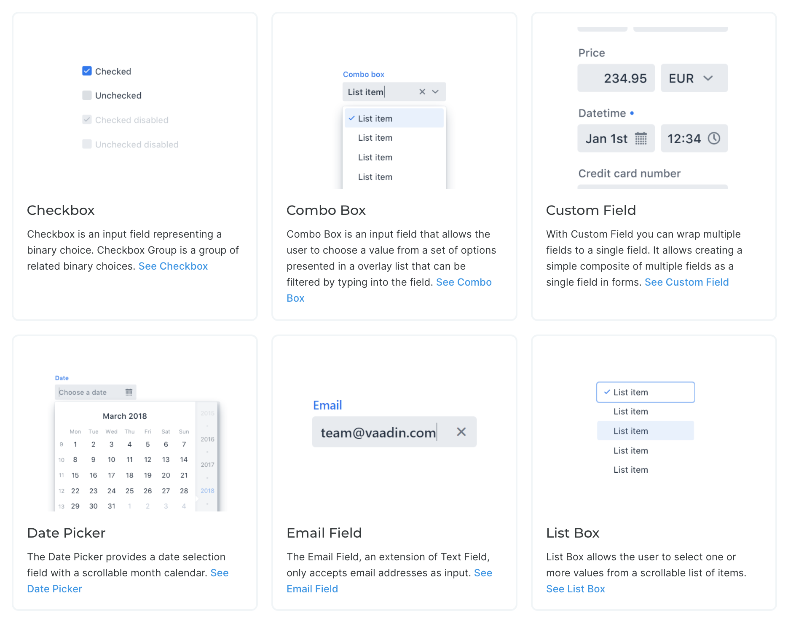
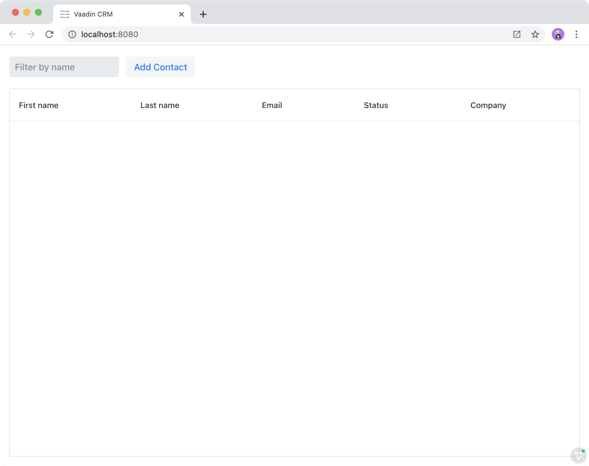

= Creating a Vaadin Fusion view using components

Vaadin Fusion uses the https://lit-element.polymer-project.org/[LitElement^] library for building views. Views are typically constructed using components from the Vaadin component library, HTML, and CSS. 

In this chapter we cover:

- Vaadin component basics.
- Building reactive UIs.
- LitElement basics.
- Constructing a view with Vaadin components and LitElement.

== Vaadin UI components
Vaadin includes over https://vaadin.com/components[40 UI components] to help you build apps faster. By using ready-made building blocks, you are able to focus more of your time on building end-user functionality. 

Vaadin components are custom HTML elements that are registered with the browser. They are based on W3C web component standards. Once loaded, you can use the custom HTML tags like any other HTML.   

The components have light and dark themes, and you can further customize them through CSS variables to fit your brand. 

== An Introduction to building reactive UIs
Building reactive views and components may take some getting used to, if your background is in Vaadin Flow, jQuery, or any other imperative model. Reactive views have fewer moving parts and because of this they are easier to understand and debug. In reactive UI programming, your UI is a function of the component's state. Whenever the state changes, the UI is re-rendered. 

In imperative UI programming, there are two states: the data model and the UI. It is your responsibility as a developer to keep them in sync. In reactive programming, there is only one state: the data. The UI always reflects that state. 

.Imperative UI with Vaadin Flow
[source,java]
----
public class ImperativeView extends Div {
 H1 header = new H1();
 ListItem email = new ListItem();
 ListItem phone = new ListItem();
 
 public ImperativeView() {
   add(header, new UnorderedList(email, phone));
 }
 
 // Update UI when contact changes
 public void setContact(Contact contact) {
   header.setText(String.format("Details for %s %s",
     contact.getFirstName(),
     contact.getLastName()));
   email.setText("Email: " + contact.getEmail());
   phone.setText("Phone: " + contact.getPhone());
 }
}

----

When building a UI imperatively, you need to keep references to elements so you can update their values when the underlying state (the `Contact`) changes. 

.Reactive UI with Vaadin Fusion
[source,typescript]
----
export class ReactiveView extends View {
 @property({ type: Object })
 contact: Contact = {...};
 
 // Render is called automatically when contact changes
 render() {
   return html`
     <h1>Details for ${this.contact.firstName} ${this.contact.lastName}</h1>
     <ul>
       <li>Email: ${this.contact.email}</li>
       <li>Phone: ${this.contact.phone}</li>
     </ul>
   `;
 }
}
----

When building a UI reactively, you define a template using values from the state (`Contact`). Whenever the model changes, the template is automatically updated. 

TIP: As a rule of thumb, you should not use `document.querySelector` or LitElement `@query` to get element reference in order to set values or properties imperatively. There is almost always a way to achieve the same with binding values through the template.

== An introduction to LitElement
LitElement is a lightweight and highly-performant library for building reactive components with declarative templates. 

=== Creating a component
Vaadin Fusion applications use a component-based architecture. Each view is a component. Views, in turn, are composed of other smaller components. 

LitElement components are custom HTML elements built using https://developer.mozilla.org/en-US/docs/Web/Web_Components[web component] standards. You create components by defining a class extending `LitElement` and giving it a HTML tag name using `@customElement("tag-name")`. The tag name needs to contain a dash and be in lower case a-z letters.    

[source,typescript]
----
@customElement("todo-view")
export class TodoView extends LitElement {
}
----

Vaadin includes two helper classes, `View` and `Layout`. Both are based on `LitElement` and are pre-configured to use MobX for state management. We cover MobX state management in a later chapter.

=== Managing the component state using properties
LitElement uses _properties_ to track the component state. Use `@property()` for properties that make up the public API and `@state()` for internal state properties. The HTML template will be re-rendered every time a property changes.  

[source,typescript]
----
@property({ type: String })
name = "";
@state()
private todos: Todo[] = [];
---
<vaadin-text-field value=${this.name}></vaadin-text-field>
<vaadin-grid .items=${this.todos}></vaadin-grid>
----

_The change-detection mechanism only observes changes to the assigned objects, not to their values_. Consider the properties as immutable data and remember to always create a new object or array when changing them. 

JavaScript https://developer.mozilla.org/en-US/docs/Web/JavaScript/Reference/Operators/Spread_syntax[spread syntax] is a convenient way to create copies of objects and arrays. It may take some getting used to if you haven't used it before. 

As an example, here are three properties we can use to understand how property-change detection works: 

[source,typescript]
----
@internalProperty()
private task = "";
@property({type: Object})
todo: Todo;
@property({type: Array})
todos: Todo[] = [];

----

Here's how you should update them to trigger a re-render.

[source,typescript]
----
// yes - changing the string instance
this.task = "Do things";
 
// no - updating a property on an object
this.todo.task = "Do things";
// yes - replacing task with an updated object
this.todo = {...this.todo, task: "Do things"};
// no - pushing items to an array
this.todos.push(this.todo);
// yes - replacing the array with an updated array
this.todos = [...this.todos, this.todo];
----

Read more about LitElement properties in the https://lit-element.polymer-project.org/guide/properties[LitElement] documentation.

=== Defining the UI Template
You define your HTML template in the `render()` method of your component. The method should return a https://developer.mozilla.org/en-US/docs/Web/JavaScript/Reference/Template_literals[template literal] containing the template. Remember to prefix the template literal with `html`.

[source,typescript]
----
render() {
 return html`<h1>Hello world!</h1>`;
}
----

==== lit-html template data binding 
You can use TypeScript expressions inside the HTML template using the `${...}` syntax. 

LitElement uses different syntax for binding, depending on the type of property or event you are binding to:

- Text content: `<h1>${...}</h1>`
- Attribute: `

`
- Boolean attribute: `?hidden=${...}`
- Property: `.value=${...}`
- Event handler: `@event=${...}`

Here is an example using each type of binding:

[source,html]
----
<h1>Hello ${this.name}</h1> 
<vaadin-combo-box
 label=${this.selectLabel}
 .items=${this.todos}
 ?disabled=${this.todos.length===0}
 @change=${this.handleChange}>
</vaadin-combo-box>
----

==== Looping over data
You can repeat templates for an array of data by using the `map` operator and returning an `html` template for each item. 

[source,html]
----
<ul>
 ${this.todos.map(todo => html`
   <li>${todo.task}</li>
 `)}
</ul>
----

==== Showing content conditionally
You can show content conditionally with an inline if clause. You can return a `nothing` (import from `lit-html`) if one of the branches doesn't return a value. 

[source, html]
----

 ${this.todos.length ?
   html`You have <b>${this.todos.length}</b> things to do.` :
   html`<b>You're all done!</b>`}

----

Now that we've covered the basic theory, let's begin coding. 

== The Contact list view
The first view we build is the Contact list view. This view lists all the contacts in the system. Users can search, add, edit, and delete contacts on this view. 

We initially focus only on the list view. We add the layout containing the header and sidebar later in the Navigation and parent layouts chapter. 

In this and the next chapter, we create the needed layouts and components for the view. Then, in the chapter that follows, we create an endpoint for populating the view with data. 

image::images/contact-list-view.png[The list view consists of a data grid and a toolbar]

For this view, you need the following Vaadin components: 

- https://vaadin.com/components/vaadin-text-field[Text Field]
- https://vaadin.com/components/vaadin-button[Button]
- https://vaadin.com/components/vaadin-grid[Grid].

== Importing Vaadin components
Before you can use Vaadin components, you need to import them. Importing the components registers the custom HTML elements with the browser. It also helps the build tool to understand what components are being used, so it can optimize the resulting JavaScript to only include the needed components. 

Add the following imports to the top of `frontend/views/list/list-view.ts`:

.list-view.ts
[source,typescript]
----
import "@vaadin/vaadin-text-field";
import "@vaadin/vaadin-button";
import "@vaadin/vaadin-grid";
import "@vaadin/vaadin-grid/src/vaadin-grid-column";
----

== Defining the view template
Now that the components are imported, you can use them in the template. The template is defined in the `render()` method. 

Replace the contents of the render method with the following: 

.list-view.ts
[source,typescript]
----
render() {
 return html`
   

     <vaadin-text-field
       placeholder="Filter by name"
       clear-button-visible
     ></vaadin-text-field>
     <vaadin-button>Add Contact</vaadin-button>
   

   

     <vaadin-grid class="grid h-full">
       <vaadin-grid-column path="firstName" auto-width>
         </vaadin-grid-column>
       <vaadin-grid-column path="lastName" auto-width>
         </vaadin-grid-column>
       <vaadin-grid-column path="email" auto-width>
         </vaadin-grid-column>
       <vaadin-grid-column
         path="status.name"
         header="Status"
         auto-width
       ></vaadin-grid-column>
       <vaadin-grid-column
         path="company.name"
         auto-width
         header="Company"
       ></vaadin-grid-column>
     </vaadin-grid>
   

 `;
}
----

- The text field is configured to show a placeholder text and a clear button.
- Grid columns map to properties on an object based on the `path` attribute. By default, the header name is derived from the path. You can override it with `header`, for instance when binding to a nested object's path. 
- Utility CSS classes like `flex` and `h-full` help us to easily create layouts without having to write custom CSS. We will include them in the application in the next step.

== Importing CSS helper classes to the theme
The Vaadin Lumo theme comes with a https://github.com/vaadin/vaadin-lumo-styles/pull/103[proposed^] set of CSS utility classes to simplify layouting and styling. Instead of having to write your own CSS for common tasks like adding margins, padding, setting sizes, and defining layouts. 

The utility classes are not yet in the official framework, so we need to import them with `npm`. Run the following command in your terminal:

[source]
----
npm i lumo-css-framework
----

Restart your server to make sure the new CSS file is picked up. 

Then, import the styles in the main theme CSS file, `frontend/themes/fusioncrmtutorial/styles.css`:

.styles.css
[source, css]
----
@import 'lumo-css-framework/classes.css';
----

The styles are now automatically available in all views and layouts. 

TIP: You can browse all the classes in `node_modules/lumo-css-framework/classes.css`

== Adding CSS classes to the view component
So far, we have only added CSS class names to HTML elements within the template. We also need to add classes to the `<list-view>` element itself. The easiest way to do this is to use the `connectedCallback` lifecycle callback. 

Add the following method to the `ListView` class: 

.list-view.ts
[source,typescript]
----
connectedCallback() {
 super.connectedCallback();
 this.classList.add(
   'box-border',
   'flex',
   'flex-column',
   'p-m',
   'sb-s',
   'w-full',
   'h-full'
 );
}
----

Here, we apply the following styles:
- `box-border` - include padding in the height and width.
- `flex`, `flex-column` - a vertical flex layout.
- `p-m` - medium padding.
- `sb-s` - spacing bottom, small.
- `w-full`, `h-full` - full width and height.

It is important to remember to call `super.connectedCallback()` whenever you override `connectedCallback()` to ensure that LitElement initializes the component correctly. 
Save your view file and you should now see this in your browser (start the dev server with `mvn` if you don't have it running):

