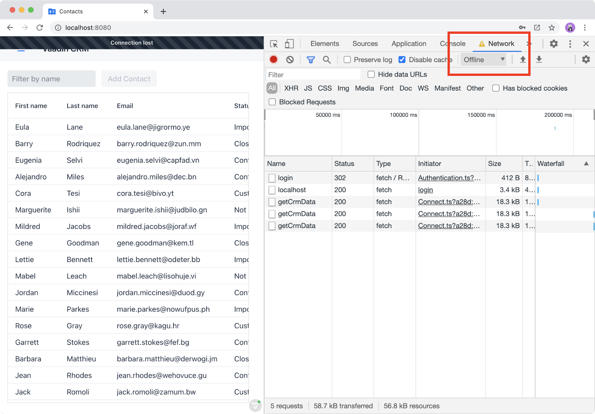
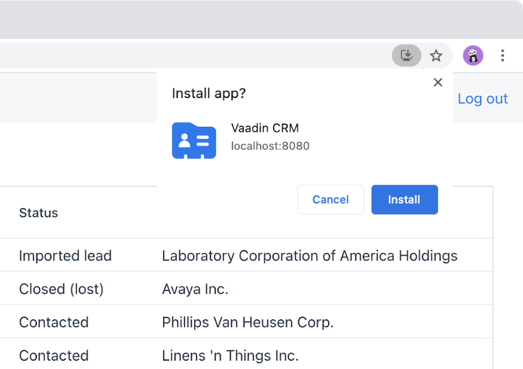
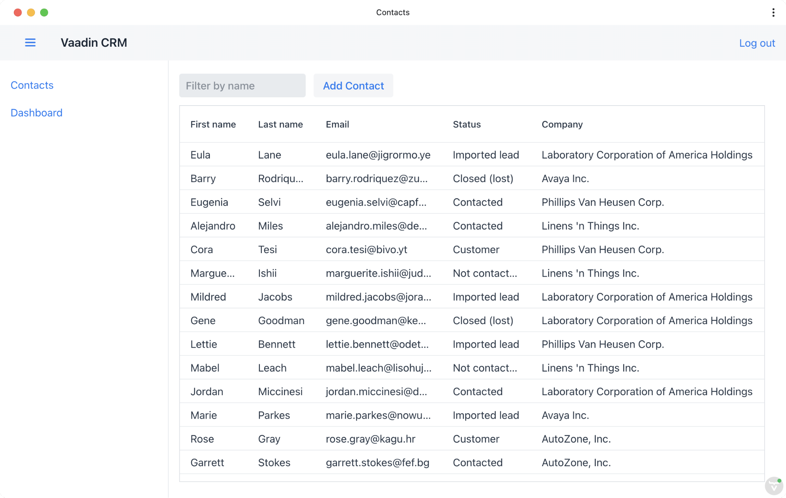

= Installing and offline use (PWA)

Vaadin Fusion applications are https://vaadin.com/pwa[progressive web applications (PWAs)] by default. This allows users to install the application on supported devices and browsers. PWAs give you control over network access and caching, which helps to build faster, more reliable apps, and even provide offline functionality. 

We use PWA technologies to enable read-only offline use. Users will be able to continue to view contacts and stats while offline, but not to add or modify contacts, until they have a connection. It is possible to build PWAs with full read-write offline functionality, but we only cover the simpler read-only case in this tutorial. 

In this chapter, we cover:

- Vaadin PWA configuration.
- Detecting network status.
- Caching content for offline use.
- Disabling functionality while offline.
- Installing the application.

== Vaadin PWA configuration
There are three requirements for a browser to consider an application a PWA:

1. A https://vaadin.com/pwa/learn/web-app-manifest[web app manifest file] that contains information about the app: name, icon, colors, URL. 
2. A registered https://vaadin.com/pwa/learn/serviceworker[ServiceWorker] that handles `fetch` events and loads the app even when offline. 
3. That the app is served over HTTPS or on localhost.

Vaadin automates the creation of the web app manifest and ServiceWorker with the `@PWA` annotation on `Application.java`. Update the `name` and `shortName` values as shown below:

.Application.java
[source,java]
----
@PWA(name = "Vaadin CRM", shortName = "CRM", offlineResources = {"images/logo.png"})
----

By default, Vaadin will cache all your frontend views for offline use. You can specify additional resources to cache with the `offlineResources` array. 

You can simulate an offline situation using the browser developer tools. In Chrome, you can find the network throttling controls under the Network tab. Select the Offline option to simulate going offline.  

If you take the app offline now, you will see a "Connection lost" notification, but you can continue to use the application. But there are still two issues: 

1. Users can try to save changes or delete contacts, even though these operations are guaranteed to fail. 
2. While offline, the application has no data when you open it.

== Reacting to changes in network status
To disable functionality while offline, we first need to track the network status in a store. We do this in `UiStore`. 

Start by importing connection state helpers from Vaadin. 

.ui-store.ts
[source,typescript]
----
import {
 ConnectionState,
 ConnectionStateStore,
} from "@vaadin/flow-frontend/ConnectionState";
----

Next, add an `offline` observable and helpers for tracking changes in the connection state: 

.ui-store.ts
[source,typescript]
----
offline = false;
connectionStateStore?: ConnectionStateStore;
 
connectionStateListener = () => {
 this.setOffline(
   this.connectionStateStore?.state === ConnectionState.CONNECTION_LOST
 );
};
 
setupOfflineListener() {
 const $wnd = window as any;
 if ($wnd.Vaadin?.connectionState) {
   this.connectionStateStore = $wnd.Vaadin
     .connectionState as ConnectionStateStore;
   this.connectionStateStore.addStateChangeListener(
     this.connectionStateListener
   );
   this.connectionStateListener();
 }
}
 
private setOffline(offline: boolean) {
 // Refresh from server when going online
 if (this.offline && !offline) {
   crmStore.initFromServer();
 }
 this.offline = offline;
}
----

The `connectionStateListener` sets the `offline` property to true whenever Vaadin detects a lost connection. The `setOffline` action also tells `crmStore` to refresh its data whenever the app is back online. 

The `setupOfflineListener()` method registers the listener with the Vaadin `ConnectionStateStore` and calls the listener once to initialize the value on startup. 

Finally, update the constructor to avoid creating actions for the listener and setup methods and to call the setup method on start. 

.ui-store.ts
[source,typescript,highlight=5-7;11]
----
constructor() {
 makeAutoObservable(
   this,
   {
     connectionStateListener: false,
     connectionStateStore: false,
     setupOfflineListener: false,
   },
   { autoBind: true }
 );
 this.setupOfflineListener();
}
----

== Disabling functionality while offline
Now that we have an `offline` observable, we can use it to disable and hide features while the application is offline. Here's what we want to do: 

- Disable the form inputs and the Save and Delete buttons.
- Hide the logout link.
- Disable the login form.

Let's begin by updating the form. Add `uiStore` to the existing `crmStore` import statement. 

.contact-form.ts
[source,typescript]
----
import { crmStore, uiStore } from 'Frontend/stores/app-store';
----

Next, use the `offline` state to disable components when the app is offline: 

.contact-form.ts
[source,typescript,highlight=7;12;17;24;31;39;46]
----
render() {
 const { model } = this.binder;
 return html`
   <vaadin-text-field
     label="First name"
     ?disabled=${uiStore.offline}
     ...=${field(model.firstName)}
   ></vaadin-text-field>
   <vaadin-text-field
     label="Last name"
     ?disabled=${uiStore.offline}
     ...=${field(model.lastName)}
   ></vaadin-text-field>
   <vaadin-text-field
     label="Email"
     ?disabled=${uiStore.offline}
     ...=${field(model.email)}
   ></vaadin-text-field>
   <vaadin-combo-box
     label="Status"
     .items=${crmStore.statuses}
     ?disabled=${uiStore.offline}
     item-label-path="name"
     ...=${field(model.status)}
   ></vaadin-combo-box>
 
   <vaadin-combo-box
     label="Company"
     item-label-path="name"
     .items=${crmStore.companies}
     ?disabled=${uiStore.offline}
     ...=${field(model.company)}
   >
   </vaadin-combo-box>
   

     <vaadin-button
       theme="primary"
       @click=${this.save}
       ?disabled=${this.binder.invalid || uiStore.offline}
     >
       ${this.binder.value.id ? "Save" : "Create"}
     </vaadin-button>
     <vaadin-button
       theme="error"
       @click=${listViewStore.delete}
       ?disabled=${!this.binder.value.id || uiStore.offline}
     >
       Delete
     </vaadin-button>
     <vaadin-button theme="tertiary" @click=${listViewStore.cancelEdit}>
       Cancel
     </vaadin-button>
   

 `;
}
----

Next, hide the logout button while offline as it has no effect. First, import `uiStore`, then use the `offline` state to toggle the `hidden` attribute of the link.

.main-layout.ts
[source,typescript]
----
import { uiStore } from './stores/app-store';
----

.main-layout.ts
[source,html]
----
<a href="/logout" class="ms-a" ?hidden=${uiStore.offline}>Log out</a>
----

Finally, update the login view to disable the login button when the app is offline. We cannot authenticate the user or fetch data if they weren't logged in before losing their connection. 

Again, import the store and use the state to disable the form. 

.login-view.ts
[source,html,highlight=6;9-12]
----
<h1>Vaadin CRM</h1>
<vaadin-login-form
 no-forgot-password
 @login=${this.login}
 .error=${this.error}
 ?disabled=${uiStore.offline}
>
</vaadin-login-form>
${uiStore.offline
 ? html` <b>You are offline. Login is only available while online.</b> `
 : nothing}
----

Shows a helpful message to users explaining why the login functionality isn't available when offline. Imports the `nothing` token from `lit-html`.

== Caching content for offline use
The application now works well offline, as long as you were online when you launched it. But if you start it while offline, you are greeted by an empty grid and no data. 

We can solve this by caching server responses and using the cached data if there is no connection when starting. We only cache data once the user is authenticated, and we clear it when they log out. 

Begin by creating a helper for caching requests, `frontend/stores/cacheable.ts`:

.cacheable.ts
[source,typescript]
----
const CACHE_NAME = 'crm-cache';
 
export async function cacheable<T>(
 fn: () => Promise<T>,
 key: string,
 defaultValue: T
) {
 let result;
 try {
   // retrive the data from backend.
   result = await fn();
   // save the data to localStorage.
   const cache = getCache();
   cache[key] = result;
   localStorage.setItem(CACHE_NAME, JSON.stringify(cache));
 } catch {
   // if failed to retrieve the data from backend, try localStorage.
   const cache = getCache();
   const cached = cache[key];
   // use the cached data if available, otherwise the default value.
   result = result = cached === undefined ? defaultValue : cached;
 
 }
 
 return result;
}
 
function getCache(): any {
 const cache = localStorage.getItem(CACHE_NAME) || '{}';
 return JSON.parse(cache);
}
 
export function clearCache() {
 localStorage.removeItem(CACHE_NAME);
}
----

The helper exports two functions: 

- `cacheable()`, which takes in an async endpoint method, a cache key name, and a default value. When online, it fetches the data from the endpoint and stores it in localStorage using the key before returning it. If offline, it instead attempts to return a stored value from localStorage, if one exists.
- `clearCache()`, clears the cache from localStorage.

Update the `initFromServer()` method in `crm-store.ts` to use the `cacheable()` helper, and default to an empty value.

.crm-store.ts
[source,typescript]
----
async initFromServer() {
 const data = await cacheable(
   endpoint.getCrmData,
   "crm",
   CrmDataModel.createEmptyValue()
 );
 
 runInAction(() => {
   this.contacts = data.contacts;
   this.companies = data.companies;
   this.statuses = data.statuses;
 });
}

----

== Installing the application
The CRM application is now a fully-functional PWA and can be installed on supported browsers. Installing works only on localhost and when serving over HTTPS. 

In Chrome, you can install the application through the install icon in the address bar. 

Once the application is installed, it opens in its own window with its own icon. 

