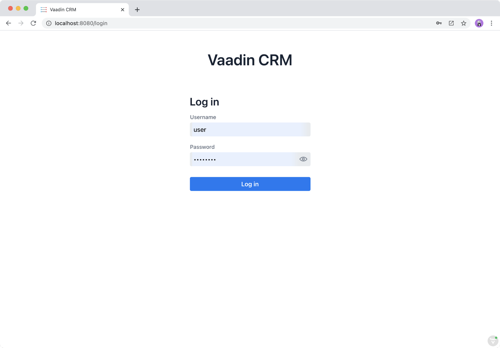

= Adding a login screen and authenticating users

Currently, the entire CRM application and all endpoint calls are available to the whole world. We want to restrict access to the system by adding a login screen and blocking unauthorized access to endpoints and views. 

In this chapter, we cover: 

- Spring Security setup.
- Securing Vaadin endpoints.
- Handling login and logout.
- Creating a login view.
- Restricting unauthorized access to views.
- Handling expired server sessions.

== Securing the backend with Spring Security
Add the Spring Security dependency to `pom.xml`. Spring Boot will automatically configure it to protect all traffic. 

.pom.xml
[source,xml]
----
<dependency>
 <groupId>org.springframework.boot</groupId>
 <artifactId>spring-boot-starter-security</artifactId>
</dependency>
----

If you run the application now, you will be greeted by a login screen, with no way of logging in. Let's configure Spring Security to work with a Vaadin Fusion app. 

Create a new package `com.example.application.security`. In the new package, create a configuration file: 

.SecurityConfig.java
[source,java]
----
package com.example.application.security;
 
import org.springframework.context.annotation.Configuration;
import org.springframework.security.config.annotation.authentication.builders.AuthenticationManagerBuilder;
import org.springframework.security.config.annotation.web.builders.HttpSecurity;
import org.springframework.security.config.annotation.web.configuration.EnableWebSecurity;
import org.springframework.security.config.annotation.web.configuration.WebSecurityConfigurerAdapter;
 
@EnableWebSecurity
@Configuration
public class SecurityConfig extends WebSecurityConfigurerAdapter {
 
}
----

Override the `HttpSecurity` configuration method. 

.SecurityConfig.java
[source,java]
----
@Override
protected void configure(HttpSecurity http) throws Exception {
 http.formLogin().loginPage("/login");
 http.csrf().ignoringAntMatchers("/login", "/connect/**");
}
----

The configuration disables cross-site request forgery protection for Vaadin endpoints because Vaadin handles checking internally. The configuration sets up form-based login for the `/login` path. 

Finally, create an in-memory test user with the username `user` and password `userpass`:

.SecurityConfig.java
[source,java]
----
@Override
protected void configure(AuthenticationManagerBuilder auth) throws Exception {
 auth.inMemoryAuthentication().withUser("user").password("{noop}userpass").roles("USER");
}
----

WARNING: You should never use hard-coded credentials in a real application. The link:/fusion/security/spring-login/#appendix-production-data-sources[Fusion security documentation page] has examples of setting up LDAP or SQL-based user management. 

== Securing Vaadin endpoints
Vaadin endpoints are secured by default. Until now, anonymous access to the endpoint has explicitly been allowed by the `@AnonymousAllowed` annotation on the endpoint. 

Remove this annotation from the endpoint to require authentication. 

.CrmEndpoint.java
[source,java]
----
@Endpoint
public class CrmEndpoint {
}
----

If you run the application now, you will notice that you no longer see any contacts, that's because the backend is refusing the endpoint call. 

== Handling login and logout
In order to restore access to the endpoints, we need to log in. For this, we need these things: 

- Login state tracking and login/logout functionality in the `UiStore`.
- A login view.
- A guard on the router to prevent unauthorized access to views.
- An autorun to navigate users to the correct place after login/logout.

Let's begin by adding the login state handling and actions to `UiStore`. Import the needed login methods at the top of the file. 

.ui-store.ts
[source,typescript]
----
import {
 login as serverLogin,
 logout as serverLogout,
} from "@vaadin/flow-frontend";
import { crmStore } from "./app-store";
----

Next, add a new observable for the login state. We initialize the state to `true` because we will soon add a middleware that will reset it to `false`, if there is no active session on the server. 

.ui-store.ts
[source,typescript]
----
loggedIn = true;
----

FInally, add three new actions: 

.ui-store.ts
[source,typescript]
----
async login(username: string, password: string) {
 const result = await serverLogin(username, password);
 if (!result.error) {
   this.setLoggedIn(true);
 } else {
   throw new Error(result.errorMessage || 'Login failed');
 }
}
 
async logout() {
 await serverLogout();
 this.setLoggedIn(false);
}
 
private setLoggedIn(loggedIn: boolean) {
 this.loggedIn = loggedIn;
 if (loggedIn) {
   crmStore.initFromServer();
 }
}
----

The `login()` action uses the imported `serverLogin()` function to log in on the server. If all goes well, it sets the `loggedIn` state to `true`, otherwise it throws an error.

The `logout()` action logs the user out of the server, and sets the `loggedIn` state to `false`. 

Both actions use the internal setter action `setLoggedIn()`. It tells `crmStore` to initialize from the server upon login. 

== Creating a login view
Now that we have the login infrastructure in place, we can create a login view to handle user logins. 

Create a new file, `frontend/views/login/login-view.ts`. 

.login-view.ts
[source,typescript]
----
import { uiStore } from 'Frontend/stores/app-store';
import { customElement, html, internalProperty } from 'lit-element';
import '@vaadin/vaadin-login/vaadin-login-form';
import { View } from '../view';
 
@customElement('login-view')
export class LoginView extends View {
 @internalProperty()
 private error = false;
 
 connectedCallback() {
   super.connectedCallback();
   this.classList.add('flex', 'flex-column', 'items-center', 'justify-center');
 }
 
 render() {
   return html`
     <h1>Vaadin CRM</h1>
     <vaadin-login-form
       no-forgot-password
       @login=${this.login}
       .error=${this.error}
     >
     </vaadin-login-form>
   `;
 }
 
 async login(e: CustomEvent) {
   try {
     await uiStore.login(e.detail.username, e.detail.password);
   } catch (e) {
     this.error = true;
   }
 }
}
----

The login view follows the same pattern as the two views we already have. It has an `@internalProperty` for handling errors. This state is only relevant for the Vaadin Login Form component, so it's not worth putting it in a MobX store, the component state is sufficient. 

The Vaadin login form component is bound to the `login()` method, which delegates to the `login` action we just created. If login succeeds, the store updates the login state. If not, we set the `error` property and the login form shows an error message. 

Next, we need to register the login view and add logic to redirect users after logging in successfully. 

Add imports for the login view and other dependencies below the existing imports in `routes.ts`. 

.routes.ts
[source,typescript]
----
import "./views/login/login-view";
import { Commands, Context, Route, Router } from '@vaadin/router';
import { uiStore } from './stores/app-store';
import { autorun } from 'mobx';
----

Notice that we use a static import for the login view, adding it to the main application bundle. This is because we know the user will need the login view on their first request and we don't want to incur a second server round trip to fetch it. 

Next, add  `login` and `logout` route handling:

.routes.ts
[source,typescript]
----
export const routes: ViewRoute[] = [
 { path: "login", component: "login-view" },
 {
   path: "logout",
   action: (_: Context, commands: Commands) => {
     uiStore.logout();
     return commands.redirect("/login");
   },
 },
 {
   path: "",
   component: "main-layout",
   children: views,
 },
];
----

Notice that the `logout` route isn't mapped to any component. Instead, it uses an action to call the `uiStore` to log out and redirect the user back to the login page. 

== Restricting unauthorized access to views
We can also use the action API to create an authorization guard that redirects users to the login page if they are not logged in, and saves the requested path in the process. 

.routes.ts
[source,typescript]
----
const authGuard = async (context: Context, commands: Commands) => {
 if (!uiStore.loggedIn) {
   // Save requested path
   sessionStorage.setItem("login-redirect-path", context.pathname);
   return commands.redirect("/login");
 }
 return undefined;
};
----

The `authGuard` action redirects users to `login` if the `loggedIn` state is false. It saves the requested path in the browser `sessionStorage` so navigation can resume after login. 

Add the `authGuard` action to the `main-layout` route definition:

.routes.ts
[source,typescript,highlight=5]
----
{
 path: '',
 component: 'main-layout',
 children: views,
 action: authGuard,
},
----

Finally, add an `autorun` that observes the `uiStore.loggedIn` state and redirects a user appropriately when the state changes. 

.routes.ts
[source,typescript]
----
autorun(() => {
 if (uiStore.loggedIn) {
   Router.go(sessionStorage.getItem("login-redirect-path") || "/");
 } else {
   if (location.pathname !== "/login") {
     sessionStorage.setItem("login-redirect-path", location.pathname);
   }
   Router.go("/login");
 }
});
----

On login, the `autorun` redirects to the path that was initially requested, if available, otherwise it redirects to the root path. On logout, it saves the current path so users can return to it once they are logged in again. 

== Handling expired server sessions
The Spring Security setup uses a server-based session. The session expires after a period of inactivity, or if the server node is shut down. We want our application to detect when the session expires and set the `loggedIn` state to `false`. This triggers the `autorun` we configured above, and redirects the user to the login page. 

Vaadin Fusion supports _middleware_ that can intercept endpoint calls. We will create a middleware that listens for the HTTP 401 response code, signifying that the session has expired. 

Create a new file, `frontend/connect-client.ts`:

.connect-client.ts
[source,typescript]
----
import { MiddlewareContext } from "@vaadin/flow-frontend";
import { MiddlewareNext } from "@vaadin/flow-frontend";
import { ConnectClient } from "@vaadin/flow-frontend";
import { uiStore } from "./stores/app-store";
 
const client = new ConnectClient({
 prefix: "connect",
 middlewares: [
   async (context: MiddlewareContext, next: MiddlewareNext) => {
     const response = await next(context);
     // Log out if the session has expired
     if (response.status === 401) {
       uiStore.logout();
     }
     return response;
   },
 ],
});
 
export default client;
----

The middleware checks the response status and calls the `uiState.logout()` action if it gets a 401 response code.

== Adding a logout link
Finally, add a logout link to the header in the main layout. 

.main-layout.ts
[source,html,highlight=4]
----
<header slot="navbar" class="w-full flex items-center ph-m">
 <vaadin-drawer-toggle></vaadin-drawer-toggle>
 <h1 class="font-size-l m-m">Vaadin CRM</h1>
 <a href="/logout" class="ms-a">Log out</a>
</header>
----

Run the application. You should now be greeted by a login screen. Use user/userpass to login and verify that everything works. 

