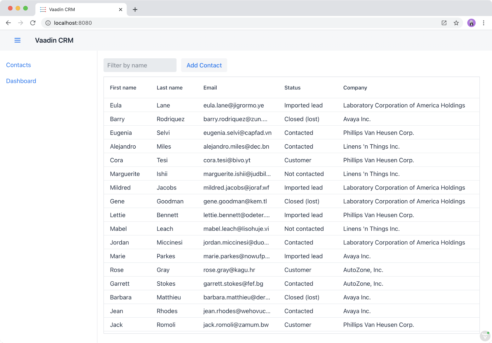

= Navigation, child views, and code splitting

Until now, we have only had one view: the list view. In this chapter, we add a second, dashboard view, to the application. In addition to this second view, we also add a parent layout that contains navigation links and a header. 

image::images/app-layout.png[A screenshot of the application with the header and sidebar highlighted.]

In this chapter, we cover: 

- Using Vaadin Router for navigating between views.
- Defining a parent layout.
- Updating the page title on navigation.
- Optimizing the application performance with code splitting. 

== Creating a parent App Layout 
Fusion comes with two parent classes for views: `View` and `Layout`. `Layout` uses https://developer.mozilla.org/en-US/docs/Web/Web_Components/Using_shadow_DOM[Shadow DOM]. This allows it to support child components through the https://developer.mozilla.org/en-US/docs/Web/HTML/Element/slot[`<slot>`] element. 

Note that Shadow DOM encapsulates CSS, which means that global CSS does not apply to content inside Layouts. Theme CSS defined in the `themes/fusioncrmtutorial/styles.css` file are available in views extending `Layout`.

Create a new file, `frontend/main-layout.ts`: 

.main-layout.ts
[source,typescript]
----
import { customElement, html } from 'lit-element';
import { Layout } from './views/view';
import '@vaadin/vaadin-app-layout';
import '@vaadin/vaadin-app-layout/vaadin-drawer-toggle';
 
import { views } from './routes';
 
@customElement('main-layout')
export class MainLayout extends Layout {
 connectedCallback() {
   super.connectedCallback();
   this.classList.add('flex', 'h-full', 'w-full');
 }
}
----

`MainLayout` extends `Layout` and adds CSS classes for full width and height. 

Define the template in the `render()` method:

.main-layout.ts
[source,typescript]
----
render() {
 return html`
   <vaadin-app-layout class="h-full w-full">
     <header slot="navbar" class="w-full flex items-center ph-m">
       <vaadin-drawer-toggle></vaadin-drawer-toggle>
       <h1 class="font-size-l m-m">Vaadin CRM</h1>
     </header>
 
     

       

         ${views.map(
           (view) => html` <a href=${view.path}> ${view.title} </a> `
         )}
       

     

     

       <slot><!-- The router puts views here --></slot>
     

   </vaadin-app-layout>
 `;
}
----

The main layout uses Vaadin App Layout for the responsive layout with a hideable drawer. 

Pass in a `<header>` component to the app layout using `slot="navbar"`. The header contains a `<vaadin-drawer-toggle>` for showing and hiding the drawer. 

The drawer content is a div that maps over all `views` and creates links to them. 

Finally, the main layout contains a `<slot></slot>` where child views will be shown. 

== Creating the Dashboard view
Next, create a stub Dashboard view. We will implement the view in the next chapter, but we need something we can navigate to now. 

Create a new view `frontend/views/dashboard/dashboard-view.ts` with the following content: 

.dashboard-view.ts
[source,typescript]
----
import { customElement, html } from "lit-element";
import { View } from "../view";
 
@customElement("dashboard-view")
export class DashboardView extends View {
 connectedCallback() {
   super.connectedCallback();
   this.classList.add("flex", "flex-column", "items-center", "pt-xl");
 }
 
 render() {
   return html`
     <h1>Dashboard view</h1>
   `;
 }
}
----

For now, the view only contains a `<h1>` that is centered. 

== Updating route definitions
With the main layout and dashboard view created, the next step is to update the route definition file to map them to URL paths. 

Update `routes.ts` with the following content:

.routes.ts
[source,typescript,highlight=3;13-20;23-28]
----
import { Route } from '@vaadin/router';
import './views/list/list-view';
import './main-layout.ts';
 
export type ViewRoute = Route & { title?: string; children?: ViewRoute[] };
 
export const views: ViewRoute[] = [
 {
   path: '',
   component: 'list-view',
   title: 'Contacts',
 },
 {
   path: 'dashboard',
   component: 'dashboard-view',
   title: 'Dashboard',
   action: async () => {
     await import('./views/dashboard/dashboard-view');
   },
 },
];
 
export const routes: ViewRoute[] = [
 {
   path: '',
   component: 'main-layout',
   children: views,
 },
];
----

The dashboard view is added to the `views` array alongside the list view. The `routes` array is updated to use the main layout and pass the views array as its children.

=== Code splitting with dynamic imports
There are two ways of importing views: statically like `list-view` and `main-layout`, or dynamically with `import()` like `dashboard-view`. 

Dynamic imports help the build tool to split code into smaller chunks that get loaded when you navigate to that view. Using code splitting minimizes the amount of JavaScript the app needs to download when you start it, making it faster. Code splitting helps to keep an application performant, even if it contains a lot of views. 

A good rule of thumb when determining whether to use dynamic or static imports, is to use static imports for anything that's always needed for the initial render, and dynamic imports for other views. 

In our case, if we had loaded `main-layout` and `list-view` dynamically, the browser would need to do 3 round trips to the server: first, to fetch the index page, second, the main layout, and third, the list-view, just to show the root path. 

== Updating the page title on navigation
The final navigation-related change we cover, is to update the page title on navigation. In `index.ts`, add `ViewRoute` to the routes import, then add a route-change listener: 

.index.ts
[source,typescript]
----
window.addEventListener("vaadin-router-location-changed", (e) => {
 const activeRoute = router.location.route as ViewRoute;
 document.title = activeRoute.title ?? "Vaadin CRM";
});
----

The listener checks if the active route has a `title` property, and uses it to update the document title. 

In your browser, verify that you now have a parent app layout and that you can navigate between views. 

