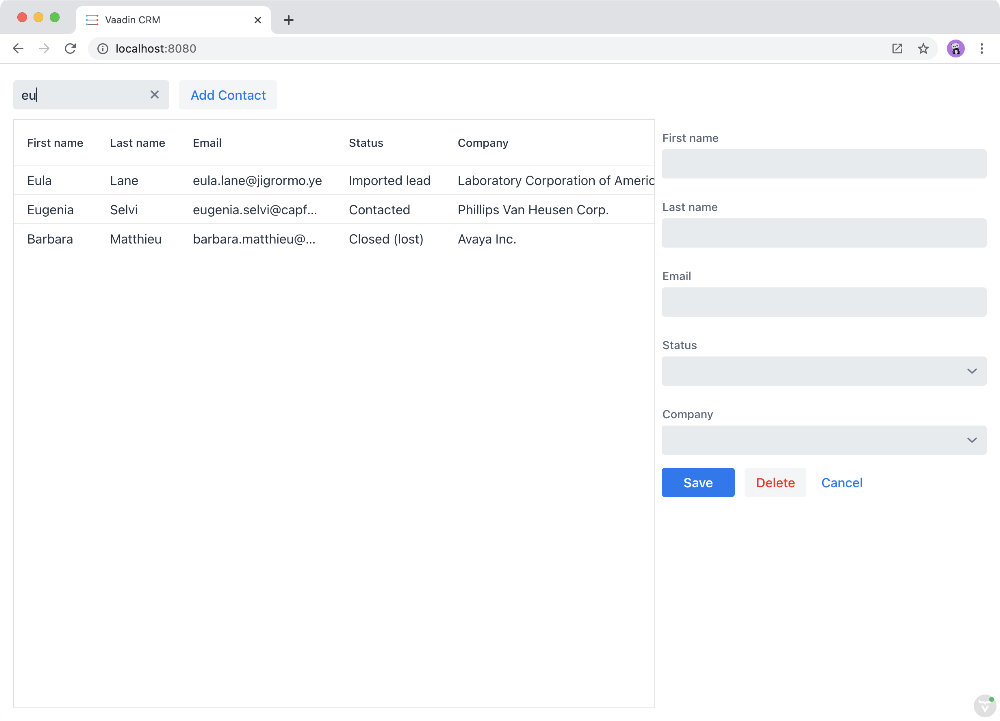
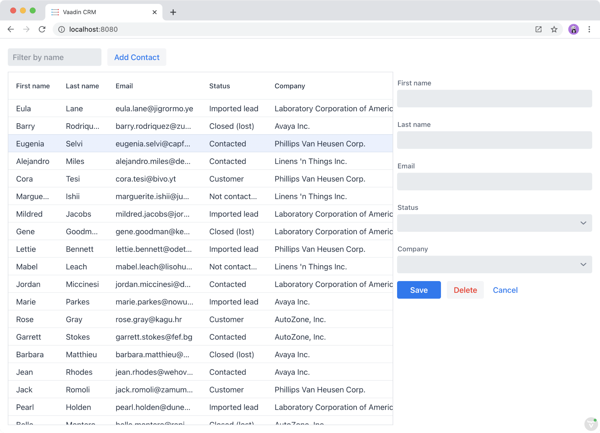

= Using events to filter and select contacts in the grid

Now that we have the CRM data in the store, we can build the list view functionality. 

In this chapter, we cover:

- Listening to events on the search field.
- Creating a view-specific store.
- Using computed properties for filtering contacts.
- Handling grid selection. 

== Filtering contacts in the grid
The grid now displays all contacts in the system. We want it to display only contacts that match the search field input instead. We do this using computed properties. 

Create a new MobX store for the list view, `frontend/views/list/list-view-store.ts`. 

.list-view-store.ts
[source,typescript]
----
import Contact from 'Frontend/generated/com/example/application/data/entity/Contact';
import ContactModel from 'Frontend/generated/com/example/application/data/entity/ContactModel';
import { crmStore } from 'Frontend/stores/app-store';
import { makeAutoObservable, observable } from 'mobx';
 
class ListViewStore {
 filterText = '';
 
 constructor() {
   makeAutoObservable(
     this,
     {},
     { autoBind: true }
   );
 }
 
 updateFilter(filterText: string) {
   this.filterText = filterText;
 }
 
 get filteredContacts() {
   const filter = new RegExp(this.filterText, 'i');
   const contacts = crmStore.contacts;
   return contacts.filter((contact) =>
     filter.test(`${contact.firstName} ${contact.lastName}`)
   );
 }
}
 
export const listViewStore = new ListViewStore();
----

The list view store follows the same pattern as the CRM store. It has one observable property, `filterText`, and one computed property, `filteredContacts`, that depends on the `filterText` and the `crmStore.contacts` array. Any time either of the dependencies of a computed property changes, the property is re-evaluated. The computed property returns an array of contacts that match the `filterText`.

Update the search field template in list view.  Make sure to import `listViewStore`.

.list-view.ts
[source,html]
----
<vaadin-text-field
 placeholder="Filter by name"
 .value=${listViewStore.filterText}
 @input=${this.updateFilter}
 clear-button-visible
></vaadin-text-field>
----

Bind the `value` property (input text) to `filterText`. Add an event listener for the `input` event and bind it to the `updateFilter` method we implement next. 

Implement `updateFilter` after the `render()` method: 

.list-view.ts
[source,typescript]
----
updateFilter(e: { target: HTMLInputElement }) {
 listViewStore.updateFilter(e.target.value);
}
----

The method reads the input value though the event (`e.target.value`) and calls the `updateFilter` action. The action changes the `filterText` observable, which in turn updates the `filteredContacts` computed property. 

The only thing needed to complete the filtering functionality is to change the grid template and bind to the computed `filteredContacts` property, instead of the array of all contacts. 

.list-view.ts
[source,html]
----
<vaadin-grid class="grid h-full" .items=${listViewStore.filteredContacts}>
----

In your browser, try out the filtering functionality by typing something into the filter input box. 

== Selecting contacts in the grid
We also use the list view store for tracking the currently selected contact. Start by adding a new observable property:

.list-view-store.ts
[source,typescript]
----
selectedContact: Contact | null = null;
----

The `selectedContact` observable is either a `Contact` or `null`. 

By default, MobX creates proxy objects for observable values. The downside of using proxy objects is that it breaks equality checks that Vaadin Grid uses for tracking items. In our case, we are not interested in tracking changes to any of the properties of the selected contact, only in getting notified when the contact changes. Update the constructor to override the observable behavior to `observable.ref`, which tracks the object reference without creating a proxy.

.list-view-store.ts
[source,typescript]
----
constructor() {
 makeAutoObservable(
   this,
   { selectedContact: observable.ref },
   { autoBind: true }
 );
}
----

Finally, add a new action to the store for updating the selected contact.  

.list-view-store.ts
[source,typescript]
----
setSelectedContact(contact: Contact) {
 this.selectedContact = contact;
}
----

Update the grid template. 

.list-view.ts
[source,html]
----
<vaadin-grid
   class="grid h-full"
   .items=${listViewStore.filteredContacts}
   .selectedItems=${[listViewStore.selectedContact]}
   @active-item-changed=${this.handleGridSelection}
 >
----

Grid supports multiple selection, so the `selectedItems` property needs to be expressed as a single-item array. The `active-item-changed` event is bound to a new method, `handleGridSelection`. Implement the new method at the end of the class. 

.list-view.ts
[source,typescript]
----
// vaadin-grid fires a null-event when initialized,
 // we are not interested in it.
 first = true;
 handleGridSelection(e: CustomEvent) {
   if (this.first) {
     this.first = false;
     return;
   }
   listViewStore.setSelectedContact(e.detail.value);
 }
----

The method calls the `setSelectedContact` action with the value from the event, either a `Contact` or `null`. Vaadin Grid fires an extra `null` event when it initializes, which we work around by adding a guard expression. 

In your browser, you should now be able to click on a row and see that it gets highlighted. In the next chapter, we will use the selected contact to populate the edit form. 

