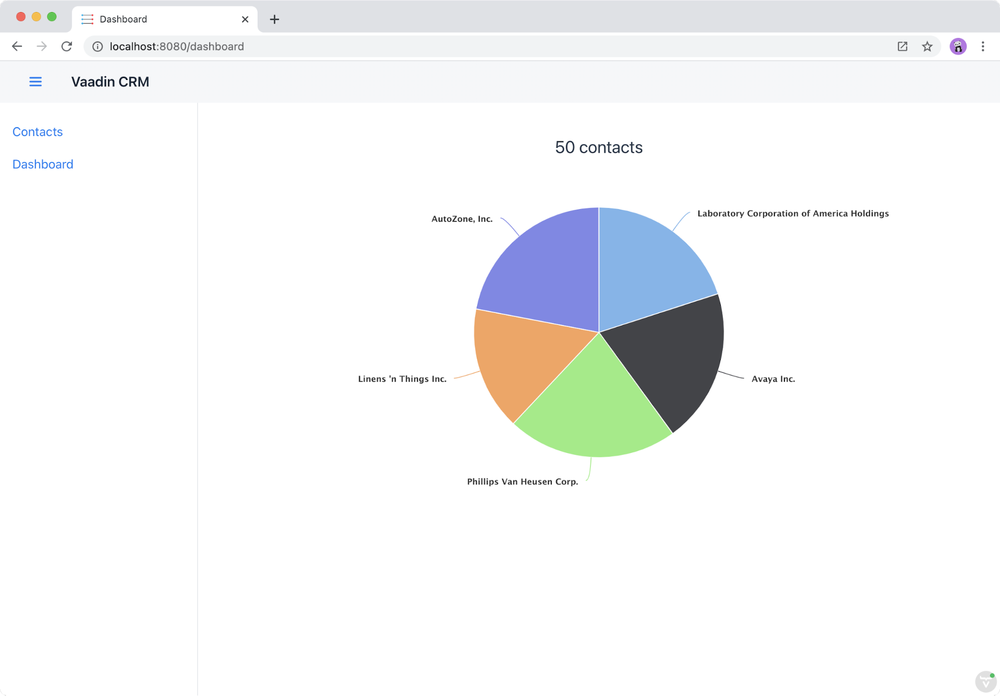

= Visualizing Data in a Dashboard Using Charts

The dashboard view displays contact statistics. 
You already have all the needed data in the MobX store, so you can calculate statistics using computed properties. 

This chapter covers: 

* Using computed properties.
* Using Vaadin charts.

== Creating a MobX Store For the Dashboard View 

Create a new file `frontend/views/dashboard/dashboard-view-store.ts` and initialize a new MobX store: 

.`dashboard-view-store.ts`
[source,typescript]
----
import { crmStore } from 'Frontend/stores/app-store';
import { makeAutoObservable } from 'mobx';
 
class DashboardViewStore {
 constructor() {
   makeAutoObservable(this);
 }
}
 
export const dashboardViewStore = new DashboardViewStore();
----

== Calculating Statistics With Computed Properties

All the data you need is already in `CrmStore`. 
Because of this, the dashboard store doesn't need any state. 
It can use computed properties to calculate the needed properties.

Add the following two computed properties to the class:

.`dashboard-view-store.ts`
[source,typescript]
----
get contactCount() {
 return crmStore.contacts.length;
}
 
get companyStats() {
 const countByCompany = crmStore.contacts.reduce((map, contact) => {
   const name = contact.company.name;
   return map.set(name, (map.get(name) || 0) + 1);
 }, new Map<string, number>());
 
 return Array.from(countByCompany.entries()).map(([company, employees]) => ({
   name: company,
   y: employees,
 }));
}
----

* `contactCount` is straightforward, it returns the length of the contacts’ array. 
* `companyStats` is more complex. 
First, it uses a `reduce` operation to produce a `Map` of employee count per company. 
Then, it transforms these entries into objects with `name` and `y` properties using the `map` operator. 
This gives you an array of values that is compatible with the Vaadin pie chart API. 

== Displaying a Pie Chart Using Vaadin Charts

Add the following three imports to `dashboard-view.ts`:

.`dashboard-view.ts`
[source,typescript]
----
import "@vaadin/vaadin-charts";
import "@vaadin/vaadin-charts/src/vaadin-chart-series";
import { dashboardViewStore } from "./dashboard-view-store";
----

Next, update the template in the `render()` method: 

.`dashboard-view.ts`
[source,typescript]
----
render() {
 return html`
   

     ${dashboardViewStore.contactCount} contacts
   

 
   ${this.getCompanyStats()}
 `;
}

----

Note that the chart template is split into a separate method, `getCompanyStats()`.

.`dashboard-view.ts`
[source,typescript]
----
getCompanyStats() {
 if (dashboardViewStore.companyStats.length === 0) {
   return html`
Loading stats...
`;
 } else {
   return html`
     <vaadin-chart type="pie">
       <vaadin-chart-series
         .values=${dashboardViewStore.companyStats}
       ></vaadin-chart-series>
     </vaadin-chart>
   `;
 }
}
----

The template shows a loading message, if the contacts haven't loaded yet, and a pie chart using the computed `companyStats` property, if they have loaded. 

In your browser, verify that you can see the pie chart. 
Try going to the contacts page and add or remove contacts, and then verify that the dashboard reflects the changes. 

.Vaadin Charts is a commercial add-on library.
[NOTE]
====
You can get a free trial by following the instructions in the popup. 
Students can get free licenses through the https://vaadin.com/student-program[Vaadin student program].
====
