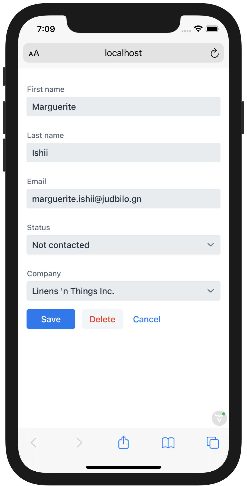

= Data Binding, Forms, and Validation

You now have a view that lists, filters, and selects contacts.
In this chapter, you use the Vaadin Binder to bind the selected contact to the form component and to validate form input.

This chapter covers:

* Creating a Vaadin Binder.
* Binding input fields.
* Field validation.
* Using CSS to improve user experience.

== Using Vaadin Binder to Create a Form and Validate Input

Vaadin Fusion uses Binder for binding form input fields to a model.
Binder also performs input validation and form submission.

=== Defining Bean Validation Rules in Java

You can define data validation rules as Java Bean Validation annotations on the Java class.
The benefit of defining the validations on the Java class is that Vaadin Fusion runs the in the client form, and re-validates the received value on the server using the same rules.

You can see all the applied validation rules by inspecting `Contact.java`. The validations are placed above the field declarations like this:

[source,java]
----
@Email
@NotEmpty
private String email = "";
----

=== Instantiating a Binder

Instantiate a new Binder in `contact-form.ts`:

.`contact-form.ts`
[source,typescript]
----
import { Binder, field } from 'Frontend/../target/flow-frontend/form';
import ContactModel from 'Frontend/generated/com/example/application/data/entity/ContactModel';
import { crmStore } from 'Frontend/stores/app-store';
import { listViewStore } from './list-view-store';

@customElement('contact-form')
export class ContactForm extends View {
 protected binder = new Binder(this, ContactModel);
  // render() omitted
}
----

`Binder` takes in two parameters: the element that contains the form, and a model descriptor.
Vaadin generates `ContactModel` based on the Java `Contact` class.
It includes information on fields and validations.

Next, update the `render()` method to bind the input fields to the model using Binder.

.`contact-form.ts`
[source,typescript]
----
render() {
 const { model } = this.binder;
 return html`
   <vaadin-text-field
     label="First name"
     ...="${field(model.firstName)}"
   ></vaadin-text-field>
   <vaadin-text-field
     label="Last name"
     ...="${field(model.lastName)}"
   ></vaadin-text-field>
   <vaadin-text-field
     label="Email"
     ...="${field(model.email)}"
   ></vaadin-text-field>
   <vaadin-combo-box
     label="Status"
     .items="${crmStore.statuses}"
     item-label-path="name"
     ...="${field(model.status)}"
   ></vaadin-combo-box>
   <vaadin-combo-box
     label="Company"
     item-label-path="name"
     .items="${crmStore.companies}"
     ...="${field(model.company)}"
   >
   </vaadin-combo-box>

   

     <vaadin-button theme="primary">Save</vaadin-button>
     <vaadin-button theme="error">Delete</vaadin-button>
     <vaadin-button theme="tertiary">Cancel</vaadin-button>
   

 `;
}
----

The important changes to the method are:

1. Save `model` into a local variable for easier access (using https://developer.mozilla.org/en-US/docs/Web/JavaScript/Reference/Operators/Destructuring_assignment[object destructuring syntax]).
2. Bind each field to its corresponding model value using the `...="${field(model.property)}"` syntax.
The `field()` directive returns all the needed validations and value change listeners, and the spread binding `...` binds them all to the field.
3. The status and companies combo boxes are populated with items from the `crmStore`.
Because both contain objects, you need to specify which property on the object should be used for the label using the `item-label-path` property.

== Populating the Form With the Selected Contact

In the previous chapter, you added a listener on the grid that saves the selected contact in the list view store.
You can use a MobX https://mobx.js.org/reactions.html#autorun[`autorun`] to automatically update the binder with the selected contact.

.`contact-form.ts`
[source,typescript]
----
constructor() {
 super();
 this.autorun(() =>
   this.binder.read(
     listViewStore.selectedContact || ContactModel.createEmptyValue()
   )
 );
}
----

Remember to call `super()` when overriding the constructor in a view to make sure the view component gets initialized.

Use `this.autorun` instead of importing and using `autorun` directly from MobX.
The helper method on `View` takes care of disposing of the listener when you navigate away from the view to avoid memory leaks.

`autorun` takes a function as a parameter.
The function runs immediately, and any time an observable value it depends on changes, in this case any time `selectedContact` changes.
If `selectedContact` is null (no contact is selected), read `ContactModel.createEmptyValue()` to clear the form instead.

== Creating New Contacts

Add support for creating new contacts by adding two new actions to `list-view-store.ts`:

.`list-view-store.ts`
[source,typescript]
----
editNew() {
 this.selectedContact = ContactModel.createEmptyValue();
}

cancelEdit() {
 this.selectedContact = null;
}
----

To edit a new contact, use `ContactModel` to create an empty `Contact` and set it as the selected contact.

Bind the click event of the Add Contact button in `list-view.ts` to the `editNew()` action.

.`list-view.ts`
[source,html]
----
<vaadin-button @click="${listViewStore.editNew}">
 Add Contact
</vaadin-button>
----

== Hiding the Editor When No Contacts Are Selected

Right now, the editor is constantly visible.
You want to hide it while it's not active.
Add a boolean `hidden` attribute on the `<contact-form>` element in list view to hide it when no contacts are selected.

.`list-view.ts`
[source,html]
----
<contact-form
 class="flex flex-column spacing-b-s"
 ?hidden="${!listViewStore.selectedContact}"
></contact-form>
----

Add a CSS selector for the `hidden` attribute in `frontend/themes/fusioncrmtutorial/styles.css`.

.`styles.css`
[source,css]
----
[hidden] {
 display: none !important;
}
----

The `hidden` attribute is a https://caniuse.com/hidden[well-supported browser feature], but the default implementation is overridden by any change in the `display` value for an event.
By explicitly overriding it, you can get it to behave the way it's intended.

== Maximizing the Form on Narrow Viewports

You can improve the usability on narrow screens by hiding the grid and the toolbar while editing.

First, add an `autorun` to the list view `connectedCallback` to add an `editing` CSS class name to the element when there is a selected contact.

.`list-view.ts`
[source,typescript]
----
connectedCallback() {
 super.connectedCallback();
 // this.classList.add(...);
 this.autorun(() => {
   if (listViewStore.selectedContact) {
     this.classList.add("editing");
   } else {
     this.classList.remove("editing");
   }
 });
}
----

Then, add a CSS media query for narrow screens to `list-view.css`.

.`list-view.css`
[source,css]
----
@media (max-width: 700px) {
 list-view.editing .toolbar,
 list-view.editing .grid {
   display: none;
 }

 list-view.editing contact-form {
   width: 100%;
 }
}
----

The rule hides the grid and toolbar when the editor is active if the viewport is 700px or narrower.

Update the Cancel button in the contact form to call the `cancelEdit` action so users have a way of exiting the editor.

.`contact-form.ts`
[source,html]
----
<vaadin-button theme="tertiary" @click="${listViewStore.cancelEdit}">
 Cancel
</vaadin-button>
----

In your browser, try selecting different contacts to make sure the form is updated correctly.
Verify that the responsive layout works by opening the application on your phone or by resizing your browser window.

