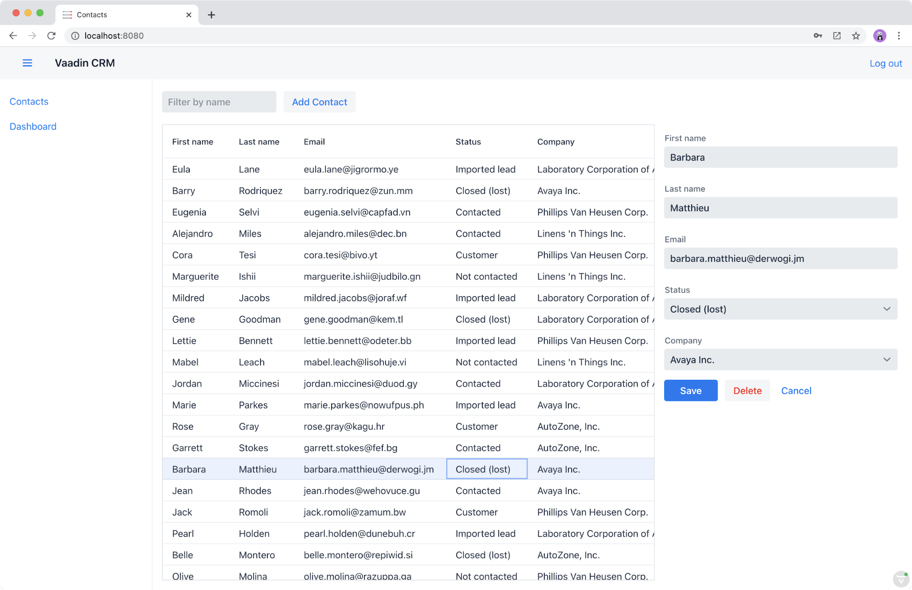
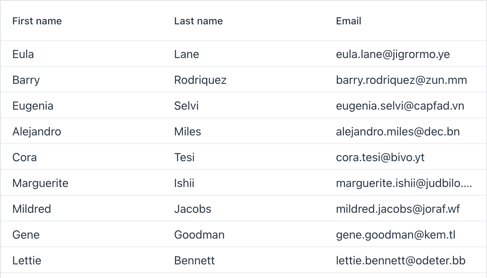

= Learn Vaadin Fusion in 4 Hours

In this step-by-step tutorial, you learn to build a full-stack web application using Vaadin Fusion. 
The tutorial starts from an empty project and covers all the steps to build the application and deploy it to production. 
Once you have completed the tutorial, you are ready to turn your next application idea into reality.

Vaadin is a full-stack platform for building web apps with Java backends. 
It simplifies web app development by giving you everything you need in one package: UI components, tooling, frontend and backend frameworks. 
With fewer moving parts and less to configure, you can get started quickly, and stay productive throughout the entire project.

== What You Learn From This Tutorial

In this tutorial you learn full-stack web application development by building a customer relationship management (CRM) application. 
The application features:

* A view for listing, editing, and creating contacts (CRUD).
* A dashboard view that shows company and contact statistics in a chart.
* Responsive layouts that work on desktop and mobile devices.
* A database for persisting data.
* Read-only offline support.

The technologies and concepts you learn are:

* Reactive frontend development with LitElement and TypeScript.
* Backend development with Java and Spring Boot.
* Application state management with MobX.
* PWA technologies for installation and offline usage.
* Cloud deployment to Heroku.

After finishing the tutorial, you’ll have all the skills you need for building and deploying an application of your own.

== What You Need to Complete This Tutorial

This tutorial requires approximately 4 hours to complete.

It is intended for developers with a basic understanding of Java, JavaScript, HTML, and CSS. 
You don't need to be an expert by any means, but understanding the syntax and basic concepts makes it easier to follow along.

Vaadin Fusion runs on Java and you need the following development tools:

* Java JDK 8 or later
* Maven 3.6
* https://code.visualstudio.com[Visual Studio (VS) Code^] or another IDE that supports Java, TypeScript, HTML, and CSS.

Vaadin supports Java versions 8 and later, but this tutorial assumes you are using version 15. 
If you wish to use an older Java version, you need to change the project and deployment setups accordingly.

You can find instructions for installing development tools in the <<{articles}/guide/install#,Installing>> documentation.

== An Introduction to Vaadin Fusion

A Vaadin Fusion app has five main parts:

1. A https://spring.io/projects/spring-boot[Spring Boot] backend.
2. A https://lit-element.polymer-project.org/[LitElement] frontend.
3. A set of https://vaadin.com/components[customizable UI components].
4. A client-server framework that provides endpoint generation and handles client-server communications, view routing, data binding, and more.
5. Vaadin Maven/Gradle plugin that handles the application build process for development and production mode. The plugin manages a webpack build internally.

Fusion integrates these and provides build tooling and code generation to give you a productive full-stack development experience.

=== Example: Populating a Data Grid From the Database

To better illustrate how Fusion works, here are the steps needed to populate a https://vaadin.com/components/vaadin-grid[Vaadin Grid] component with data from the database.

Don't worry about understanding the syntax yet. 
For now, focus on understanding the data flow and how the pieces fit together. 
The tutorial covers all these concepts in depth in the upcoming chapters.

First, create a server endpoint to access data from the client.

.ContactRepository.java
[source,java]
----
@Endpoint
@AnonymousAllowed
public class ContactEndpoint {
 private ContactRepository repository;

 public ContactEndpoint(ContactRepository repository) {
   this.repository = repository;
 }

 public List<Contact> findAllContacts() {
   return repository.findAll(); // Call DB
 }
}
----

When you annotate a class with `@Endpoint`, Vaadin:

* Creates REST endpoints for all methods in the class.
* Generates corresponding TypeScript types for the parameters and return types.
* Generates asynchronous TypeScript methods for accessing the endpoint.

Next, in the frontend code, import the `vaadin-grid` component, the generated `Contact` type, and the `findAllContacts` method.

.list-view.ts
[source,typescript]
----
import "@vaadin/vaadin-grid";
import "@vaadin/vaadin-grid/src/vaadin-grid-column";
import Contact from "Frontend/generated/com/example/application/data/entity/Contact";
import { findAllContacts } from "Frontend/generated/ContactEndpoint";

----

You can now call the server when the component is created and store the list of `Contact`s in a property.

.list-view.ts
[source,typescript]
----
@customElement("list-view")
export class ListView extends View {
  @internalProperty()
  private contacts: Contact[] = [];

  async connectedCallback() {
    super.connectedCallback();
    this.contacts = await findAllContacts();
  }
}
----

The property update triggers a re-render of the template. 
The template binds the  contacts to `vaadin-grid` through the `items` property.

.list-view.ts
[source, typescript]
----
render() {
 return html`
     <vaadin-grid .items=${this.contacts}>
       <vaadin-grid-column path="firstName">
         </vaadin-grid-column>
       <vaadin-grid-column path="lastName">
         </vaadin-grid-column>
       <vaadin-grid-column path="email">
         </vaadin-grid-column>
     </vaadin-grid>
   

 `;
}
----

As you can see, Fusion ties together the frontend and backend seamlessly, allowing you to share data types between the two. 
Not only does this make development faster by enabling IDE autocomplete everywhere, it also means you can more confidently change and refactor your backend code and APIs, knowing that the compiler informs you if you break something.

=== How is Vaadin Fusion Different From React, Angular, or Vue?

Although Vaadin Fusion, React, Angular, and Vue all share the concept of reactive, component-based UI building, only Fusion is a full-stack development platform designed specifically for Java backends.

Unlike the other frameworks, Fusion:

* Includes a large set of customizable https://vaadin.com/components[UI components].
* Handles both frontend and backend.
* Includes integrated build tooling for both frontend and backend.
* Automatically generates TypeScript types based on Java types for end-to-end type safety.

If you come from a React, Angular, or Vue background, you can use the https://vaadin.com/comparison[Vaadin frontend framework comparison tool] to learn how concepts in other frameworks translate in Vaadin Fusion.
