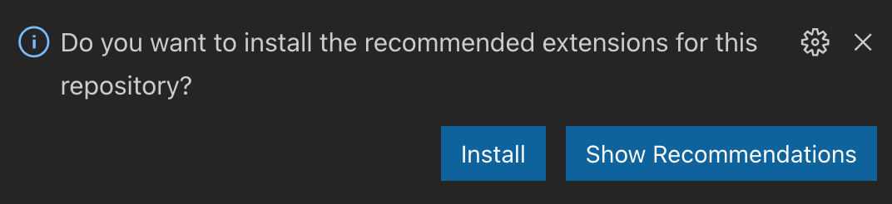
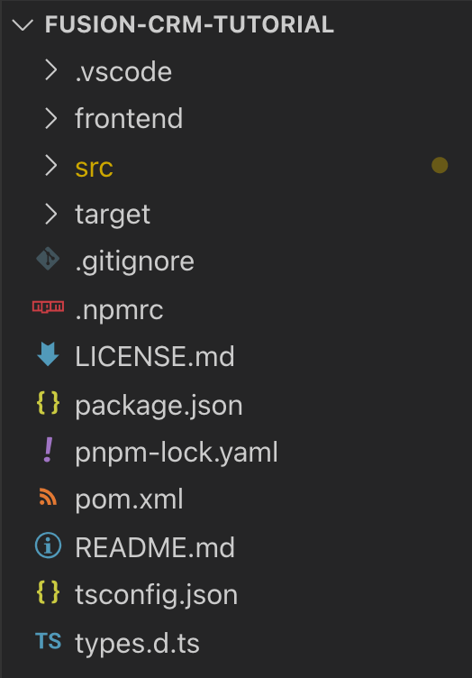
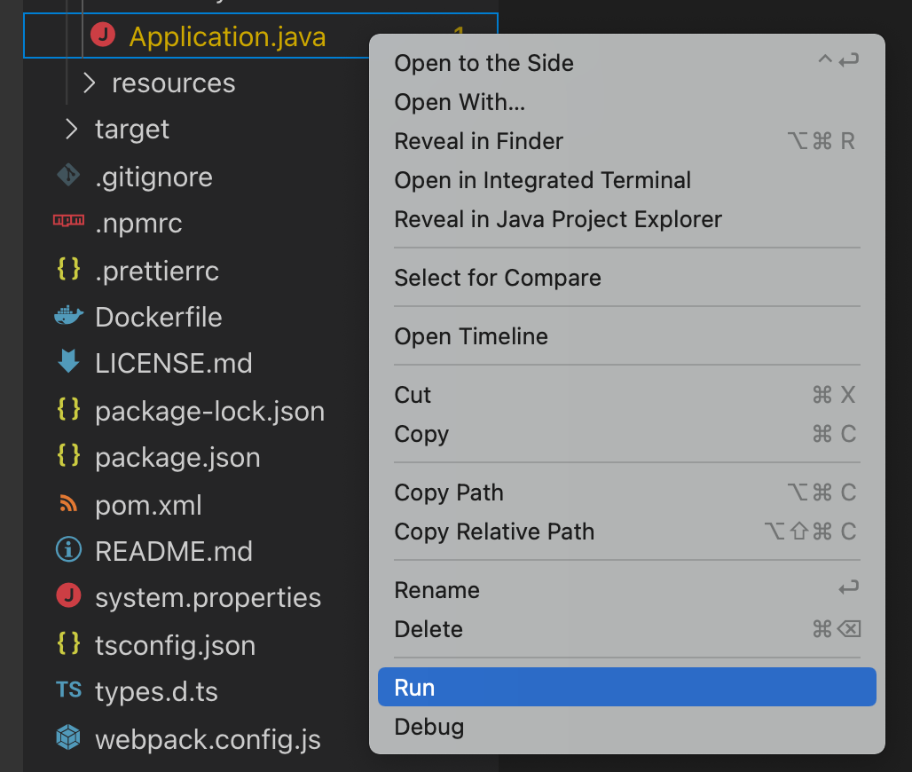

= Vaadin Fusion Project Setup

Make sure you have Java 8 and Maven installed before you begin.
Follow the instructions for installing development tools in the <<{articles}/guide/install#, Installing>> documentation if you don't yet have them.

This chapter covers:

* Downloading a Vaadin app starter.
* Importing a Vaadin project in VS Code.
* Installing VS Code plugins for productive development.
* Running a Vaadin application in development mode.

== Downloading a Vaadin Application Starter

This tutorial uses a pre-configured starter from start.vaadin.com.
The starter application includes:

* A data model consisting of `Contact`, `Company`, and `Status` JPA entities.
* Spring Data repositories for persisting and retrieving the entities from an embedded H2 database.
* A data generator that populates the database with test data.
* A single, empty view.
* A Dockerfile.

Download the starter application (zip file) below:

https://start.vaadin.com/?preset=fusion-crm-tutorial&dl[Download starter^]

== Importing a Vaadin project in VS Code

Unzip the downloaded `fusion-crm-tutorial.zip` file and open the folder in VS Code.
You can open the folder by:

* Navigating to the project folder and running `code .` (note the period).
* Choosing **File > Open (Folder)...** in VS Code and selecting the _project folder_.

== Installing VS Code Plugins for Productive Development

When you import the project, VS Code should show a prompt suggesting recommended plugins. Select **Install**.

If you don't see the prompt, install the following plugins manually through the **Extensions** view.

* https://marketplace.visualstudio.com/items?itemName=vscjava.vscode-java-pack[Java Extension Pack^]
* https://marketplace.visualstudio.com/items?itemName=runem.lit-plugin[lit-plugin^]
* https://marketplace.visualstudio.com/items?itemName=Pivotal.vscode-spring-boot[Spring Boot Tools^].

== Vaadin Fusion Project Structure

Now that you have the project imported, it's time to get familiar with the structure.

The two main folders to know are:

* `frontend` - this is where your views and frontend code lives.
* `src` - this is where your Java backend code lives.

The key files in a Vaadin Fusion application are:

* `pom.xml` - the project configuration file that defines backend dependencies.
* `frontend/index.html` - the bootstrap page.
* `frontend/index.ts` - the routing definition.
* `src/main/java/com/example/application/Application.java` - runs the Spring Boot application.

== Running a Vaadin Application in Development Mode

Start the application by locating `Application.java` within the `src` folder, right-click on it and select Run.
You can also select Debug, if you wish to debug the server endpoint code.

You can also run the application from the command line with the following command:

.Command line
[source,terminal]
----
mvn
----

The first startup may take a few minutes.
Vaadin downloads all needed frontend and backend dependencies and builds the application.
Vaadin also installs Node and npm, if you don't already have them installed on your computer.

When the build finishes, Vaadin opens your default browser to http://localhost:8080.

Vaadin reloads your browser automatically when you make changes during development.
Try this out by changing the placeholder text in `frontend/views/list/list-view.ts` to something else and saving the file.
Your browser should reflect the change within a second or two.

.`list-view.ts`
[source,typescript]
----
render() {
 return html`
Content placeholder
`;
}
----

image::images/initial-app.png[Running application showing placeholder content]
