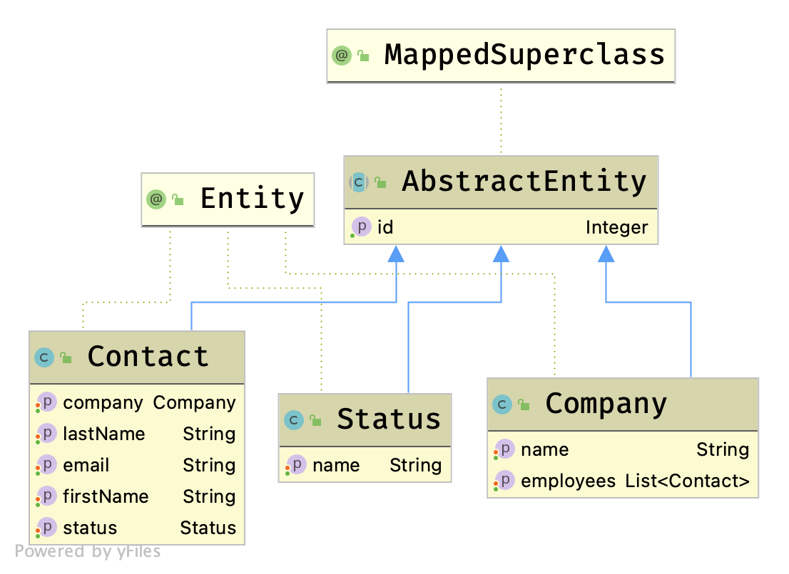

= Fetching Data From the Server With Vaadin Endpoints

One of the unique features of Vaadin Fusion is type-safe server access through endpoints. 
Instead of using REST and JSON, Fusion gives you type-safe asynchronous server access.

Annotating a class with `@Endpoint` makes the methods available to the TypeScript frontend as async methods. 
Fusion generates TypeScript types based on the Java method parameters and return types, so you have type safety throughout your application.

You can find the backend code in the `src/main/java` directory. 

This chapter covers:

* The backend architecture.
* How to create an endpoint.
* How to optimize communication by using data transfer objects (DTO).

== Backend Overview

The starter you downloaded contains the _entities_ and _repositories_ you need, along with a sample data generator. 

=== Domain Model: Entities

The Vaadin CRM application has three JPA entities that make up its domain model: `Contact`, `Company`, and `Status`. 
A contact belongs to a company and has a status. 

You can find the entities in the `com.example.application.data.entity` package. 

=== Database Access: Repositories

The application uses Spring Data JPA repositories for database access. 
Spring Data provides implementations of basic create, read, update, and delete (CRUD) database operations when you extend from the `JpaRepository` interface. 

You can find the repositories in the `com.example.application.data.service` package. 

=== Sample Data Generator

The `com.example.application.data.generator` package contains a sample data generator that populates the database with data. 
It uses `CommandLineRunner`, which Spring Boot runs when the application starts up. 

=== What About a Service Layer?

In a more complex application, you want to also have a service layer that runs business logic, coordinates data layer access, and maps entities to data-transfer objects (DTO) to decouple entities from business objects. 

This tutorial omits the service layer for the sake of simplicity.

== Creating a Fusion Endpoint

You can turn a class into an endpoint by adding an `@Endpoint` annotation to it. 
When you create an endpoint, Vaadin Fusion:

* Exposes secured REST endpoints for each method.
* Generates TypeScript type definitions for method parameters and return types.
* Creates asynchronous TypeScript methods for calling the endpoints in a type-safe manner.

=== Creating the CRM Endpoint

For this application, you need an endpoint that: 

* Provides all contacts, companies, and statuses in the database.
* Lets you save and delete contacts. 

Create a new file, `CrmEndpoint.java`, in the `com.example.application.data.endpoint` package with the following content: 

.`CrmEndpoint.java`
[source,java]
----
package com.example.application.data.endpoint;
 
import com.example.application.data.entity.Company;
import com.example.application.data.entity.Contact;
import com.example.application.data.entity.Status;
import com.example.application.data.repository.CompanyRepository;
import com.example.application.data.repository.ContactRepository;
import com.example.application.data.repository.StatusRepository;
import com.vaadin.flow.server.auth.AnonymousAllowed;
import com.vaadin.fusion.Endpoint;
import com.vaadin.fusion.Nonnull;
 
@Endpoint
@AnonymousAllowed
public class CrmEndpoint {
}
----

Turn the class into an endpoint with `@Endpoint` and allow anonymous access with `@AnonymousAllowed`. 
The tutorial covers authentication and securing endpoints later in the <<login-and-authentication#, Adding a login screen and authenticating users>> chapter. 

Inject the needed repositories into the endpoint class though the constructor. 
Fusion endpoints are Spring components, so you can use the Spring dependency injection container as you would for any other Spring components. 
Save the repositories in fields for later access.

.`CrmEndpoint.java`
[source,java]
----
private ContactRepository contactRepository;
private CompanyRepository companyRepository;
private StatusRepository statusRepository;
 
public CrmEndpoint(ContactRepository contactRepository, CompanyRepository companyRepository,
   StatusRepository statusRepository) {
 this.contactRepository = contactRepository;
 this.companyRepository = companyRepository;
 this.statusRepository = statusRepository;
}
----

Use a data-transfer object (DTO) to wrap the contacts, companies, and statuses into one return type. 
That way, the client only needs to make one server call to get all the needed data.

Within the same class, create an inner class `CrmData`. 
Note that because this class is only used as a data wrapper, it doesn't need data encapsulation and the associated getters and setters. 
Instead, it uses public fields. 

.`CrmEndpoint.java`
[source,java]
----
public static class CrmData {
  @Nonnull
  public List<@Nonnull Contact> contacts = Collections.emptyList();
  @Nonnull
  public List<@Nonnull Company> companies = Collections.emptyList();;
  @Nonnull
  public List<@Nonnull Status> statuses = Collections.emptyList();;
  }
----

TypeScript is more strict with handling `null` values than Java is. 
Because of this, Fusion generates optional (nullable) TypeScript types for all non-primitive Java types.
In this case, you ensure that you never return `null` values or `null` elements in the collections by annotating the types with `@Nonnull`.
This creates non-nullable TypeScript types which are easier to work with. 
You can read more about type nullability <<../../advanced/endpoints-generator/#type-nullability,here>>. 

Next, implement API methods for getting, updating, and deleting data. 

.`CrmEndpoint.java`
[source,java]
----
@Nonnull
public CrmData getCrmData() {
  CrmData crmData = new CrmData();
  crmData.contacts = contactRepository.findAll();
  crmData.companies = companyRepository.findAll();
  crmData.statuses = statusRepository.findAll();
  return crmData;
}

@Nonnull
public Contact saveContact(Contact contact) {
  contact.setCompany(companyRepository.findById(contact.getCompany().getId())
      .orElseThrow(() -> new RuntimeException(
          "Could not find Company with id" + contact.getCompany().getId())));
  contact.setStatus(statusRepository.findById(contact.getStatus().getId())
      .orElseThrow(() -> new RuntimeException(
          "Could not find Status with id" + contact.getStatus().getId())));
  return contactRepository.save(contact);
}

public void deleteContact(Integer contactId) {
  contactRepository.deleteById(contactId);
}
----

Note that `saveContact()` looks up the `company` and `status` by id to avoid saving changes to them by accident. 

Save the file and ensure the development server build is successful. 
If you have shut down the server, re-start it with the `mvn` command from the command line. 
