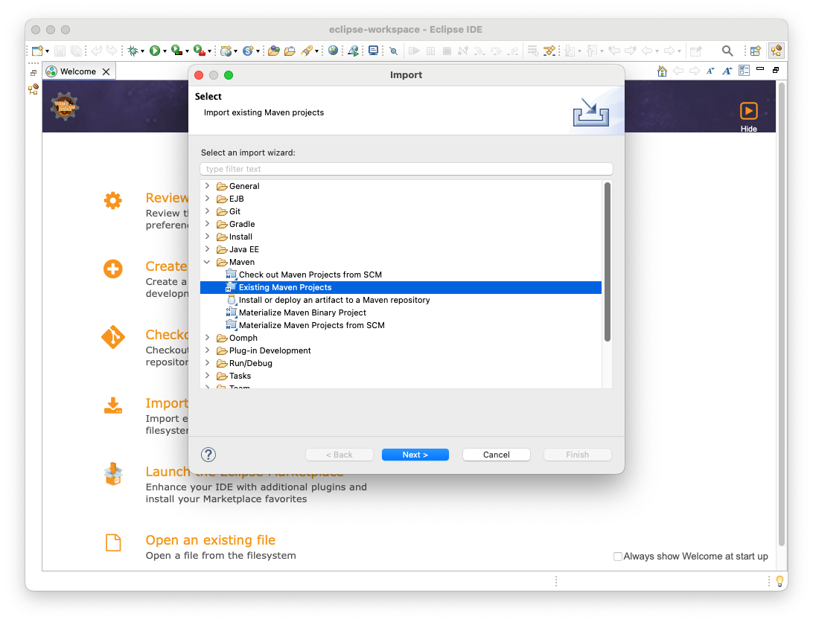
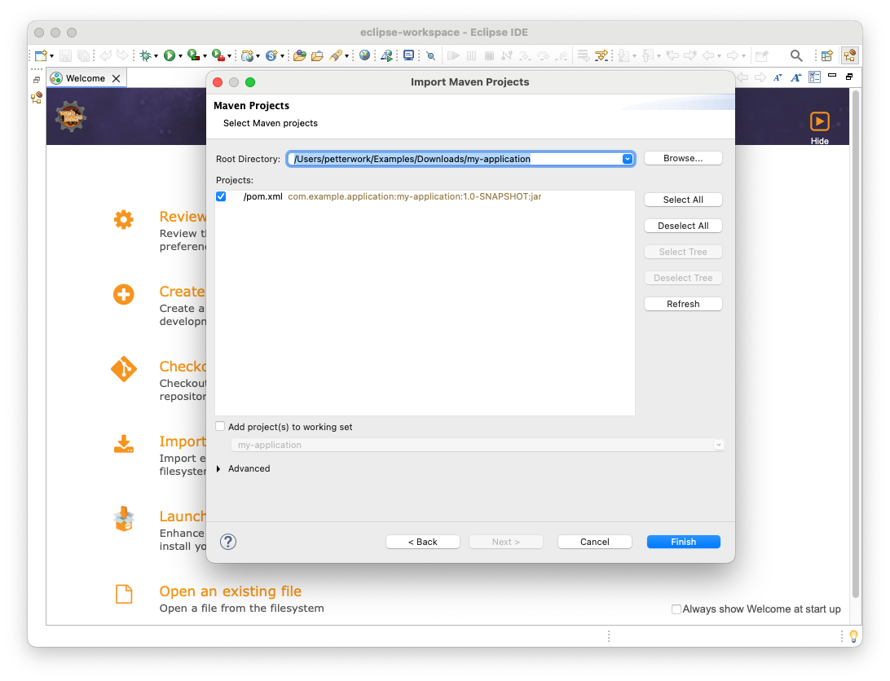

= Import into Eclipse IDE

To import a Vaadin project into Eclipse IDE, click menu:File[Import] in the menu. Then, in the *Import* dialog, select menu:Maven[Existing Maven Projects] and click [guibutton]*Next*.

Then click [guibutton]*Browse* and find the project directory.

Make sure all the projects are selected and click [guibutton]*Finish*. Your project is now imported.
