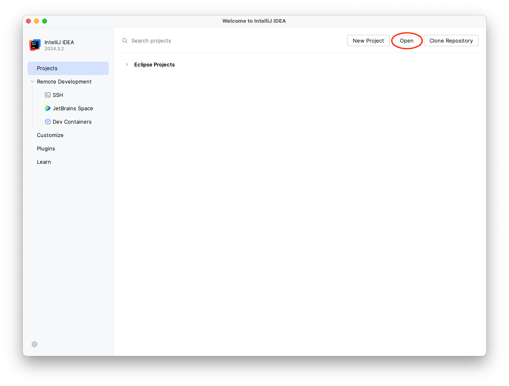

= IntelliJ IDEA

To import a Vaadin project into IntelliJ IDEA, click [guibutton]*Open* on the *Welcome to IntelliJ IDEA* screen.

The welcome screen is only shown when you don't have any projects open in IntelliJ IDEA. If you don't want to close your open projects, you can select menu:File[Open] in the menu instead. 

Next, find the project directory and click [guibutton]*Open*.

image::images/open-dialog.png[IntelliJ IDEA open project dialog]

If you are opening the project for the first time, IntelliJ IDEA may ask you whether you trust the project or not. Click [guibutton]*Trust Project*.

Your project is now imported.
