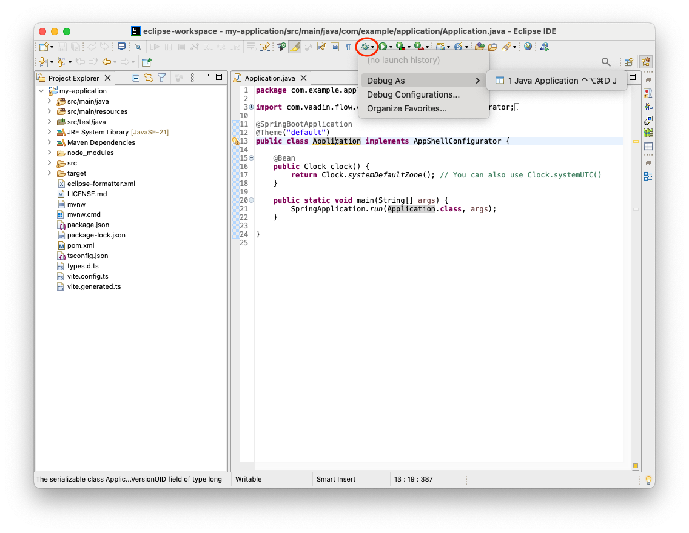
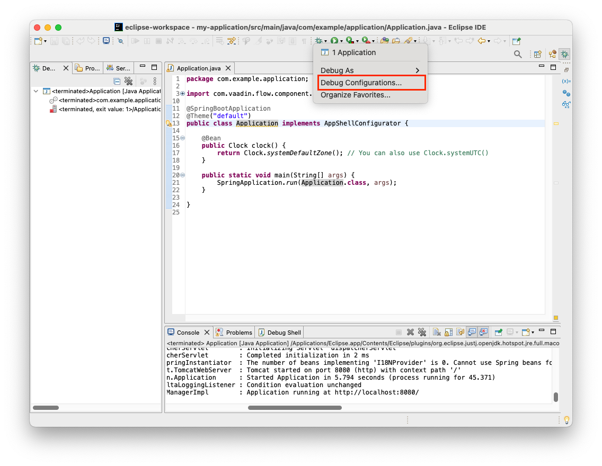
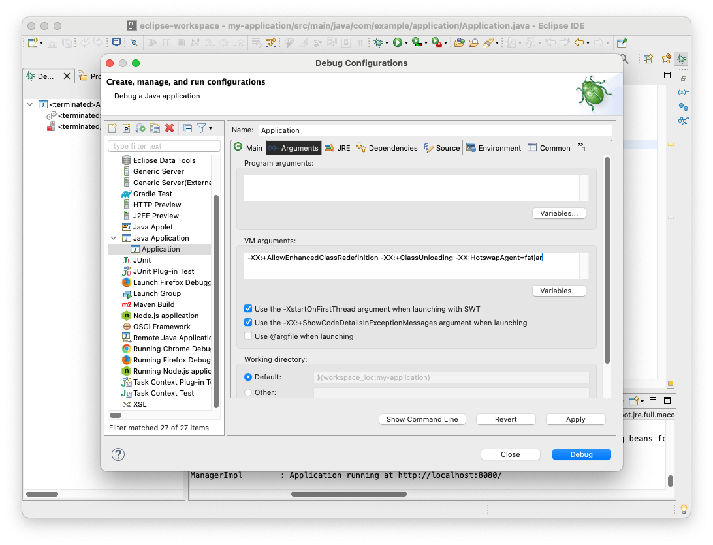
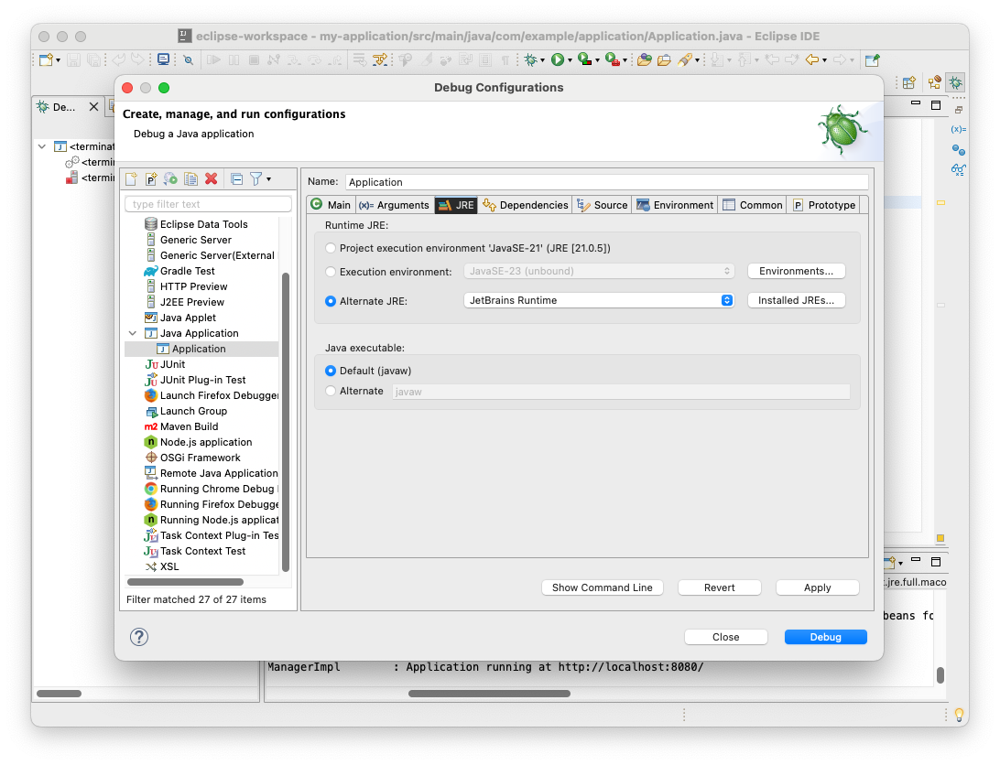
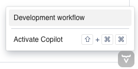

= Run in Eclipse IDE

You can run and debug your Vaadin application in Eclipse IDE as you would any other Java application. Open the main `Application` class. Then click the *Debug* button in the toolbar indicated by a red circle in this screenshot:

Now click menu:Debug As[Java Application]. The application starts up and you can access it at http://localhost:8080. Hot deploy of the frontend files is enabled automatically. However, to enable Java hotswap, you have to take some additional actions.

== JetBrains Runtime

Whichever way you enable hotswap, the application has to run on JetBrains Runtime, because hotswap of Java classes needs the enhanced class redefinition that it provides. You can download the latest version from the https://github.com/JetBrains/JetBrainsRuntime/releases[JetBrains GitHub release page]. Be sure to select the correct architecture. Use JetBrains Runtime to execute your application, not necessarily your IDE.

[[enabling-hotswap-using-the-vaadin-plugin]]
== Enabling Hotswap Using the Vaadin Plugin

The easiest way of running a Vaadin application with hotswap in Eclipse IDE is by installing the link:https://marketplace.eclipse.org/content/vaadin-tools[Vaadin plugin] from the Eclipse Marketplace. If you haven't done so already, do it now. Use the Eclipse IDE for Enterprise Java and Web Developers package. The same plugin also integrates Eclipse IDE with Vaadin Copilot, so that changes you make in the browser are written to your sources through the IDE.

The plugin bundles HotswapAgent and installs it for you as [filename]`.vaadin/eclipse-plugin/hotswap-agent.jar` in your home directory, so the only thing you have to install yourself is JetBrains Runtime. The plugin picks up any JetBrains Runtime that Eclipse IDE knows about. If it can't find one, add it on the menu:Java[Installed JREs] page in menu:Window[Preferences] (Windows) or menu:Eclipse[Preferences] (Mac).

To start the application, right-click the main `Application` class in the project navigator and click menu:Debug As[Debug using Hotswap Agent]. If you can't see this option, the Vaadin plugin has not been installed correctly.

The plugin creates a debug configuration named `Application [Hotswap]` that runs the application on JetBrains Runtime, starts the bundled HotswapAgent with a `-javaagent` parameter, and adds the other JVM parameters that hotswap needs. Because the agent comes from the plugin, you don't have to install it into JetBrains Runtime, and the parameters listed in <<debug-configuration,Debug Configuration>> are needed only for the manual setup. You can reuse the configuration later from the *Debug* button in the toolbar.

Once the application is running, continue with <<verifying-the-setup,Verifying the Setup>>. You don't need the manual steps described next.

== Enabling Hotswap Manually

If you prefer not to install the Vaadin plugin, you can set up hotswap by hand. This consists of three steps:

1. Download and install JetBrains Runtime, as described above;
2. Download HotswapAgent and install it into JetBrains Runtime; and
3. Create a debug configuration for Eclipse IDE that runs the application with JetBrains Runtime and the `-XX:+AllowEnhancedClassRedefinition`, `-XX:+ClassUnloading`, and `-XX:HotswapAgent=fatjar` JVM parameters, as described in <<debug-configuration,Debug Configuration>>.

=== HotswapAgent

You can download HotswapAgent from the https://github.com/HotswapProjects/HotswapAgent/releases[HotswapAgent GitHub release page]. You'll need version 1.4.2 or later.

Download the JAR file and place it inside the JetBrains Runtime installation directory as [filename]`lib/hotswap/hotswap-agent.jar`. You'll need to create the `hotswap` folder, and rename the downloaded file to `hotswap-agent.jar`.

If you want to know more about the features of HotswapAgent, the documentation in the https://hotswapagent.org/[HotswapAgent webpage] is a good resource.

[[debug-configuration]]
=== Debug Configuration

Select menu:Debug[Debug Configurations], indicated by a red rectangle on this screenshot:

In the *Debug Configurations* window, select the *Application* configuration. Go to the *Arguments* tab. In the *VM arguments* field, copy-paste the following:

[source]
----
-XX:+AllowEnhancedClassRedefinition -XX:+ClassUnloading -XX:HotswapAgent=fatjar
----

These parameters do the following:

`-XX:+AllowEnhancedClassRedefinition`::
Enables the enhanced class redefinition of JetBrains Runtime. This is what allows changes such as added or removed methods and fields to be hotswapped; a standard JVM can only redefine method bodies.

`-XX:+ClassUnloading`::
Keeps class unloading enabled, so that classes the JVM no longer needs after a redefinition can be garbage collected. This is the default setting of the JVM; it's passed explicitly to be sure that it isn't turned off elsewhere.

`-XX:HotswapAgent=fatjar`::
Starts the HotswapAgent that you installed as [filename]`lib/hotswap/hotswap-agent.jar`, including the plugins bundled with it.

These are JVM parameters, so they belong in the *VM arguments* field -- not in the *Program arguments* field.

Next, go to the *JRE* tab. From the *Alternate JRE* select box, select *JetBrains Runtime*. If you can't find it in the list, click [guibutton]*Installed JREs* and add it manually.

Click [guibutton]*Apply*, then start the application by clicking [guibutton]*Debug*. The application starts up.

[[verifying-the-setup]]
== Verifying the Setup

Open the application in a browser and verify that everything is working through Vaadin Copilot. Move your mouse pointer over the *Copilot* button at the bottom-right corner:

[IMPORTANT]
The Copilot button is only available when the application is running in development mode. It is not available in production mode.

Now click *Development workflow*. Copilot reports the state of the Eclipse IDE integration and of Java hotswap. Both should be green when the Vaadin plugin is installed and the application was started with hotswap enabled. If the Eclipse IDE item is orange, the plugin is either not installed or not running; if the hotswap item is orange, the application isn't running on JetBrains Runtime with HotswapAgent.
