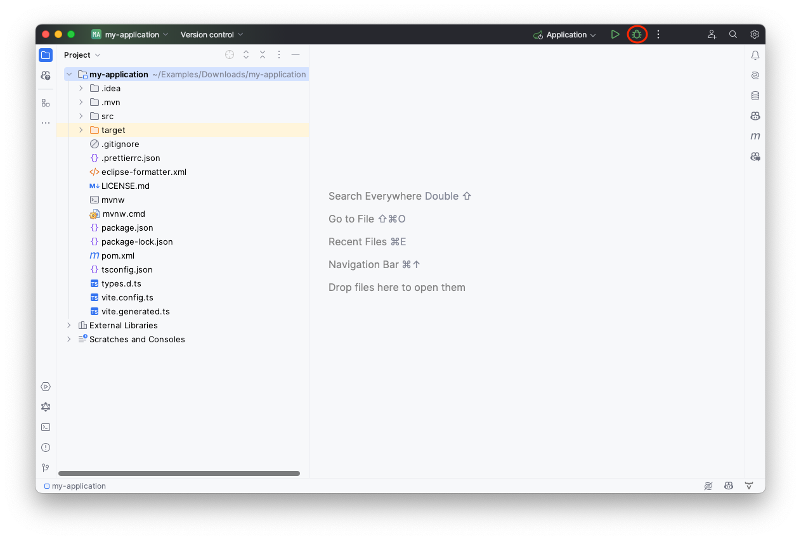
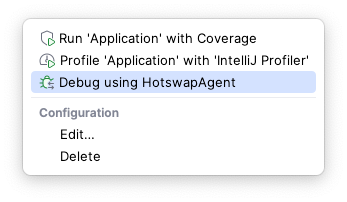
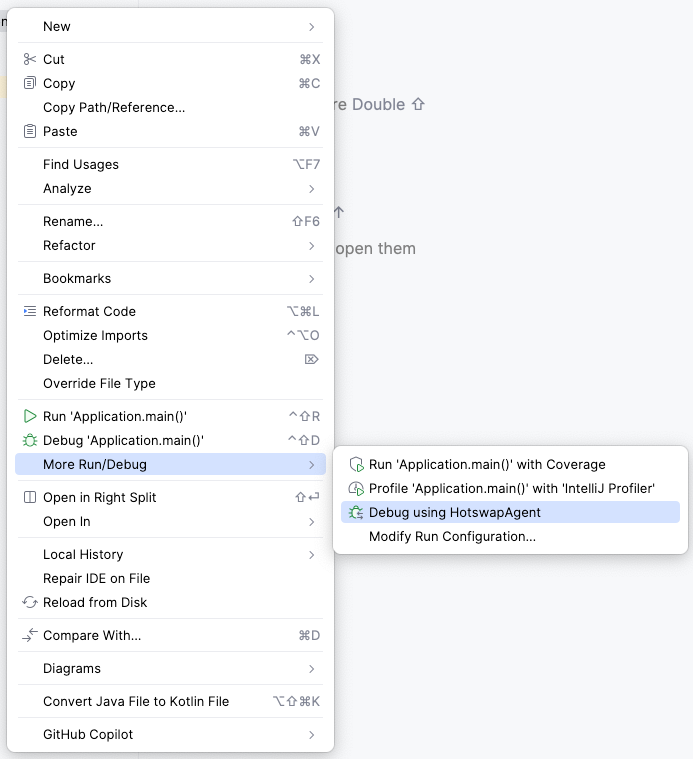
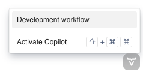
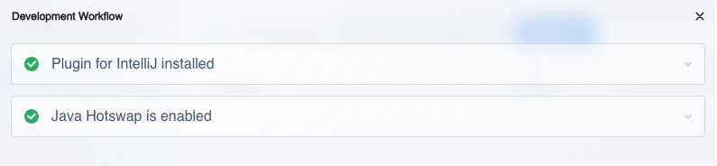

= Run in IntelliJ IDEA

You can run and debug your Vaadin application in IntelliJ IDEA as you would any other Java application. When you imported the project into IntelliJ IDEA, a run/debug configuration called _Application_ should have been created automatically. You can start the application by clicking the *Debug* button in the toolbar. It is indicated by a red circle in this screenshot:

The application starts up and you can access it at http://localhost:8080. Hot deploy of the frontend files is enabled automatically. However, to enable Java hotswap, you have to take some additional actions.

== Enabling Hotswap

The easiest way of running a Vaadin application with hotswap in IntelliJ IDEA is by installing the link:https://plugins.jetbrains.com/plugin/23758-vaadin[Vaadin plugin]. If you haven't done so already, do it now.

Click on the button with three small dots next to the run/debug configuration. It is highlighted on this screenshot with a red circle:

image::images/idea.png[IntelliJ IDEA with a generated skeleton]

This brings up a menu that looks like this:

Start the application by selecting *Debug using HotswapAgent*. If you can't see this option, the Vaadin plugin has not been installed correctly.

If the run/debug configuration was not automatically created, you can start the application in another way. Look up the main application class and right-click it in the project navigator. Then click menu:More Run/Debug[Debug using HotswapAgent], as shown on this screenshot:

Your application now starts up with hotswap of Java classes enabled. Open the application in a browser and verify that everything is working through Vaadin Copilot. Move your mouse pointer over the *Copilot* button at the bottom-right corner:

[IMPORTANT]
The Copilot button is only available when the application is running in development mode. It is not available in production mode.

Now click *Development workflow*. You can see that both the IntelliJ IDEA plugin and hotswap are working correctly:

