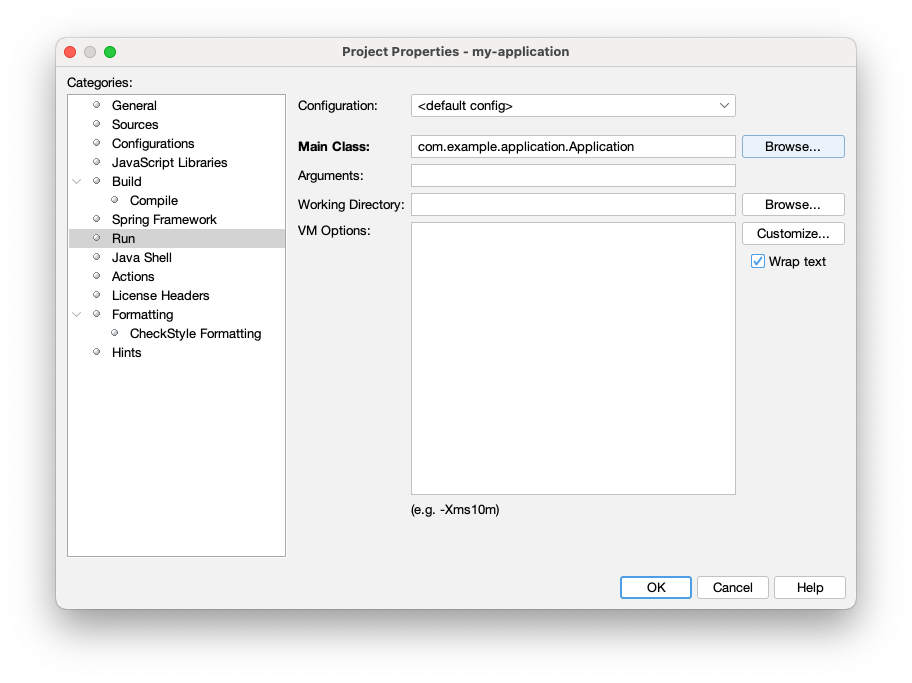
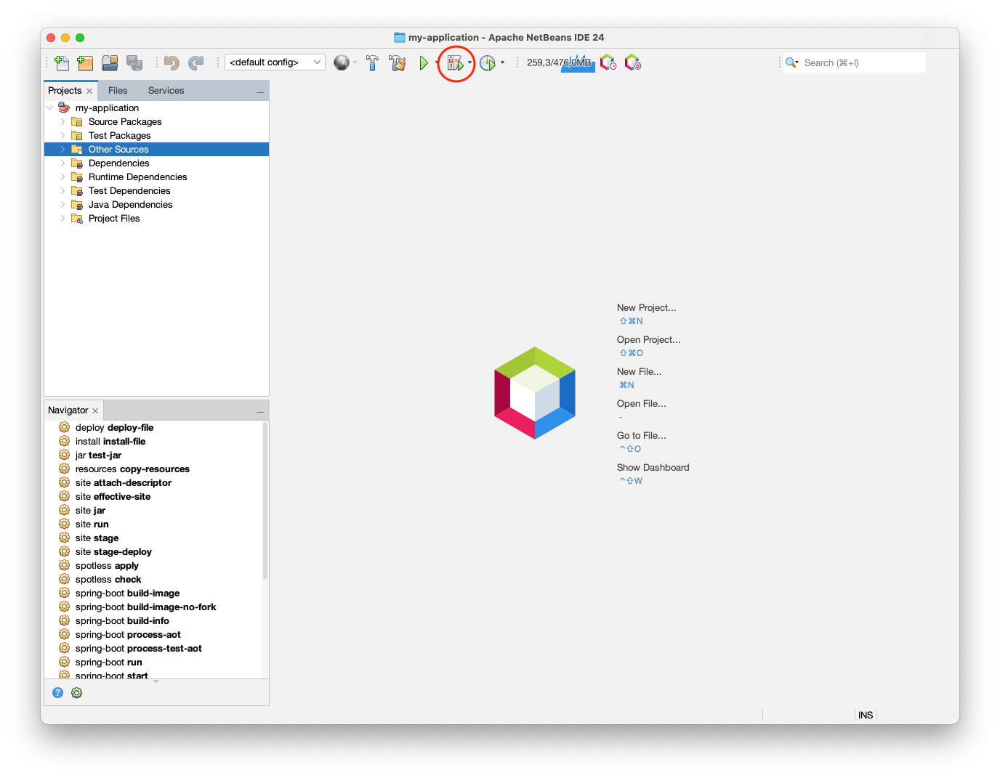
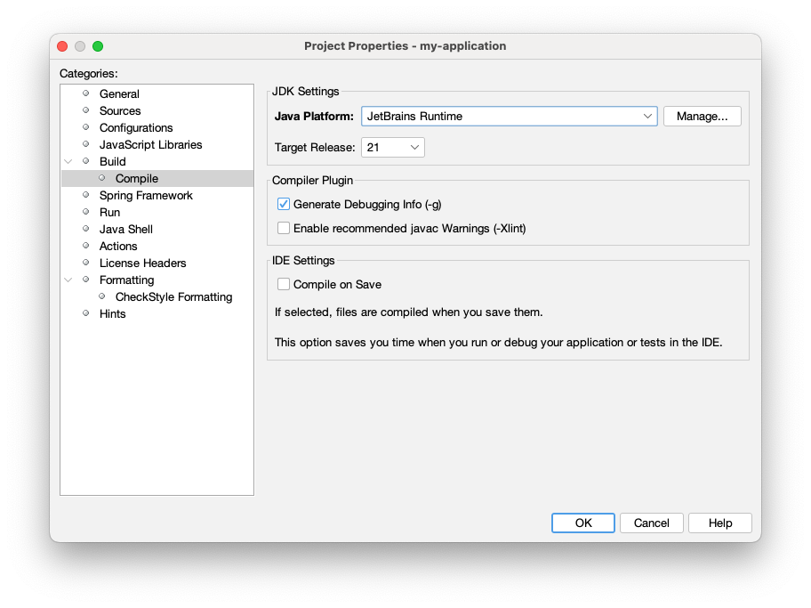
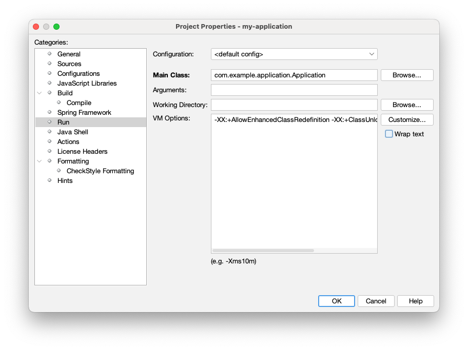
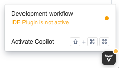
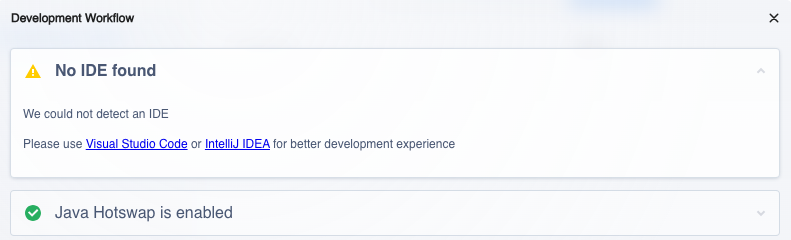

= Run in NetBeans

You can run and debug your Vaadin application in NetBeans as you would any other Java application. Start by selecting menu:File[Project Properties]. Select the *Run* category and specify your *Main Class*, like this:

Click [guibutton]*OK* to close the dialog. Next, click the *Debug* button on the toolbar, indicated by a red circle in this screenshot:

The application starts up and you can access it at http://localhost:8080. Hot deploy of the frontend files is enabled automatically. However, to enable Java hotswap, you have to take some additional actions.

== Enabling Hotswap

Enabling hotswap manually consists of three steps:

1. Download and install JetBrains Runtime;
2. Download HotswapAgent and install it into JetBrains Runtime; and
3. Create a launch configuration for VS Code that runs the application with JetBrain Runtime and additional JVM parameters.

=== JetBrains Runtime

You can download the latest version from the https://github.com/JetBrains/JetBrainsRuntime/releases[JetBrains GitHub release page]. Be sure to select the correct architecture. Use JetBrains Runtime to execute your application, not necessarily your IDE.

=== HotswapAgent

You can download HotswapAgent from the https://github.com/HotswapProjects/HotswapAgent/releases[HotswapAgent GitHub release page]. You'll need version 1.4.2 or later.

Download the JAR file and place it inside the JetBrains Runtime installation directory as [filename]`lib/hotswap/hotswap-agent.jar`. You'll need to create the `hotswap` folder, and rename the downloaded file to `hotswap-agent.jar`.

If you want to know more about the features of HotswapAgent, the documentation in the https://hotswapagent.org/[HotswapAgent webpage] is a good resource.

== Project Configuration

Select menu:File[Project Properties]. If the menu item is disabled, your application is likely running and you have to stop it. Then go to the menu:Build[Compile] category.

Under *JDK Settings*, click [guibutton]*Manage* and locate the JetBrains Runtime. Then select it as your *Java Platform*.

Next, go to the *Run* category. In the *VM Options* field, copy-paste the following:

[source]
----
-XX:+AllowEnhancedClassRedefinition -XX:+ClassUnloading -XX:HotswapAgent=fatjar
----

Click [guibutton]*OK* to close the dialog, then start the application again. The application starts up.

Open the application in a browser and verify that everything is working through Vaadin Copilot. Move your mouse pointer over the *Copilot* button at the bottom-right corner:

[IMPORTANT]
The Copilot button is only available when the application is running in development mode. It is not available in production mode.

Now click *Development workflow*. Your browser should look something like this:

The first item is orange because Vaadin does not have an official plugin for NetBeans. However, Java hotswap is enabled.