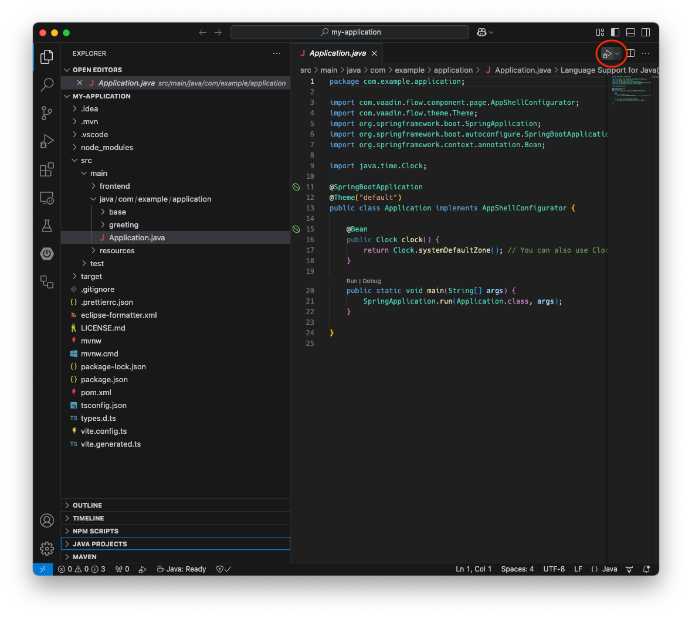
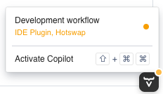
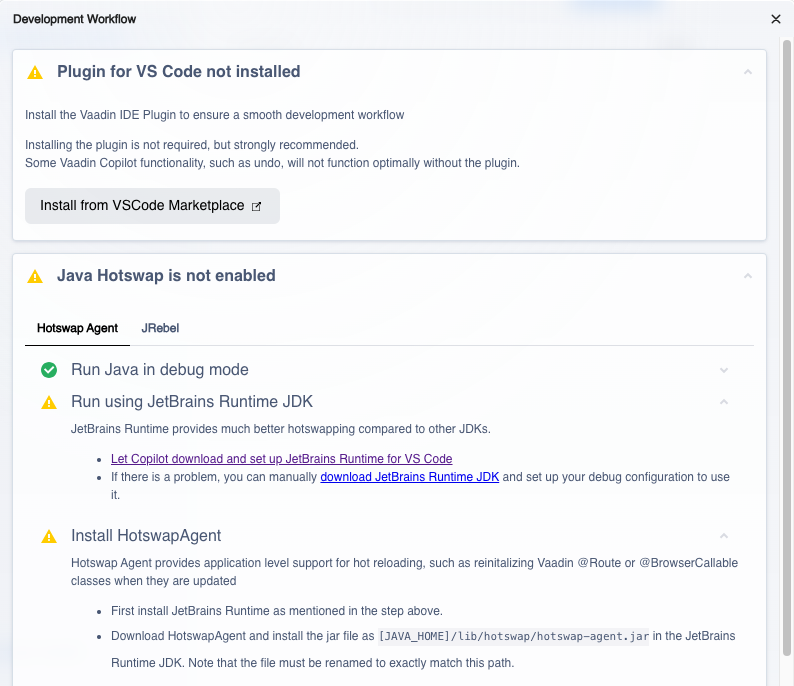
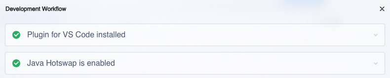

= Visual Studio Code

You can run and debug your Vaadin application in Visual Studio Code as you would any other Java application. Open the main `Application` class. Then select either *Run Java* or *Debug Java* in the upper-right corner indicated by a red circle in this screenshot:

The application starts up and you'll be able to access it at http://localhost:8080. Hot deploy of the frontend files is enabled automatically. However, to enable Java hotswap, you have to take some additional actions.

== Enabling Hotswap Using Vaadin Copilot

The easiest way of enabling hotswap is to use Vaadin Copilot. Start your application, open it in a browser and move your mouse pointer over the *Copilot* button at the bottom-right corner:

[IMPORTANT]
The Copilot button is only available when the application is running in development mode. It is not available in <<../../build#,production mode>>.
 
Now click *Development workflow*. Your browser should look something like this:

Copilot guides you through the steps needed to optimize your development workflow. This includes installing the Visual Studio Code extension and setting up hotswap.

When you have completed all the steps, you can verify that everything is working. Start your application with hotswap enabled, and open it in a browser. Then select menu:Copilot[Development workflow] again. All the checkmarks should be green:

