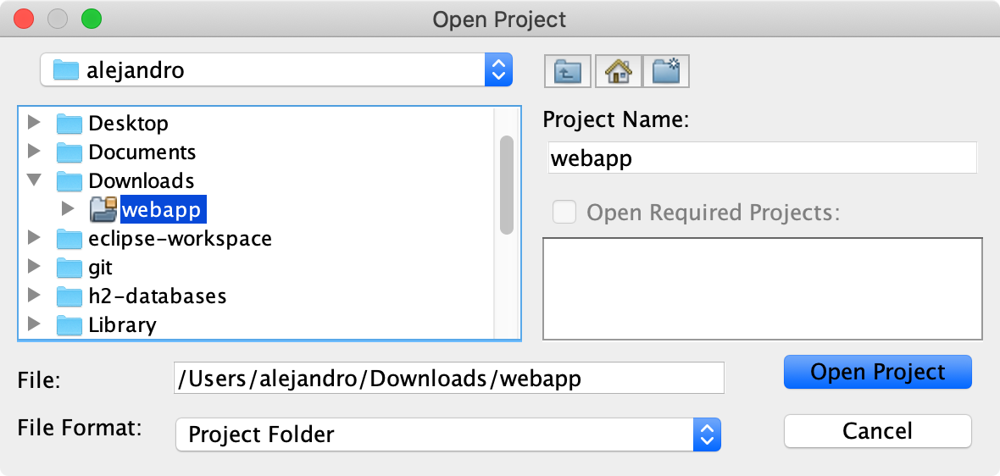

= Importing a Project in the NetBeans IDE

To import a project into NetBeans IDE, there are very few steps.

To start, in NetBeans, select menu:File[Open Project...]

Then select the folder containing the Maven project you want to import.

Finally, click *Open Project* to complete the process.

[discussion-id]`75A529CC-D68C-42DE-91FD-DFFE4802645E`
