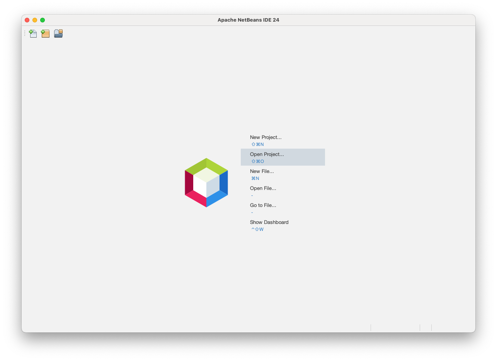
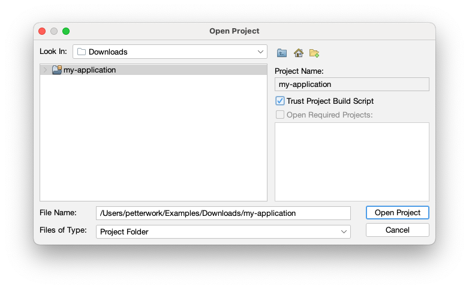

= NetBeans

To import a Vaadin project into NetBeans, click [guibutton]*Open Project* on the start screen.

You can also select menu:File[Open Project] in the menu.

Next, find the project directory. Check *Trust Project Build Script*, and click [guibutton]*Open Project*.

Your project is now imported.
