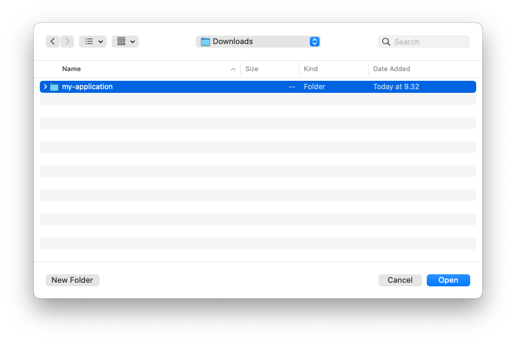
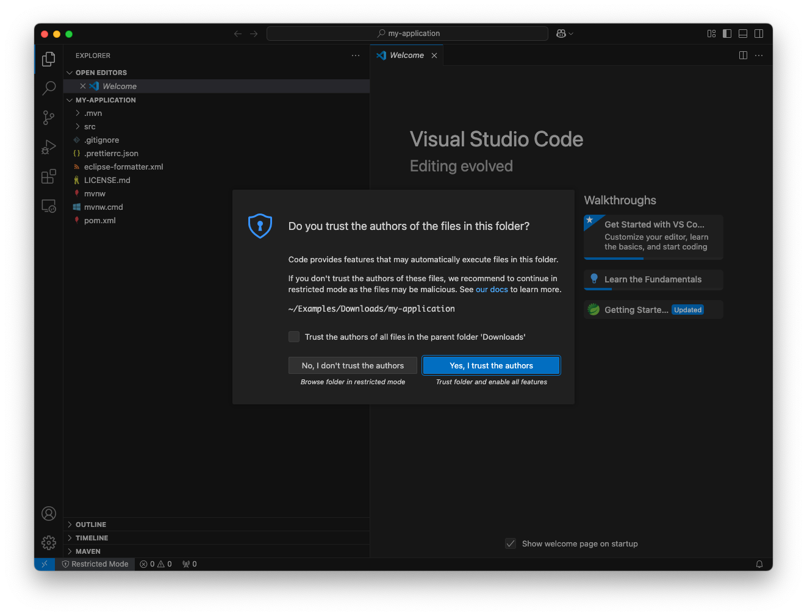
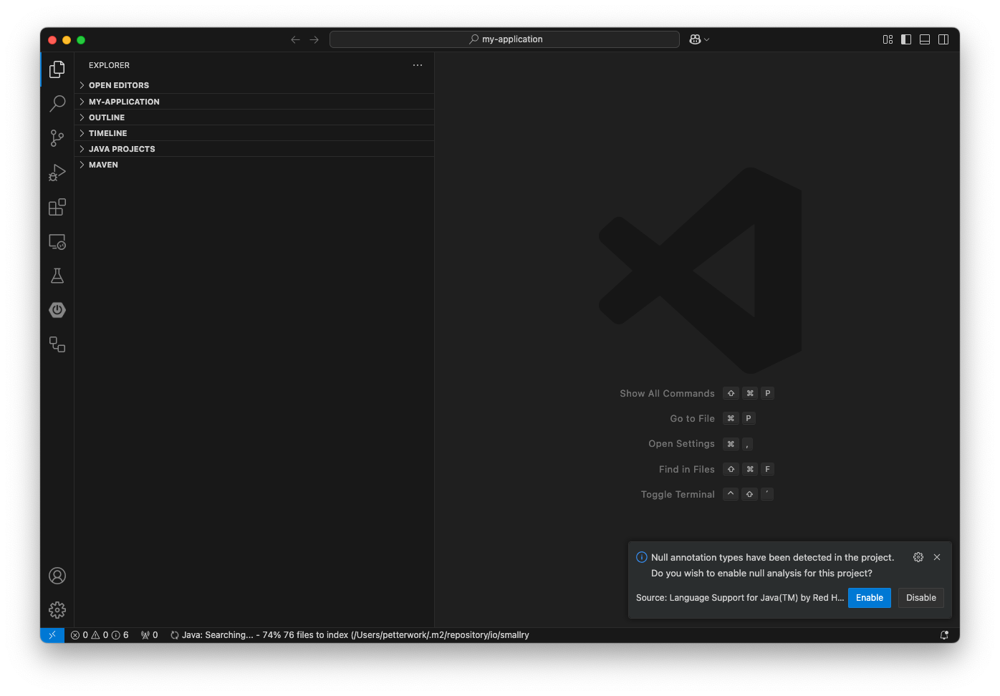

= Visual Studio Code

To import a Vaadin project into Visual Studio Code, select menu:File[Open Folder] in the menu. Then, find the project directory and click [guibutton]*Open*.

If you are opening the project for the first time, Visual Studio Code may ask you whether you trust the authors of the files in the folder. Click [guibutton]*Yes, I trust the authors*.

Depending on which extensions you have installed, VS Code may ask you to enable null analysis for the project. Click [guibutton]*Enable*.

Your project is now imported.
