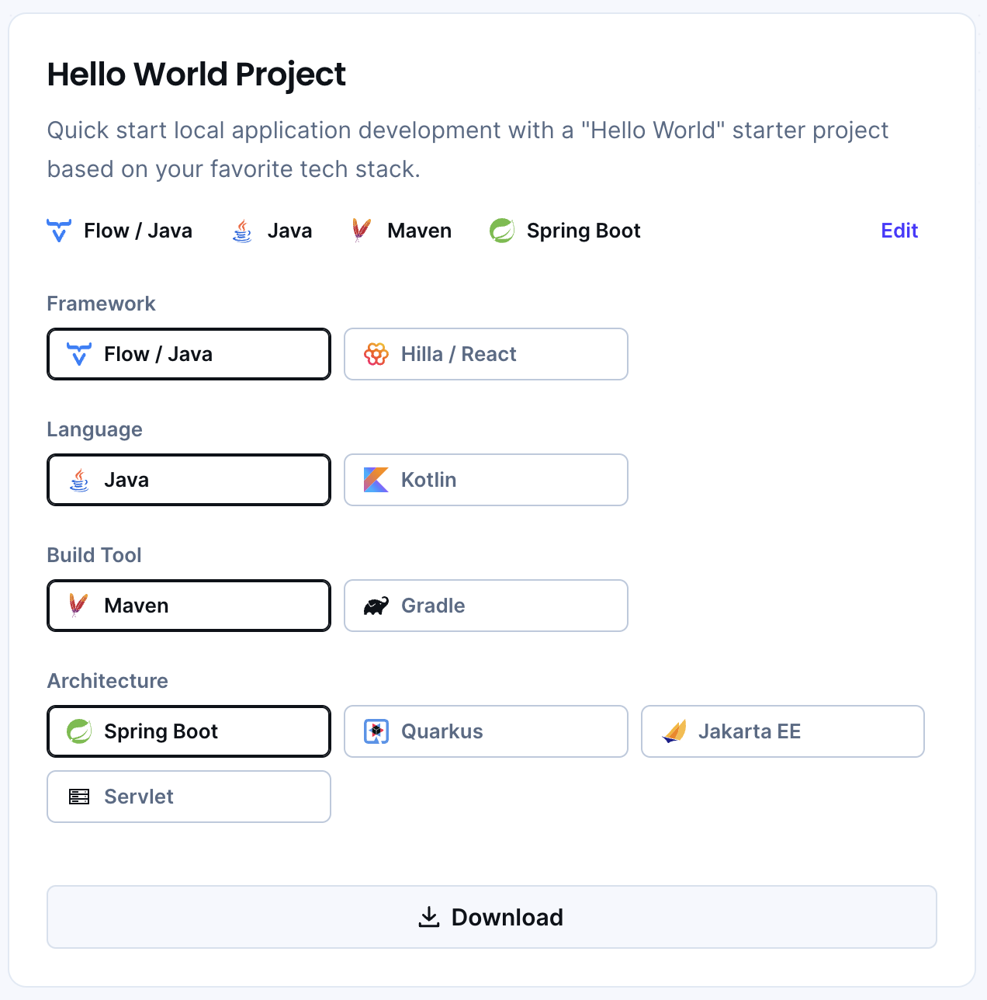
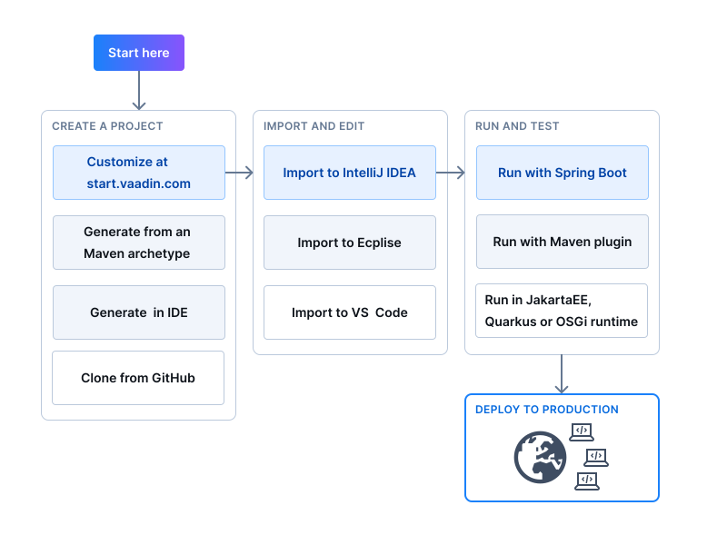

= Start a Project
:wizard-name: Vaadin Start
:toclevels: 2

The recommended way to start a new Vaadin project is to use *{wizard-name}* (start.vaadin.com). This allows you to configure and download a customizable starting point for an application.

https://start.vaadin.com?preset=latest[Open {wizard-name}, role="button primary water"]
xref:/tools/start#[Learn More, role="button secondary water"]

== Non-Spring Boot Starters

Applications created using {wizard-name} are based on Spring Boot. You can find "Hello World" starters, if you'd prefer, for other technology stacks from there as well.

.Hello World Starters

== Next Steps

Once you've downloaded a starter project and extracted it in a local folder, you can then import it into your favorite integrated development environment (IDE) to develop it further.

.Ways to Create and Run a New Project
[.subtle]

If you create a project outside an IDE, you'll have to import it into one. During development, you can run the project with a Maven target, depending on the technology stack you're using. After you have the project in your IDE, you can then develop, run, or debug it.

[discussion-id]`416cfd0c-fc39-41eb-ac4d-9b73731b02af`
