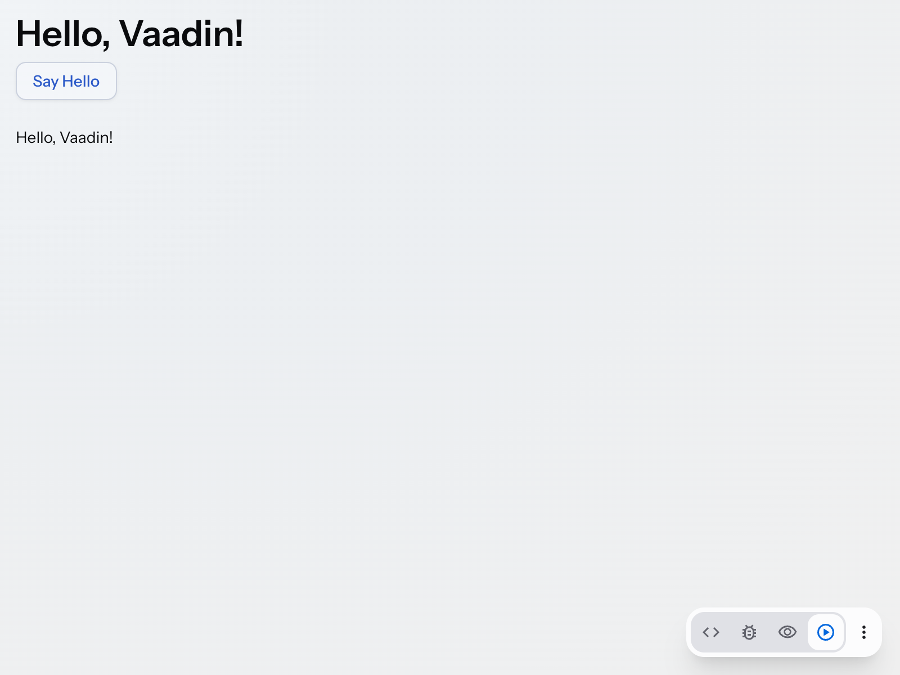
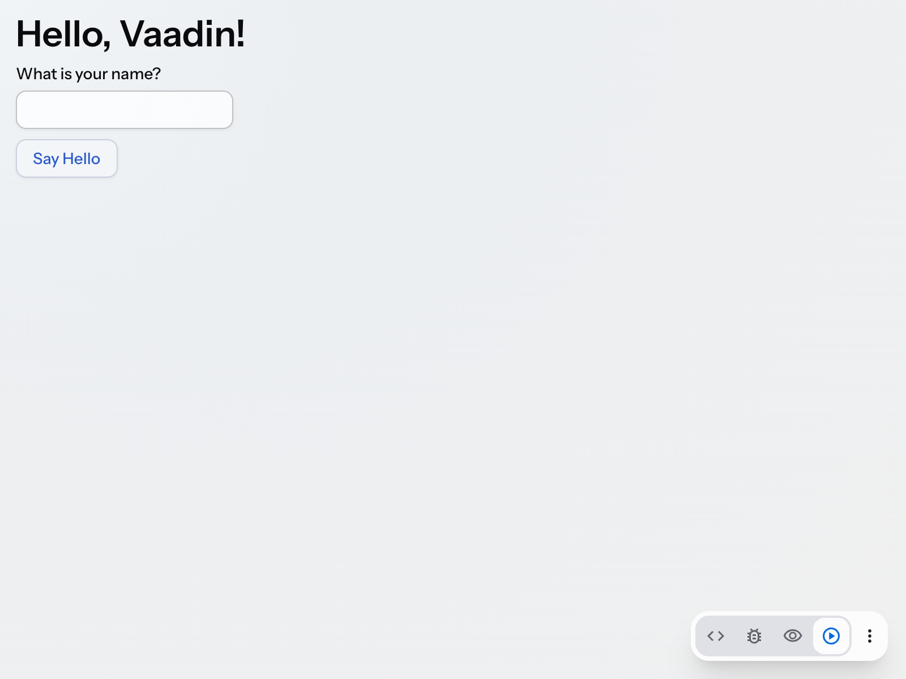
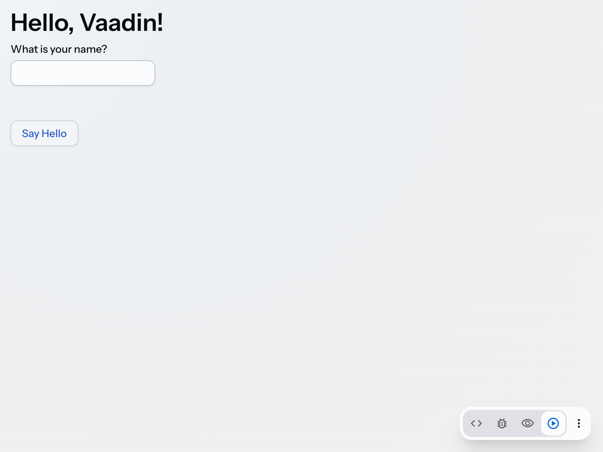
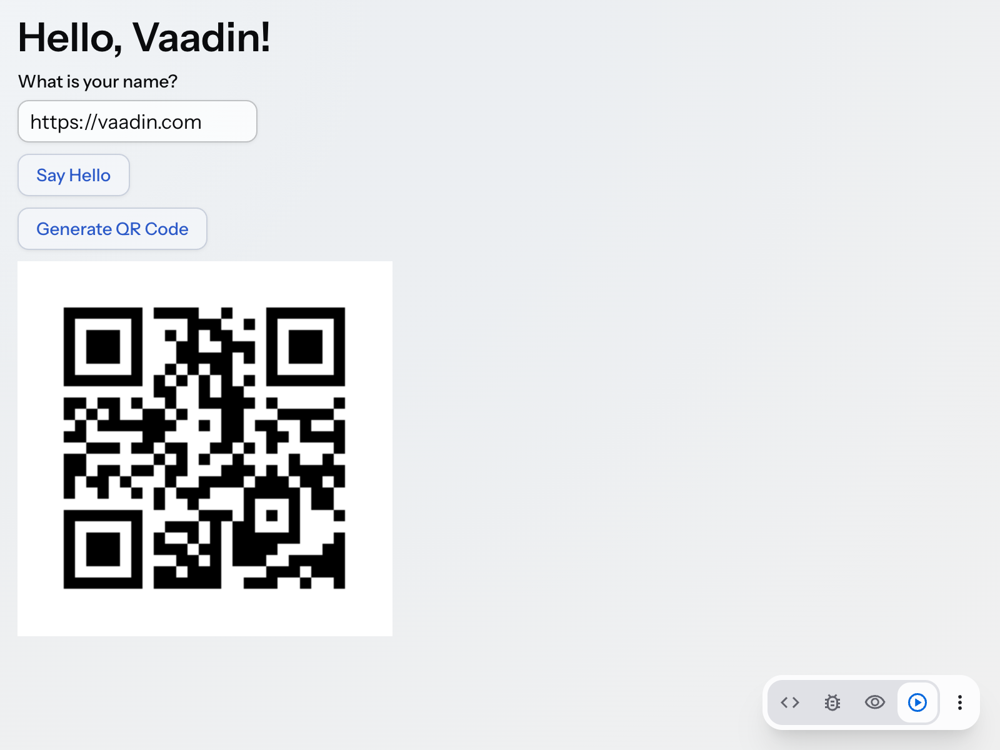

include::{articles}/_vaadin-version.adoc[]

= Quick Start Tutorial

This is a quick tutorial *for developers trying out Vaadin for the first time*. It walks you through creating a simple Vaadin application from scratch, demonstrating the core concepts along the way. It will take about 10 minutes to complete.

Vaadin allows you to build modern web applications in 100% Java. You don't need to know HTML, CSS, or JavaScript to get started. All you need is a <<../dev-environment/install-java#,Java Development Kit (JDK)>> and an <<../dev-environment/install-ide#,Integrated Development Environment (IDE)>>.

== Bootstrap a Vaadin Project

Click the button below to download a minimal Vaadin project skeleton:

link:https://start.vaadin.com/skeleton?platformVersion={vaadin-start-platform-version}&javaVersion={vaadin-start-java-version}&groupId=com.example&artifactId=app&frameworks=none&aiTool=NONE[Download Project, role="button primary water", id="docs-quick-start-download-project-cta"]

After downloading the project, unzip it and <<../dev-environment/import#,open it in your favorite IDE>>.

.This is a Spring Boot Project
[NOTE]
The downloaded project skeleton is a Spring Boot project. The <<../starters#,Starters>> documentation page describes *how to create Vaadin projects using different technology stacks*.

== Create Your First View

In Vaadin, a "view" is a Java class that defines the user interface and behavior of a specific screen in your application. It is associated with a URL _route_, allowing users to navigate to it via a web browser.

Create a new Java class named `MainView` in the `com.example` package, next to the `Application` class:

.MainView.java
[source,java]
----
package com.example;

import com.vaadin.flow.component.button.Button;
import com.vaadin.flow.component.html.H1;
import com.vaadin.flow.component.html.Paragraph;
import com.vaadin.flow.component.orderedlayout.VerticalLayout;
import com.vaadin.flow.router.PageTitle;
import com.vaadin.flow.router.Route;

@Route("") // <1>
@PageTitle("Hello, Vaadin!") // <2>
public class MainView extends VerticalLayout { // <3>
    public MainView() {
        add(new H1("Hello, Vaadin!")); // <4>
        add(new Button("Say Hello", event -> add(new Paragraph("Hello, Vaadin!")))); // <5>
    }
}
----
<1> The `@Route` annotation turns this class into a view, mapping it to the root URL ("/") of the application.
<2> The `@PageTitle` annotation sets the title of the web page when this view is displayed.
<3> `MainView` extends `VerticalLayout`, which is a layout component that arranges its children vertically.
<4> `H1` is a component that corresponds to the HTML `<h1>` element (a top-level heading).
<5> This line creates a new Button with the label "Say Hello". When clicked, it triggers a lambda function that adds a new `Paragraph` with the message "Hello, Vaadin!" to the view.

This programming model is typical for Vaadin applications. You construct the UI from components, and define behavior using event listeners. If you have used Swing or JavaFX before, this should feel familiar.

== Run the Application

To get the best development experience, run your application from your IDE with *hotswap* enabled. Hotswap automatically applies your code changes to the running application without restarting it, which saves a lot of time during this tutorial.

To enable hotswap, install the *Vaadin plugin* for your IDE and use it to start the application. You can find IDE-specific instructions here:

* <<../dev-environment/run/intellij#,IntelliJ IDEA>>
* <<../dev-environment/run/vscode#,Visual Studio Code>>
* <<../dev-environment/run/eclipse#,Eclipse IDE>>
* <<../dev-environment/run/netbeans#,NetBeans>>

[IMPORTANT]
Even if you are already familiar with your IDE, follow the instructions above. Running the application with hotswap requires the *Vaadin plugin*, which you may not have installed yet.

The first startup may take a while as Maven and npm download the required dependencies.

.Are you behind a proxy?
[TIP]
Vaadin uses Node.js to download the frontend toolchain during the build. If you are behind a proxy, you may need to configure Node to use that. See the <<{articles}/flow/configuration/development-mode/node-js#proxy-settings-for-downloading-frontend-toolchain,reference>> guide for details.

Once initialization is complete, the application is available at: http://localhost:8080

Click the button. It should look like this:

[.device]

The paragraph is added to the end of the view, below the button. If you click multiple times, new paragraphs are added each time.

The toolbar in the bottom-right corner is the *Copilot toolbar*, which is visible when running in development mode. See the <</tools/copilot#,Copilot documentation>> for details.

== Add Input

Next, you'll add a `TextField` to allow user input, and modify the button to greet the user by name. Update the `MainView` class as follows:

.MainView.java
[source,java]
----
package com.example;

import com.vaadin.flow.component.button.Button;
import com.vaadin.flow.component.html.H1;
import com.vaadin.flow.component.html.Paragraph;
import com.vaadin.flow.component.orderedlayout.VerticalLayout;
// tag::snippet[]
import com.vaadin.flow.component.textfield.TextField;
// end::snippet[]
import com.vaadin.flow.router.PageTitle;
import com.vaadin.flow.router.Route;

@Route("")
@PageTitle("Hello, Vaadin!")
public class MainView extends VerticalLayout {
    public MainView() {
        add(new H1("Hello, Vaadin!"));
// tag::snippet[]
        var nameField = new TextField("What is your name?"); // <1>
        add(nameField);
// end::snippet[]
        add(new Button("Say Hello", event ->
// tag::snippet[]
            add(new Paragraph("Hello, %s!".formatted(nameField.getValue()))) // <2>
// end::snippet[]
        ));
    }
}
----
<1> Creates a `TextField` component with a label prompting the user for their name.
<2> Adds a new `Paragraph` with a personalized greeting message to the view.

Now the browser view should look like this:

[.device]

Enter your name in the text field and click the button. The added paragraph greets you using the name you provided.

.What about input sanitization and escaping?
[IMPORTANT]
Vaadin takes care of input sanitization and escaping to prevent security vulnerabilities like script injection. Try to enter HTML or JavaScript code in the text field and observe that it is treated as plain text in the notification.

== Update a Component

The problem with the current implementation is that each time you click the button, a new paragraph is added. Instead, you want to add a single `Paragraph` and update its content on every click. Modify the `MainView` class as follows:

.MainView.java
[source,java]
----
package com.example;

import com.vaadin.flow.component.button.Button;
import com.vaadin.flow.component.html.H1;
import com.vaadin.flow.component.html.Paragraph;
import com.vaadin.flow.component.orderedlayout.VerticalLayout;
import com.vaadin.flow.component.textfield.TextField;
import com.vaadin.flow.router.PageTitle;
import com.vaadin.flow.router.Route;

@Route("")
@PageTitle("Hello, Vaadin!")
public class MainView extends VerticalLayout {
    public MainView() {
        add(new H1("Hello, Vaadin!"));
        var nameField = new TextField("What is your name?");
        add(nameField);
// tag::snippet[]
        var greeting = new Paragraph(); // <1>
        add(greeting);
// end::snippet[]
        add(new Button("Say Hello", event ->
// tag::snippet[]
            greeting.setText("Hello, %s!".formatted(nameField.getValue())) // <2>
// end::snippet[]
        ));
    }
}
----
<1> Creates a `Paragraph` component to hold the greeting message and adds it to the view above the button.
<2> Updates the text of the existing `Paragraph` instead of adding a new one.

If you now try the application again, you'll see that there is some extra space between the text field and the button:

[.device]

This is because the `Paragraph` component is initially empty but still occupies space in the layout. You can fix that by hiding the `Paragraph` when it has no content. Update the code as follows:

.MainView.java
[source,java]
----
package com.example;

import com.vaadin.flow.component.button.Button;
import com.vaadin.flow.component.html.H1;
import com.vaadin.flow.component.html.Paragraph;
import com.vaadin.flow.component.orderedlayout.VerticalLayout;
import com.vaadin.flow.component.textfield.TextField;
import com.vaadin.flow.router.PageTitle;
import com.vaadin.flow.router.Route;

@Route("")
@PageTitle("Hello, Vaadin!")
public class MainView extends VerticalLayout {
    public MainView() {
        add(new H1("Hello, Vaadin!"));
        var nameField = new TextField("What is your name?");
        add(nameField);
        var greeting = new Paragraph();
// tag::snippet[]
        greeting.setVisible(false); // <1>
// end::snippet[]
        add(greeting);
// tag::snippet[]
        add(new Button("Say Hello", event -> {
            greeting.setText("Hello, %s!".formatted(nameField.getValue()));
            greeting.setVisible(!nameField.isEmpty()); // <2>
        }));
// end::snippet[]
    }
}
----
<1> Hides the `Paragraph` component initially since it has no content.
<2> Sets the visibility of the `Paragraph` based on whether the `TextField` is empty or not. By default, a text field is empty if its value is an empty string.

If you now enter your name and click the button, you'll see that the greeting message updates in place each time you click the button. If you clear the text field and click the button, the greeting message disappears and no extra space is occupied.

== Call a Java Library

A Vaadin application is a regular Java application. Because the user interface runs on the server side, you can call any Java library directly from your UI code. You'll now try this by adding a QR code to your application using the popular `zxing` library.

Start by adding the following dependency to your `pom.xml` file inside the `<dependencies>` section:

[source,xml]
----
<dependency>
    <groupId>com.google.zxing</groupId>
    <artifactId>javase</artifactId>
    <version>3.5.3</version>
</dependency>
----

Import the dependency by refreshing your Maven project in the IDE. Next, add a new button to the `MainView` class that generates and displays a QR code for the entered name:

.MainView.java
[source,java]
----
package com.example;

// tag::snippet[]
import com.google.zxing.BarcodeFormat;
import com.google.zxing.WriterException;
import com.google.zxing.client.j2se.MatrixToImageWriter;
import com.google.zxing.qrcode.QRCodeWriter;
// end::snippet[]
import com.vaadin.flow.component.button.Button;
import com.vaadin.flow.component.html.H1;
// tag::snippet[]
import com.vaadin.flow.component.html.Image;
// end::snippet[]
import com.vaadin.flow.component.html.Paragraph;
import com.vaadin.flow.component.orderedlayout.VerticalLayout;
import com.vaadin.flow.component.textfield.TextField;
import com.vaadin.flow.router.PageTitle;
import com.vaadin.flow.router.Route;
// tag::snippet[]
import java.io.IOException;
// end::snippet[]

@Route("")
@PageTitle("Hello, Vaadin!")
public class MainView extends VerticalLayout {
    public MainView() {
        add(new H1("Hello, Vaadin!"));
        var nameField = new TextField("What is your name?");
// tag::snippet[]
        nameField.setErrorMessage("Enter a name"); // <1>
// end::snippet[]
        add(nameField);
        var greeting = new Paragraph();
        greeting.setVisible(false);
        add(greeting);
        add(new Button("Say Hello", event -> {
            greeting.setText("Hello, %s!".formatted(nameField.getValue()));
            greeting.setVisible(!nameField.isEmpty());
        }));
// tag::snippet[]
        var qrImage = new QrImage();
        add(new Button("Generate QR Code", event -> {
            nameField.setInvalid(nameField.isEmpty());
            qrImage.setQrCode(nameField.getValue());
        }));
        add(qrImage);
// end::snippet[]
    }

// tag::snippet[]
    static class QrImage extends Image {

        public void setQrCode(String text) {
            if (text == null || text.isEmpty()) {
                return;
            }
            setSrc(downloadEvent -> { // <2>
                downloadEvent.setContentType("image/png");
                try (var out = downloadEvent.getOutputStream()) {
                    var qrWriter = new QRCodeWriter();
                    var bitMatrix = qrWriter.encode(text, BarcodeFormat.QR_CODE, 300, 300);
                    MatrixToImageWriter.writeToStream(bitMatrix, "PNG", out); // <3>
                } catch (WriterException e) {
                    throw new IOException(e);
                }
            });
        }
    }    
// end::snippet[]
}
----
<1> Sets an error message on the text field that is shown when the field is marked as invalid.
<2> The image source can be either a URL or a `DownloadHandler`. Vaadin serves server-generated content using the `DownloadHandler` interface.
<3> The QR code is generated and written to the output stream as a PNG image.

Because you have added new dependencies to the project, you have to stop and restart the application from your IDE for the changes to take effect. After restarting, enter a name and click the [guibutton]*Generate QR Code* button. A QR code representing the entered name is displayed below the button:

[.device]

If you click the button with an empty text field, an error message is shown instead.

Having access to the entire Java ecosystem allows you to leverage existing libraries and tools in your Vaadin applications, making development faster and easier.

== Make a Production Build

Up to this point, you have been running the application in development mode, which is optimized for fast feedback during development. Before deploying your application to production, you should create a production build that is optimized for performance.

Execute the Maven `package` goal to create a production build. Stop the application in your IDE, then run the following command from the project directory:

[source,terminal]
----
mvn clean package
----

TIP: If you don't have Maven installed, you can use the Maven Wrapper included in the project instead: `./mvnw clean package`.

After the build completes, check the `target` directory in your project. You should find a JAR file named `app-1.0-SNAPSHOT.jar` (assuming your project is named `app`).
You can run the production build using the following command:

.Terminal/PowerShell
[source,terminal]
----
java -jar target/app-1.0-SNAPSHOT.jar
----

Open your browser and navigate to http://localhost:8080 to see your application running in production mode. You'll notice that the Copilot toolbar is no longer visible.

== Next Steps

You have now created a simple Vaadin application from scratch, learning some core concepts along the way. Now is a good time to explore more advanced topics and features of Vaadin in the <<../tutorial#,Tutorial>>.
