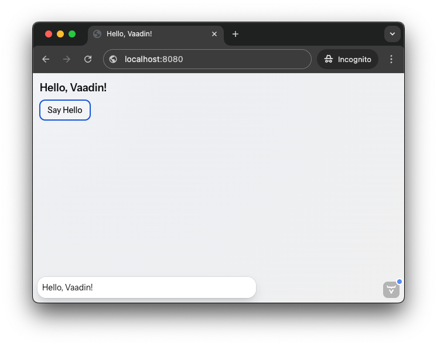
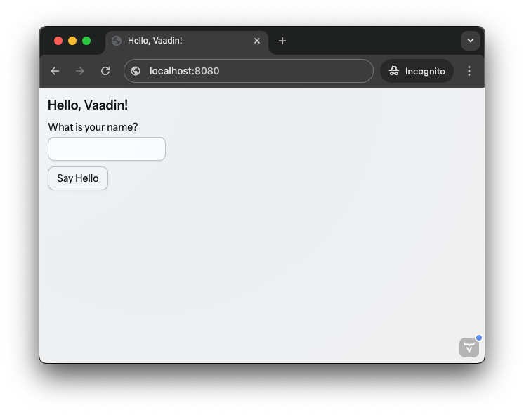

= Quick Start Tutorial

This is a quick tutorial *for developers trying out Vaadin for the first time*. It walks you through creating a simple Vaadin application from scratch, demonstrating the core concepts along the way. It will take about 10 minutes to complete.

Vaadin allows you to build modern web applications in 100% Java. You don't need to know HTML, CSS, or JavaScript to get started. All you need is a <<../dev-environment/install-java#,Java Development Kit (JDK)>> and an <<../dev-environment/install-ide#,Integrated Development Environment (IDE)>>.

== Bootstrap a Vaadin Project

Go to link:https://start.vaadin.com/[Vaadin Start] and create a new Vaadin project. *Don't include a sample view, as you'll create your first view from scratch* in the next section.

link:https://start.vaadin.com/[Open Vaadin Start, role="button primary water"]   

After downloading the project, unzip it and <<../dev-environment/import#,open it in your favorite IDE>>.

== Create Your First View

In Vaadin, a "view" is a Java class that defines the user interface and behavior of a specific screen in your application. It is associated with a URL route, allowing users to navigate to it via a web browser.

Create a new Java class named `MainView` in the `com.example` package, next to the `Application` class:

.MainView.java
[source,java]
----
package com.example;

import com.vaadin.flow.component.html.H1;
import com.vaadin.flow.component.orderedlayout.VerticalLayout;
import com.vaadin.flow.router.PageTitle;
import com.vaadin.flow.router.Route;

@Route("/") // <1>
@PageTitle("Hello, Vaadin!") // <2>
public class MainView extends VerticalLayout { // <3>
    public MainView() {
        add(new H1("Hello, Vaadin!")); // <4>
    }
}
----
<1> The `@Route` annotation turns this class into a view, mapping it to the root URL ("/") of the application.
<2> The `@PageTitle` annotation sets the title of the web page when this view is displayed.
<3> `MainView` extends `VerticalLayout`, which is a layout component that arranges its children vertically.
<4> `H1` is a component that corresponds to the HTML `<h1>` element (a top-level heading).

== Run the Application

You can run the application <<../dev-environment/run#,directly from your IDE>> or from the command line. To run it from the command line, open a terminal in the project directory and run the following command:

[.example]
--
.Terminal
[source,terminal,subs="+attributes"]
----
<source-info group="macOS / Linux"></source-info>
./mvnw
----

.PowerShell
[source,terminal,subs="+attributes"]
----
<source-info group="Windows"></source-info>
mvnw
----
--

The first startup may take a while as Maven and npm download the required dependencies.

.Are you behind a proxy?
[TIP]
Vaadin uses Node.js to download the frontend toolchain during the build. If you are behind a proxy, you may need to configure Node to use that. See the <<{articles}/flow/configuration/development-mode/node-js#proxy-settings-for-downloading-frontend-toolchain,reference>> guide for details.

Once initialization is complete, the application is available at: http://localhost:8080 

It should look like this:

[.device]

The [guilabel]*}>* button in the bottom-right corner is the *Copilot menu*, which is visible when running in development mode. You'll learn more about it later.

== Add Functionality

You'll now enhance the view by adding a Button that shows a notification when clicked. Update the `MainView` class as follows:

.MainView.java
[source,java]
----
package com.example;

// tag::snippet[]
import com.vaadin.flow.component.button.Button;
// end::snippet[]
import com.vaadin.flow.component.html.H1;
// tag::snippet[]
import com.vaadin.flow.component.notification.Notification;
// end::snippet[]
import com.vaadin.flow.component.orderedlayout.VerticalLayout;
import com.vaadin.flow.router.PageTitle;
import com.vaadin.flow.router.Route;

@Route("/")
@PageTitle("Hello, Vaadin!")
public class MainView extends VerticalLayout {
    public MainView() {
        add(new H1("Hello, Vaadin!"));
// tag::snippet[]
        add(new Button("Say Hello", event -> Notification.show("Hello, Vaadin!"))); // <1>
// end::snippet[]
    }
}
----
<1> This line creates a new Button with the label "Say Hello". When clicked, it triggers a lambda function that shows a Notification with the message "Hello, Vaadin!".

This programming model is typical for Vaadin applications. You construct the UI from components, and define behavior using event listeners. If you have used Swing or JavaFX before, this should feel familiar.

If you started the application from your IDE with <<../dev-environment/run#,hotswap (automatic code reload) enabled>>, the changes should be reflected automatically. If not, restart the application and refresh the browser. Click the button to see the notification in action:

[.device]

The notification appears at the bottom of the screen when you click the button, disappearing after a short time. If you click multiple times, new notifications stack above the previous ones.

== Add Input

Next, you'll add a `TextField` to allow user input, and modify the button to greet the user by name. Update the `MainView` class as follows:

.MainView.java
[source,java]
----
package com.example;

import com.vaadin.flow.component.button.Button;
import com.vaadin.flow.component.html.H1;
import com.vaadin.flow.component.notification.Notification;
import com.vaadin.flow.component.orderedlayout.VerticalLayout;
// tag::snippet[]
import com.vaadin.flow.component.textfield.TextField;
// end::snippet[]
import com.vaadin.flow.router.PageTitle;
import com.vaadin.flow.router.Route;

@Route
@PageTitle("Hello, Vaadin!")
public class MainView extends VerticalLayout {
    public MainView() {
        add(new H1("Hello, Vaadin!"));
// tag::snippet[]
        var nameField = new TextField("What is your name?"); // <1>
        add(nameField);
// end::snippet[]
        add(new Button("Say Hello", event -> 
// tag::snippet[]
            Notification.show("Hello, %s!".formatted(nameField.getValue())) // <2>
// end::snippet[]
        ));
    }
}
----
<1> Creates a `TextField` component with a label prompting the user for their name.
<2> Displays a notification with a personalized greeting message.

Now the browser view should look like this:

[.device]

Enter your name in the text field and click the button. The notification will greet you using the name you provided.

.What about input sanitization and escaping?
[IMPORTANT]
Vaadin takes care of input sanitization and escaping to prevent security vulnerabilities like script injection. Try to enter HTML or JavaScript code in the text field and observe that it is treated as plain text in the notification.

== Call a Java Library

A Vaadin application is a regular Java application. Because the user interface runs on the server side, you can call any Java library directly from your UI code. You'll now try this by adding a QR code to your application using the popular `zxing` library.

Start by adding the following dependency to your `pom.xml` file inside the `<dependencies>` section:

[source,xml]
----
<dependency>
    <groupId>com.google.zxing</groupId>
    <artifactId>javase</artifactId>
    <version>3.5.3</version>
</dependency>
----

Import the dependency by refreshing your Maven project in the IDE. Next, add a new button to the `MainView` class that generates and displays a QR code for the entered name:

.MainView.java
[source,java]
----
package com.example;

// tag::snippet[]
import com.google.zxing.BarcodeFormat;
import com.google.zxing.WriterException;
import com.google.zxing.client.j2se.MatrixToImageWriter;
import com.google.zxing.qrcode.QRCodeWriter;
// end::snippet[]
import com.vaadin.flow.component.button.Button;
import com.vaadin.flow.component.html.H1;
// tag::snippet[]
import com.vaadin.flow.component.html.Image;
// end::snippet[]
import com.vaadin.flow.component.notification.Notification;
import com.vaadin.flow.component.orderedlayout.VerticalLayout;
import com.vaadin.flow.component.textfield.TextField;
import com.vaadin.flow.router.PageTitle;
import com.vaadin.flow.router.Route;
// tag::snippet[]
import com.vaadin.flow.server.streams.DownloadHandler;
import java.io.IOException;
// end::snippet[]

@Route
@PageTitle("Hello, Vaadin!")
public class MainView extends VerticalLayout {
    public MainView() {
        add(new H1("Hello, Vaadin!"));
        var nameField = new TextField("What is your name?");
        add(nameField);
        add(new Button("Say Hello", event -> 
            Notification.show("Hello, %s!".formatted(nameField.getValue()))
        ));
// tag::snippet[]
        var qrImage = new Image();
        add(new Button("Generate QR Code", event -> 
            qrImage.setSrc(generateQrCode(nameField.getValue())) // <1>
        ));
        add(qrImage);
// end::snippet[]
    }

// tag::snippet[]
    private DownloadHandler generateQrCode(String text) {
        return downloadEvent -> {
            try (var out = downloadEvent.getOutputStream()) {
                var qrWriter = new QRCodeWriter();
                var bitMatrix = qrWriter.encode(text, BarcodeFormat.QR_CODE, 300, 300);
                downloadEvent.setContentType("image/png");
                MatrixToImageWriter.writeToStream(bitMatrix, "PNG", out); // <2>
            } catch (WriterException e) {
                throw new IOException(e);
            }
        };
    }
// end::snippet[]
}
----
<1> The image source can be either a URL or a `DownloadHandler`. Vaadin serves server-generated content using the `DownloadHandler` interface.
<2> The QR code is generated and written to the output stream as a PNG image.

Because you have added new dependencies to the project, you have to restart the application for the changes to take effect. After restarting, enter a name and click the [guibutton]*Generate QR Code* button. A QR code representing the entered name will be displayed below the button:

[.device]

Having access to the entire Java ecosystem allows you to leverage existing libraries and tools in your Vaadin applications, making development faster and easier.

== Make a Production Build

Up to this point, you have been running the application in development mode, which is optimized for fast feedback during development. Before deploying your application to production, you should create a production build that is optimized for performance.

Execute the Maven `package` goal to create a production build. You can do it from the command line like this:

[.example]
--
.Terminal
[source,bash,subs="+attributes"]
----
<source-info group="macOS / Linux"></source-info>
./mvnw clean package
----

.PowerShell
[source,powershell,subs="+attributes"]
----
<source-info group="Windows"></source-info>
mvnw clean package
----
--

After the build completes, check the `target` directory in your project. You should find a JAR file named `app-1.0-SNAPSHOT.jar` (assuming your project is named `app`).
You can run the production build using the following command:

.Terminal/PowerShell
[source,terminal]
----
java -jar app-1.0-SNAPSHOT.jar
----

Open your browser and navigate to http://localhost:8080 to see your application running in production mode. You'll notice that the [guilabel]*}>*  button is no longer visible.

== Next Steps

You have now created a simple Vaadin application from scratch, learning some core concepts along the way. Now is a good time to explore more advanced topics and features of Vaadin in the <</building-apps#,Building Apps guide>>.