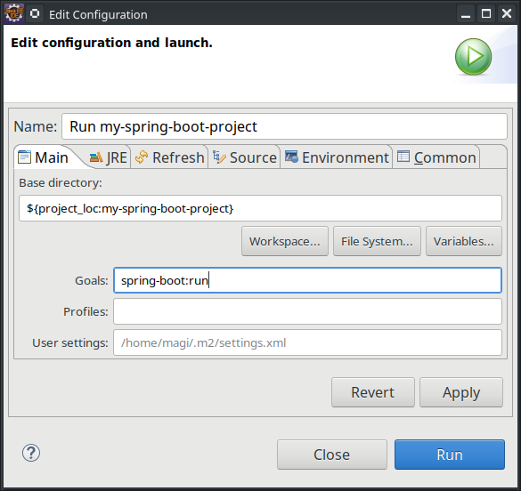
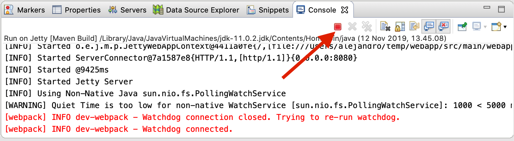
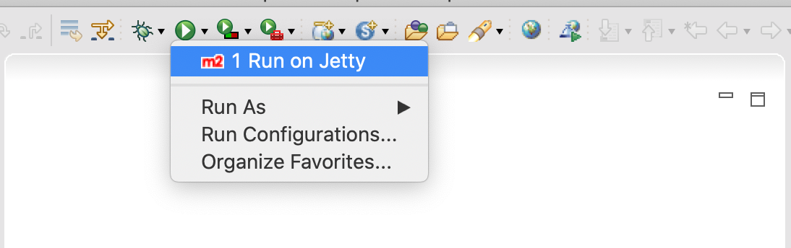
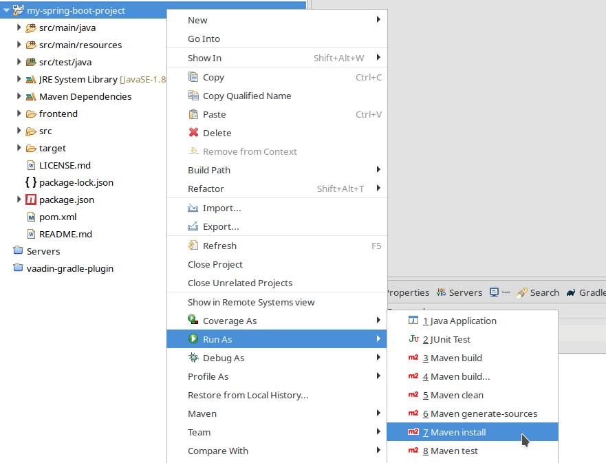

= Run a Project in Eclipse

This page describes how to run a project with Eclipse.

[[spring-boot]]
== Run a Spring Boot Project

If you are developing a Spring Boot project, such as one created with <</tools/start#,Vaadin Start>>, Spring Boot makes it easier to run a Java web application, because it takes care of starting and configuring the server.

To run your application, all you need to do is to run the [classname]`Application` class that contains the [methodname]`main()` method that starts Spring Boot. Eclipse automatically detects that you have such a class with a [methodname]`main()` method and lets you run it.

To start your application, you can do any of the following:

- Click [guilabel]*Run Application* (the "play" icon) in the toolbar.
- Select menu:Run[Run] in the menu.
- Press kbd:[Ctrl+F11].
- Select the [filename]`Application.java` in the [guilabel]*Project Explorer*, right-click, and select menu:Run As[Java Application].

The first time you start a Vaadin application, it downloads frontend dependencies and builds a JavaScript bundle. This can take several minutes, depending on your computer and internet speed.

You'll know that your application has started when you see the following output in the console:

----
Tomcat started on port(s): 8080 (http) with context path ''
Started Application in 80.189 seconds (JVM running for 83.42)
----

You can now open the web application in a browser at http://localhost:8080/[localhost:8080].

[[maven]]
== Run the Application with Maven

To run the application in an embedded web server, you need to create a _run configuration_, a shortcut to run a task in Eclipse, in this case, a Maven goal.

.Debugging Spring Boot Applications
[NOTE]
When you run a Spring Boot application with Maven, it's executed in a separate process. Therefore you can't run it in debug mode.

You can create such a run configuration as follows:

- Right-click the project in the [guilabel]*Project Explorer* view.
- Select menu:Run As[Maven build].
- In the [guilabel]*Edit Configuration* window, for [guilabel]*Goals* enter the goals to run.
+
[cols=3*,options=header]
|===
| Technology Stack | Embedded Server | Goal to Run
| Spring Boot | – | `spring-boot:run`
| CDI / Java EE | Apache TomEE | `tomee:run`
| Plain Java | Jetty | `jetty:run`
|===
+
Optionally, you can also give the run configuration a new name.
+

- Click [guibutton]*Run* to save the new configuration and execute it.
+
You should see the [guilabel]*Console* view with the log generated by the application and the server.

- You can now open the web application in a browser at http://localhost:8080/[localhost:8080].

- If you modify and save any of the project Java source files, they are compiled and the server redeploys the application, so you should see the modified behavior by reloading the page.
+
<<{articles}/flow/configuration/live-reload#, Live Reload>> should be enabled by default, making the page refresh automatically.

- To stop the server, click the [guilabel]*Terminate* icon in the [guilabel]*Console* view:
+

When the run configuration has been created, you can deploy and run the web application.
You do this by clicking the [guilabel]*Run* (or [guilabel]*Debug*) icon in the toolbar and selecting the corresponding run or debug configuration:

[[getting-started.eclipse.maven]]
== Build a Maven Goal

The Eclipse IDE has built-in integration with Maven. You can run common commands such as `mvn install` or `mvn jetty:run` without having to leave the IDE.

The project is built with Maven, and you can also run it in an embedded development server with Maven, as described later.

The most common commands are available in the [guilabel]*Run As* and [guilabel]*Debug As* folders when you right-click the project in the [guilabel]*Project Explorer* panel.

For example, to compile the project and install it in your local Maven repository, right-click the project and select menu:Run As[Maven install]:

After invoking the command, you can see how Eclipse executes the `install` goal and all the previous phases in Maven's default lifecycle. Building the application downloads dependencies from the repositories and copies the generated artifacts into your local Maven repository, among other things.

You can find additional useful options in the [guilabel]*Maven* sub-menu.

ifdef::web[]
To learn more about the topics covered here:

- The key concepts in Maven, see https://vaadin.com/blog/learning-maven-concepts[Learning Maven Concepts].
endif::web[]

[discussion-id]`E0D2D6E1-71C4-42CD-B185-C692F9CCD606`
