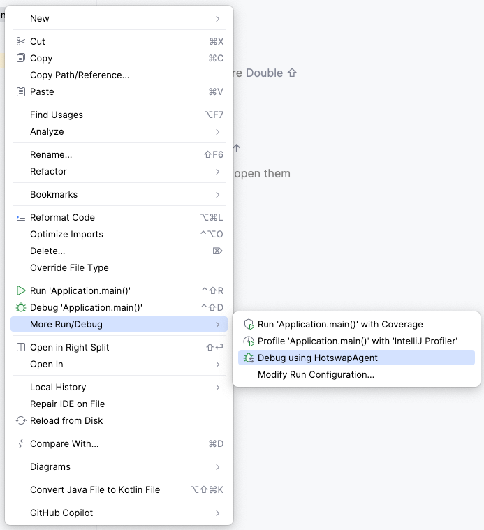

= IntelliJ IDEA

The easiest way of running a Vaadin application in IntelliJ IDEA is by installing the link:https://plugins.jetbrains.com/plugin/23758-vaadin[Vaadin plugin]. If you haven't done so already, do it now.

When you imported the project into IntelliJ IDEA, a run/debug configuration called _Application_ should have been created automatically. Click on the button with three small dots next to the configuration. It is highlighted on this screenshot with a red circle:

image::images/idea.png[IntelliJ IDEA with a generated skeleton]

This brings up a menu that looks like this:

image::images/idea-run-menu.png[The more actions menu in IntelliJ IDEA]

All the options work since this is a normal Java application. However, the one you'll want to pick to enable hotswapping is *Debug using HotswapAgent*. If you can't see this option, the Vaadin plugin has not been installed correctly.

If the run/debug configuration was not automatically created, you can start the application in another way. Look up the main application class and right-click it in the project navigator. Then click menu:More Run/Debug[Debug using HotswapAgent], as shown on this screenshot:

Your application now starts up with hotswapping of Java classes enabled.

image::images/idea-running.png[]

If you make a change to any of the frontend files, you'll find that hot deploy is also enabled. 
