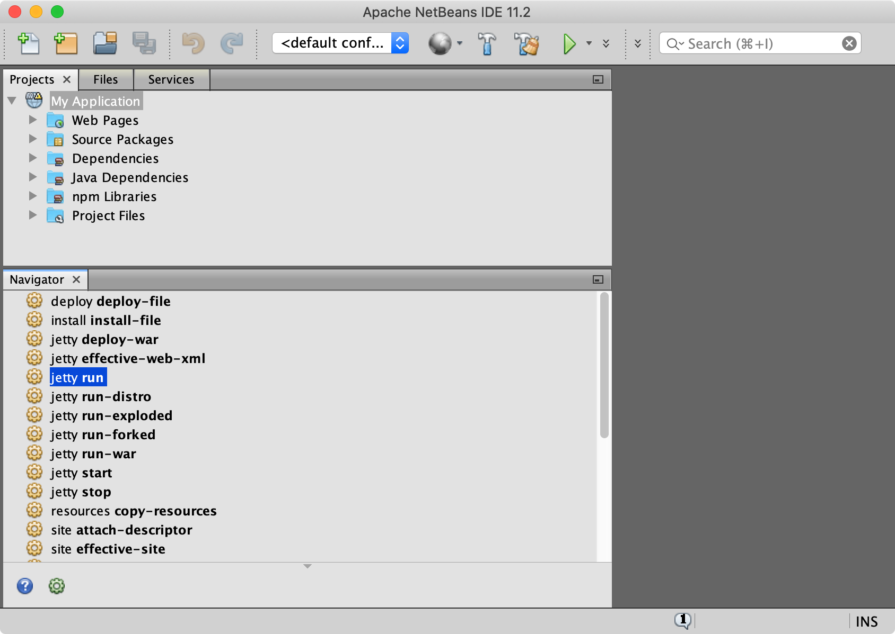
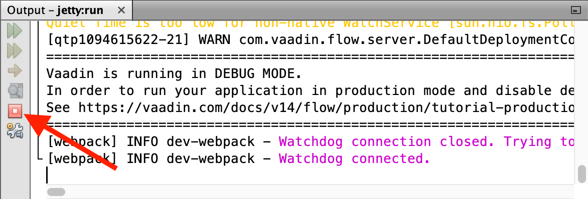
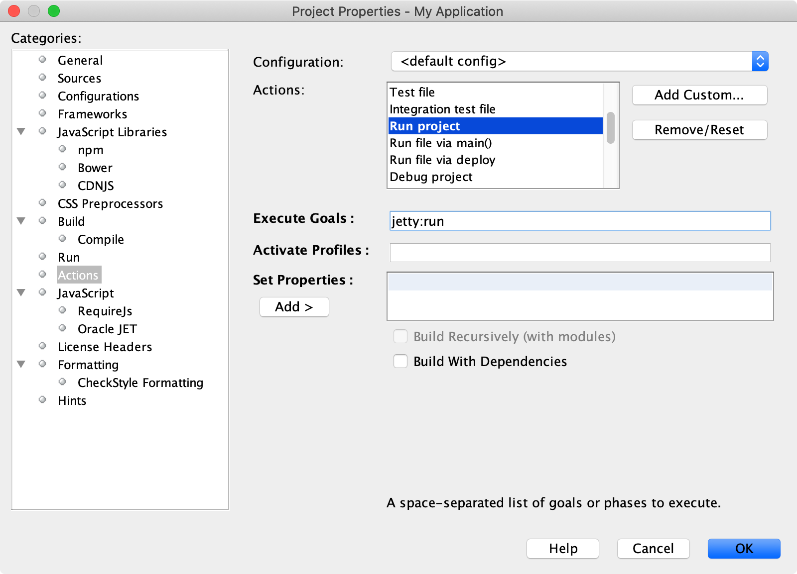
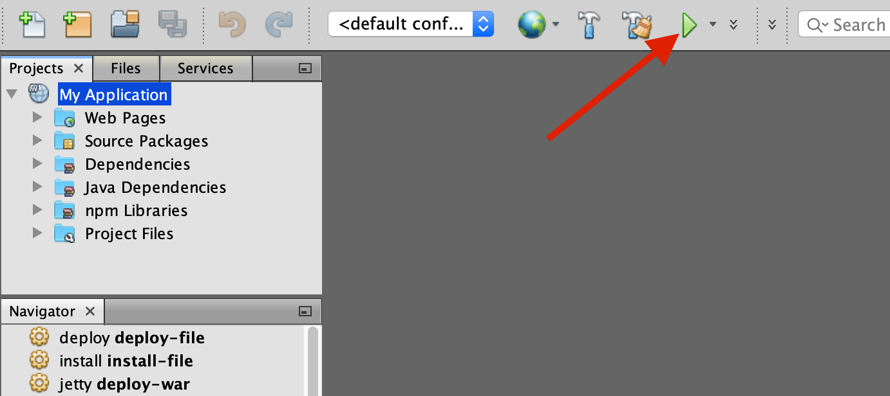

= Run a Project in NetBeans

This page describes how to run a project with NetBeans.

== Run Maven Goals

NetBeans integrates with Maven, enabling you to run Maven commands. Besides building and cleaning the project, you can run the web application on an embedded web server.

Select the project in the [guilabel]*Projects* view. NetBeans shows common https://vaadin.com/blog/learning-maven-concepts[Maven goals] inside the [guilabel]*Navigator* view:

.Navigator View

Double-click a goal to execute it.

[[getting-started.netbeans.maven.running]]
=== Run the Web Application

You can run the web application in an embedded web server by running the appropriate goal for your technology stack.

[cols=3*,options=header]
|===
| Technology Stack | Embedded Server | Goal to Run
| Spring Boot | – | `spring-boot:run`
| CDI / Java EE | Apache TomEE | `tomee:run`
| Plain Java | Jetty | `jetty:run`
|===

While the server is running, when you edit and save any source files, the server notices the change and redeploys the web application. <<{articles}/flow/configuration/live-reload#, Live Reload>> should be enabled by default, making the page refresh automatically.

To stop the server, click the "stop" button (red stop sign) in the [guilabel]*Output* view:

.Output View

[[maven.actions]]
=== Bind Maven Goals to IDE Actions

As running the web application is a frequent task during development, you may want to bind such a Maven goal to an _IDE action_.

To associate the [guilabel]*Run project* action with a Maven goal to start the server, proceed as follows:

- Right-click the project in the [guilabel]*Projects* view and select [guilabel]*Properties*.
- In the [guilabel]*Project Properties* window, select menu:Categories[Actions].
- Select the menu:Actions[Run project] option.
- Type the goal to start the web server in [guilabel]*Execute Goals*: `jetty:run` (plain Java project), `tomee:run` (CDI project), or `spring-boot:run` (Spring Boot project).
- Click [guibutton]*OK*:
+

You can now deploy and run the web application by clicking the "run" icon (green play triangle) in the toolbar:

You can repeat the process to bind the same Maven goal to the [guilabel]*Debug project* IDE action, as well.

If the Vaadin application was created with <</getting-started/project#,Vaadin Start>> or a <</getting-started/project/maven-archetype#,Maven archetype>>, you should be able to access it at http://localhost:8080/[localhost:8080].

With the above configuration, you can now use NetBeans to develop your Vaadin application with Maven.

ifdef::web[]
To learn more about:

- The key concepts in Maven, see https://vaadin.com/blog/learning-maven-concepts[Learning Maven concepts].
- How to develop a Java web application without coding JavaScript or HTML, see the <</flow/tutorial#,Vaadin Flow tutorial>>.
endif::web[]

[discussion-id]`9E46A6C2-30AC-4252-810A-B95BB6D177F2`
